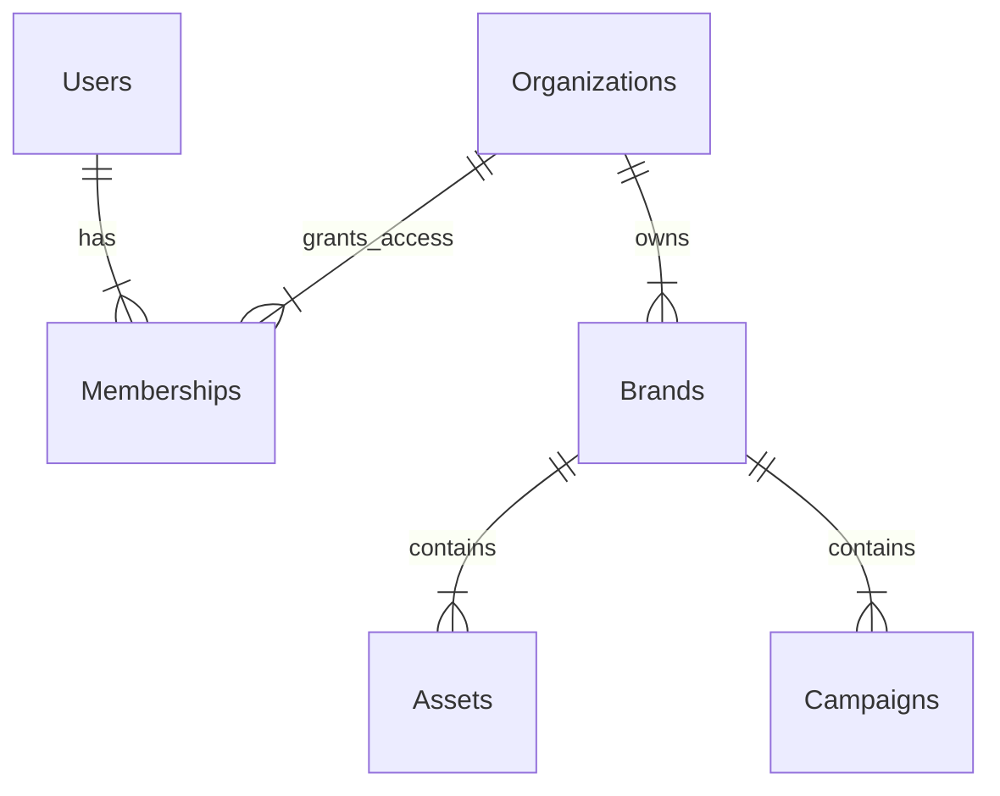

# 🔐 Estrategia de Multi-Tenancy & Segregación de Datos (v1.0)

> **Estado:** Autoridad Técnica / Definición Arquitectónica
> **Alcance:** Toda la plataforma LoopDev OS
> **Objetivo:** Definir cómo el sistema gestiona múltiples clientes (Tenants) en una única instancia, garantizando aislamiento absoluto de datos y flexibilidad operativa.

---

## 1. El Desafío de Negocio

LoopDev OS debe servir a dos arquetipos de clientes radicalmente diferentes con el mismo código base:

*   **Caso A (Single-Brand Tenant):** Empresas como *LoopDev* o una Startup. Tienen 1 sola marca. Su "universo" es simple.
*   **Caso B (Multi-Brand Holding):** Empresas como *Estar Protegidos* o *Unilever*. Tienen N marcas, subsidiarias y unidades de negocio bajo un mismo paraguas corporativo.

El sistema no puede asumir `1 Usuario = 1 Marca`.

---

## 2. Decisión Arquitectónica: Logical Segregation (Pool)

En lugar de crear bases de datos separadas por cliente (Silo), utilizamos una **Pool Architecture** con segregación lógica reforzada a nivel de motor de base de datos (PostgreSQL RLS).

### Principios Rectores
1.  **Shared Schema:** Todos los tenants viven en las mismas tablas.
2.  **Row Level Security (RLS):** Es imposible hacer una consulta SQL que devuelva datos de otro tenant, incluso si el desarrollador olvida el `WHERE`.
3.  **Tenant Context:** El `tenant_id` se inyecta en cada petición a nivel de sesión/JWT.

---

## 3. Modelo de Datos (The Tenant Spine)

La jerarquía de propiedad es estricta:



### Tablas Clave

1.  **`public.organizations` (Tenants)**
    *   `id`: UUID (Primary Key)
    *   `name`: "Estar Protegidos Group"
    *   `plan`: "Enterprise"

2.  **`public.memberships` (La tabla de vinculación)**
    *   `user_id`: UUID (FK auth.users)
    *   `organization_id`: UUID (FK organizations)
    *   `role`: 'owner' | 'editor' | 'viewer'

3.  **`public.brands` (Recursos)**
    *   `id`: UUID
    *   `tenant_id`: UUID (FK organizations) **<-- CRÍTICO**
    *   `name`: "Marca A"

---

## 4. Implementación de Seguridad (RLS Policies)

La seguridad no vive en el Frontend (React) ni en el Middleware (Next.js), vive en la **Database**.

### Política Maestra (Pseudocódigo SQL)

```sql
-- Política: Un usuario solo ve marcas de su organización
CREATE POLICY "Tenant Isolation" ON public.brands
FOR ALL
USING (
  tenant_id IN (
    SELECT organization_id 
    FROM public.memberships 
    WHERE user_id = auth.uid()
  )
);
```

**Resultado:**
*   Usuario de LoopDev hace `SELECT * FROM brands` -> Recibe 1 fila.
*   Usuario de Holding hace `SELECT * FROM brands` -> Recibe 15 filas.

---

## 5. Impacto en Experiencia de Usuario (UX)

La interfaz debe ser "Tenant-Aware" y adaptarse a la cardinalidad de los datos.

### 5.1 Patrón de "Smart Redirection"
Para evitar clics innecesarios en clientes pequeños:

*   **Escenario 1 (Single-Brand):**
    *   El usuario entra a `/brand-hub`.
    *   El sistema detecta `brands.length === 1`.
    *   **Acción:** Redirección automática a `/brand-hub/brands/:id/overview`.
    *   *Sensación:* "Es mi dashboard".

*   **Escenario 2 (Multi-Brand):**
    *   El usuario entra a `/brand-hub`.
    *   El sistema detecta `brands.length > 1`.
    *   **Acción:** Muestra el `ModuleOverview` (Directorio de Marcas).
    *   *Sensación:* "Es mi portafolio".

---

## 6. Hoja de Ruta de Implementación

1.  [x] **Fase 1:** Agregar columna `tenant_id` a recursos clave (`brands`).
2.  [ ] **Fase 2:** Crear tablas `organizations` y `memberships`.
3.  [ ] **Fase 3:** Implementar triggers para crear organización automática al registrarse (Sign-up).
4.  [ ] **Fase 4:** Migrar políticas RLS de "abiertas" a "basadas en membership".
5.  [ ] **Fase 5:** Implementar "Smart Redirection" en el frontend.

---
*Documento de Estrategia - LoopDev Engineering*
