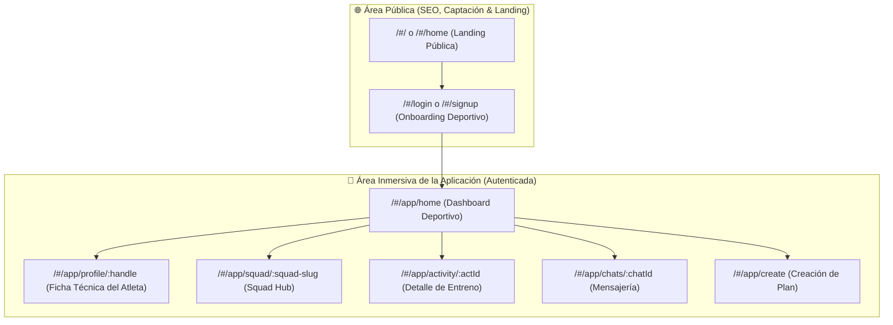

# Estándar Canónico de LoopDev: Deep Linking, Identificadores y Convenciones de URL

## 1. Visión y Propósito

Este documento establece el **estándar oficial transversal de LoopDev** para la construcción de URLs, Deep Links e identificadores de entidades en todas las aplicaciones de producto y plataformas sociales (CIMO, ProtegeTuSalud, CRM, Marketing Studio).

Inspirado en los estándares de clase mundial de **Instagram, Strava, Twitter/X, Spotify y Airbnb**, este sistema resuelve tres vectores críticos:
1. **Experiencia Humana (Shareability):** URLs legibles y memorables para personas y enlaces en WhatsApp / Redes Sociales.
2. **Seguridad y Anti-Scraping:** Prevención total de ataques de enumeración de IDs secuenciales.
3. **Escalabilidad Distribuida:** Compatibilidad con arquitecturas sharded y bases de datos cloud sin cuellos de botella de auto-incremento.

---

## 2. Taxonomía de Identificadores por Tipo de Entidad

```
┌─────────────────────────────────────────────────────────────────────────────────────────────┐
│ 1. PERFILES DE USUARIO / ATLETAS                                                           │
│    • Formato: `@username` o slug legible                                                    │
│    • Regex de Validación: ^[a-zA-Z0-9._-]{3,30}$                                            │
│    • URL Canónica: /app/profile/:handle                                                    │
│    • Ejemplo: /app/profile/alexrivera o /app/profile/sofiadiaz                              │
│    • Motivo: Identidad de marca personal y máxima facilidad de compartir.                  │
├─────────────────────────────────────────────────────────────────────────────────────────────┤
│ 2. MICRO-COMUNIDADES, CLUBS Y SQUADS                                                        │
│    • Formato: `kebab-case` semántico                                                        │
│    • Regex de Validación: ^[a-z0-9]+(-[a-z0-9]+)*$                                          │
│    • URL Canónica: /app/squad/:squad-slug                                                   │
│    • Ejemplo: /app/squad/retiro-morning-runners o /app/squad/padel-chamartin                │
│    • Motivo: Sensación de club/equipo oficial en mensajes de WhatsApp.                      │
├─────────────────────────────────────────────────────────────────────────────────────────────┤
│ 3. EVENTOS, ENTRENOS Y PLANES DEPORTIVOS                                                    │
│    • Formato: Prefijo semántico de 3-4 letras + NanoID / Timestamp (`act_[id]`)             │
│    • URL Canónica: /app/activity/:activityId                                                │
│    • Ejemplo: /app/activity/act_849201 o /app/activity/act_k7x9p2                           │
│    • Motivo: Anti-scraping, inmutabilidad y unicidad global en bases distribuidas.          │
├─────────────────────────────────────────────────────────────────────────────────────────────┤
│ 4. CONVERSACIONES Y CHATS                                                                   │
│    • Formato: `chat_[id]` o `dm_[userA]_[userB]`                                            │
│    • URL Canónica: /app/chats/:chatId                                                       │
│    • Ejemplo: /app/chats/chat_retiro_8k                                                     │
└─────────────────────────────────────────────────────────────────────────────────────────────┘
```

---

## 3. Jerarquía de Rutas de Aplicación (Public vs Inmersive App)

Todas las aplicaciones de LoopDev deben respetar la separación estricta entre el dominio público indexable y el espacio autenticado:



---

## 4. Contrato TypeScript Oficial (`@loopdev/contracts`)

El paquete `@loopdev/contracts` exporta las utilidades y validadores oficiales:

```ts
import {
  isValidUserHandle,
  isValidKebabSlug,
  createProfileDeepLink,
  createActivityDeepLink,
  createSquadDeepLink,
  createChatDeepLink,
  LOOPDEV_DEEP_LINK_PATTERNS
} from '@loopdev/contracts';

// Ejemplo de uso:
const profileUrl = createProfileDeepLink('alexrivera'); // "#/app/profile/alexrivera"
const squadUrl = createSquadDeepLink('retiro-morning-runners'); // "#/app/squad/retiro-morning-runners"
```

---

## 5. Auditoría de Calidad y Criterios de Aceptación

Para certificar que una aplicación cumple el estándar LoopDev de Deep Linking:
- [x] **Cero IDs numéricos secuenciales simples** (`1, 2, 3...`) en URLs públicas.
- [x] **Compatibilidad con portapapeles:** Cada vista tiene un botón de compartir que copia la URL canónica con micro-feedback.
- [x] **Fallback seguro:** Si el usuario accede a una URL con ID antiguo o no encontrado, la app redirige con elegancia al feed o a su propio perfil.
- [x] **Tests unitarios:** Suite de Vitest validando regex de handles y generación de enlaces.
