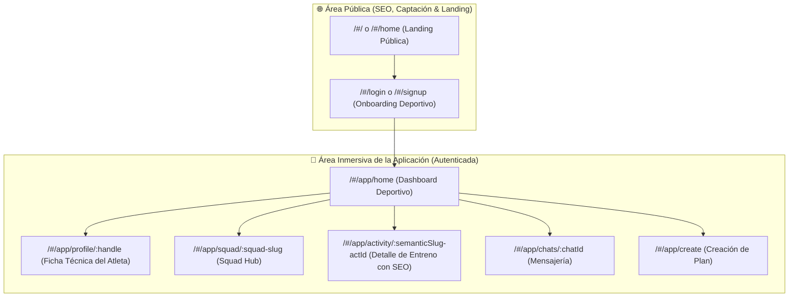

# Estándar Canónico de LoopDev: Deep Linking, Identificadores y Convenciones de URL

## 1. Visión y Propósito

Este documento establece el **estándar oficial transversal de LoopDev** para la construcción de URLs, Deep Links e identificadores de entidades en todas las aplicaciones de producto y plataformas sociales (CIMO, ProtegeTuSalud, CRM, Marketing Studio).

Inspirado en los estándares de clase mundial de **Instagram, Strava, Twitter/X, Spotify y Airbnb**, este sistema resuelve tres vectores críticos:

1. **Experiencia Humana (Shareability):** URLs legibles y memorables para personas y enlaces en WhatsApp / Redes Sociales.
2. **Seguridad y Anti-Scraping:** Prevención total de ataques de enumeración de IDs secuenciales.
3. **Escalabilidad Distribuida:** Compatibilidad con arquitecturas sharded y bases de datos cloud sin cuellos de botella de auto-incremento.

---

## 2. Taxonomía de Identificadores por Tipo de Entidad

```
┌─────────────────────────────────────────────────────────────────────────────────────────────┐
│ 1. PERFILES DE USUARIO / ATLETAS                                                           │
│    • Formato: `@username` o slug legible                                                    │
│    • Regex de Validación: ^[a-zA-Z0-9._-]{3,30}$                                            │
│    • URL Canónica: /app/profile/:handle                                                    │
│    • Auto-Canonica: Si el usuario entra a `/app/profile`, la app reescribe a su @handle.    │
│    • Ejemplo: /app/profile/alexrivera o /app/profile/sofiadiaz                              │
│    • Motivo: Identidad de marca personal y máxima facilidad de compartir.                  │
├─────────────────────────────────────────────────────────────────────────────────────────────┤
│ 2. MICRO-COMUNIDADES, CLUBS Y SQUADS (CON RESOLUCIÓN ANTI-COLISIÓN)                        │
│    • Formato: `kebab-case` semántico                                                        │
│    • Regex de Validación: ^[a-z0-9]+(-[a-z0-9]+)*$                                          │
│    • Resolución de Nombres Duplicados: `generateUniqueSlug(name, existing)`                 │
│      ➔ 1º Squad: /app/squad/retiro-morning-runners                                          │
│      ➔ 2º Squad duplicado: /app/squad/retiro-morning-runners-7k2p                            │
│    • Motivo: Sensación de club/equipo oficial en mensajes de WhatsApp e inmunidad a choque. │
├─────────────────────────────────────────────────────────────────────────────────────────────┤
│ 3. EVENTOS, ENTRENOS Y PLANES DEPORTIVOS (SEO-FRIENDLY & BIDIRECCIONAL)                     │
│    • Formato: Keywords semánticas + Prefijo ID al final (`:slug-act_:id`)                   │
│    • URL Canónica: /app/activity/running-8k-por-parque-del-retiro-act_1                     │
│    • Compatibilidad: El router acepta tanto el enlace semántico largo como el corto `act_1`.│
│    • Motivo: Indexación orgánica en Google (SEO), enriquecimiento OpenGraph y anti-scraping│
├─────────────────────────────────────────────────────────────────────────────────────────────┤
│ 4. CONVERSACIONES Y CHATS                                                                   │
│    • Formato: `chat_[id]` o `dm_[userA]_[userB]`                                            │
│    • URL Canónica: /app/chats/:chatId                                                       │
│    • Ejemplo: /app/chats/chat_retiro_8k                                                     │
└─────────────────────────────────────────────────────────────────────────────────────────────┘
```

---

## 3. Jerarquía de Rutas de Aplicación (Public vs Inmersive App)

Todas las aplicaciones de LoopDev deben respetar la separación estricta entre el dominio público indexable y el espacio autenticado:



---

## 4. Contrato TypeScript Oficial (`@loopdev/contracts`)

El paquete `@loopdev/contracts` exporta las utilidades, algoritmos y validadores oficiales:

```ts
import {
  isValidUserHandle,
  isValidKebabSlug,
  slugifyText,
  generateUniqueSlug,
  createProfileDeepLink,
  createActivitySemanticSlug,
  extractActivityIdFromSlug,
  createActivityDeepLink,
  createSquadDeepLink,
  createChatDeepLink,
  LOOPDEV_DEEP_LINK_PATTERNS,
} from '@loopdev/contracts';

// 1. Generación de Perfil con @handle:
const profileUrl = createProfileDeepLink('alexrivera');
// ➔ "#/app/profile/alexrivera"

// 2. Slug semántico SEO para entrenos:
const activityUrl = createActivityDeepLink('act_1', 'Running 8K por Parque del Retiro');
// ➔ "#/app/activity/running-8k-por-parque-del-retiro-act_1"

// 3. Extracción tolerante a fallos de ID de actividad:
const rawId = extractActivityIdFromSlug('running-8k-por-parque-del-retiro-act_1');
// ➔ "act_1"

// 4. Resolución anti-colisión para nombres de Squads duplicados:
const uniqueSlug = generateUniqueSlug('Retiro Morning Runners', ['retiro-morning-runners']);
// ➔ "retiro-morning-runners-7k2p"
```

---

## 5. Auditoría de Calidad y Criterios de Aceptación

Para certificar que una aplicación cumple el estándar LoopDev de Deep Linking:

- [x] **Cero IDs numéricos secuenciales simples** (`1, 2, 3...`) en URLs públicas.
- [x] **Auto-canonicalización:** Rutas base como `/app/profile` se reescriben automáticamente al `@handle` del atleta.
- [x] **Resolución Anti-Colisión:** Nombres idénticos de Squads se diferencian con sufijos no invasivos sin romper URLs.
- [x] **Palabras Clave SEO:** Las actividades contienen el título slugificado + ID para máxima visibilidad en Google y WhatsApp.
- [x] **Compatibilidad con portapapeles:** Cada vista tiene un botón de compartir que copia la URL canónica con micro-feedback.
- [x] **Fallback bidireccional seguro:** Si el usuario accede con ID corto (`act_1`) o slug largo, el router resuelve sin error 404.
- [x] **Tests unitarios certificados:** Suite de Vitest en `@loopdev/contracts` validando regex, slugs y generación de enlaces.
