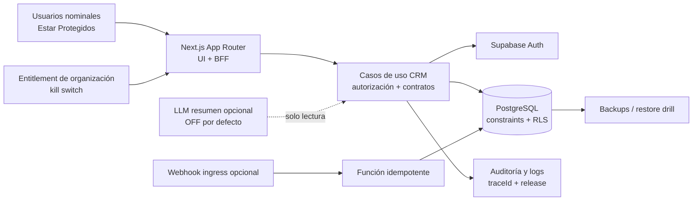

# LoopDev: evaluación CTO y roadmap de 30 días para el piloto CRM

---

| Campo               | Valor                                                                                            |
| ------------------- | ------------------------------------------------------------------------------------------------ |
| Estado              | Propuesto para aprobación ejecutiva                                                              |
| Versión             | 1.0                                                                                              |
| Fecha de evaluación | 2026-08-13                                                                                       |
| Ventana objetivo    | 2026-08-13 a 2026-09-11; contingencia hasta 2026-09-13                                           |
| Cliente piloto      | Estar Protegidos                                                                                 |
| Documento base      | `docs/architecture/LOOPDEV_PRODUCT_ARCHITECTURE_AND_ROADMAP.md`                                  |
| Decisión CTO        | **GO condicional** para un piloto H1 controlado; **NO-GO** para el alcance comercial H2 completo |

## 1. Decisión ejecutiva

La dirección arquitectónica general es correcta: CRM primero, monolito modular, Next.js, Supabase,
base compartida con RLS, contratos compartidos, design system y evolución incremental. No recomiendo
un cambio de stack ni una migración a microservicios. Esa decisión consumiría el mes sin reducir el
riesgo real del producto.

Sí recomiendo cambiar inmediatamente la unidad de planificación. El objetivo de los próximos 30 días
no debe ser «terminar la plataforma LoopDev», sino poner en manos de 3 a 10 usuarios nominales de
Estar Protegidos un único flujo CRM, persistente, autorizado, observable y reversible. El piloto es
viable con dos frentes de ingeniería efectivos y participación diaria de producto/UAT. Con una sola
persona, el alcance debe reducirse a contactos, leads y pipeline.

El sistema actual no está listo para recibir datos reales. Los bloqueantes más importantes son:

1. una política RLS de CRM permite que un rol con `crm.read` ejecute `DELETE`;
2. varias relaciones CRM no garantizan por constraint que padre e hijo pertenezcan al mismo tenant;
3. desactivar una organización o workspace no revoca acceso en todos los helpers;
4. la interfaz principal sigue usando fixtures, estado local y un score de IA aleatorio;
5. las APIs no completan los journeys que la interfaz promete;
6. CI puede omitir lint, typecheck, unit tests y build en cambios normales del frontend web;
7. no hay evidencia versionada de despliegue, observabilidad, restauración o runbooks;
8. faltan pruebas CRM de comportamiento, autorización y aislamiento;
9. el flujo modal crítico no satisface requisitos básicos de accesibilidad;
10. el modelo local mezcla CRM genérico con datos de salud del vertical asegurador.

**Regla de salida:** si los gates de seguridad y persistencia de la semana 1 no se cumplen, el entorno
se denominará UAT privado. No se presentará como «producción controlada».

### 1.1 Decisiones para las próximas 48 horas

1. aprobar por escrito el scope de la sección 6 y nombrar Product Owner, Tech Lead y release owner;
2. congelar Marketing, Quant, mobile, billing, IA y refactors globales hasta G5;
3. ocultar del piloto AI Insights, score aleatorio, cotización, SLA y comunicaciones simuladas;
4. abrir primero `SEC-01/02/03/04`, `DB-01/02`, `CI-01/02` y `CRM-01`;
5. reservar desde hoy las sesiones UAT y el go/no-go del 2026-09-11;
6. decidir si hay dos ingenieros efectivos; si no, aprobar inmediatamente el scope reducido.

## 2. Alcance y límites de esta evaluación

La evaluación se hizo sobre `develop`, commit `6dfeb0d`, con la copia local del repositorio disponible
el 2026-08-13. En ese punto, `develop` estaba 78 commits por delante de `origin/main`.

Se revisaron:

- el roadmap de producto y arquitectura;
- el track activo de CRM;
- frontend CRM, shell y design system;
- rutas BFF y servicios CRM;
- migraciones y pruebas SQL de Supabase;
- GitHub Actions, scripts de validación, tests y skills;
- contratos compartidos y estructura del monorepo.

Limitaciones que deben quedar explícitas:

- no hubo acceso al dashboard ni a la configuración viva de Supabase;
- el CLI de GitHub no pudo consultar PRs remotos por token inválido y proxy local; se auditó el
  historial Git disponible;
- `pnpm validate:ci` no comenzó a ejecutar código porque el gestor no pudo verificar la firma de
  `pnpm@9.0.0` contra el registro desde este entorno;
- Vitest completo no pudo arrancar inicialmente dentro del sandbox porque `esbuild` recibió
  `spawn EPERM`; al repetirlo con permiso, ejecutó 257 tests correctamente, pero 69 suites no
  llegaron a cargar por una instalación local inconsistente de `aria-hidden`/`react-remove-scroll`;
- Turbo alcanzó 3 de 10 tareas antes de que pnpm fallara al hacer `chmod` sobre su store local; la
  repetición de lint/build fuera del sandbox no fue autorizada, por lo que no se declaran verificados;
- esta revisión es de arquitectura y repositorio; no sustituye un pentest ni una revisión legal.

Los checks read-only focalizados sí aportaron evidencia: el scope checker pasó, 48 tests de los
validadores pasaron de forma secuencial, Playwright enumeró 72 casos y auditorías aisladas ejecutaron
76 tests en 15 suites. En la corrida amplia, 66 archivos/257 tests pasaron y 69 suites fallaron durante
el import por dependencias locales ausentes; no hubo assertions rojas. Esto **no es un verde**: el
bootstrap reproducible queda como deuda P0 de CI/toolchain. Además, un `tsc --noEmit` directo de
`loopdev-os` encontró un error vigente en `services/marketing/repository.test.ts:41`: el fixture
omite `status` y `currency`. No se pudo ejecutar pgTAP local sin Supabase CLI/Docker.

Por tanto, backup, PITR, región, SMTP, rate limits, MFA, Network Restrictions, Security Advisor y
secrets de producción son **condiciones por verificar**, no capacidades asumidas.

## 3. Diagnóstico de preparación

La escala siguiente no es una métrica matemática; expresa riesgo de entrega: rojo bloquea datos
reales, ámbar requiere trabajo dentro del mes y verde es suficiente para el piloto.

| Área                      | Estado               | Evaluación objetiva                                                                                                                          |
| ------------------------- | -------------------- | -------------------------------------------------------------------------------------------------------------------------------------------- |
| Estrategia de producto    | Ámbar                | CRM-first y design partner son buenas decisiones; H0/H1/H2 mezclan demasiados horizontes sin capacidad ni fechas.                            |
| Frontend CRM              | Rojo                 | Es un prototipo visual avanzado: la autoridad sigue siendo `INITIAL_LEADS` y `useState`; varias capacidades son simuladas.                   |
| Backend/BFF               | Ámbar-rojo           | Hay auth, contratos y servicios útiles, pero el CRUD y los journeys están incompletos y la validación es inconsistente.                      |
| Datos y multi-tenancy     | Rojo                 | La base es aprovechable, pero las policies y la falta de FKs compuestas impiden usar datos reales.                                           |
| Infraestructura/operación | Rojo                 | No hay `render.yaml`, health/readiness, error tracking, release evidence ni restore drill versionados.                                       |
| Tests de plataforma/DS    | Ámbar-verde          | Existe una inversión considerable en Vitest, Playwright, Axe, contratos y pgTAP.                                                             |
| Tests del CRM             | Rojo                 | Casi no hay pruebas de rutas, componentes, workflows, permisos o persistencia CRM.                                                           |
| CI y automatización       | Ámbar-rojo           | La superficie de scripts es buena, pero hay rutas de falsos verdes y varias fuentes de verdad.                                               |
| Design system             | Ámbar                | Hay primitives y contratos valiosos; la deuda de tokens y accesibilidad no está certificada de extremo a extremo.                            |
| IA/LLM                    | Rojo para producción | La arquitectura propuesta es razonable; no existe un caso productivo con evals, ledger, privacidad y kill switch.                            |
| Skills                    | Ámbar-rojo           | Hay cuatro skills ejecutables útiles, pero la biblioteca histórica se confunde con automatización vigente y no tiene evaluación sistemática. |

Resumen: la **dirección** está aproximadamente en 7/10; la **preparación operativa del CRM** está
aproximadamente en 3/10. El mes debe cerrar esa diferencia, no ampliar la plataforma.

## 4. Evidencia crítica y contradicciones

### 4.1 Seguridad de datos

- `supabase/migrations/20260827000000_crm_core_catalog_foundation.sql:318-319` concede
  `SELECT, INSERT, UPDATE, DELETE` y crea una única policy `FOR ALL`. En PostgreSQL, `DELETE` evalúa
  `USING` pero no `WITH CHECK`; por ello `crm.read` basta para borrar una fila por PostgREST.
- La misma policy se aplica a `crm_audit_events`, de modo que el supuesto registro de auditoría se
  puede modificar o borrar por el camino ordinario.
- Relaciones como lead-contacto u oportunidad-lead referencian el ID, pero no siempre el par
  `(id, organization_id)`. RLS reduce exposición, pero no evita que un bug privilegiado persista una
  referencia cruzada entre tenants.
- `has_organization_permission` valida la membresía, pero no siempre `organizations.is_active`;
  `can_access_workspace` tampoco acredita el estado del workspace. Los kill switches documentados
  no están completos.
- Communications usa una capacidad amplia sobre cuentas, templates, mensajes, estados y webhooks.
  Si entra en el piloto, los permisos deben separarse por lectura, envío, configuración y moderación.
- `supabase/tests/database` solo contiene `001` a `004` para plataforma, marketing y content engine;
  no hay matriz pgTAP de CRM o Communications.

Estas condiciones son P0. Deben corregirse mediante migraciones **forward-only**; no se deben
reescribir migraciones ya aplicadas.

### 4.2 Verdad de producto y frontend

- `apps/loopdev-os/src/app/sales-crm/context/index.tsx:125-400` define fixtures, mantiene leads en
  memoria, cambia etapas localmente y genera `aiScore` con `Math.random()`.
- `apps/loopdev-os/src/app/sales-crm/context/LeadDetailContext.tsx` mantiene notas, tareas,
  documentos y comunicaciones en estado local.
- `apps/loopdev-os/src/app/sales-crm/ai-insights/page.tsx:44` afirma evaluar más de 15 variables en
  tiempo real sin un motor productivo que lo respalde.
- `apps/loopdev-os/src/app/sales-crm/layout.tsx:190-200` construye un `accessMap` habilitado de forma
  local, en lugar de derivarlo de permisos y entitlements reales.
- `MasterDetailModal` es un portal propio sin semántica de diálogo, trap/restauración de foco y
  manejo completo de teclado.
- el tipo `Lead` local incluye DNI, fecha de nacimiento, altura, peso, fumador y notas médicas,
  mezclando CRM Core con Insurance Pack.

La interfaz no puede llegar al piloto con dos fuentes de verdad. El corte debe ser vertical: cuando un
slice usa API real, no conserva fallback silencioso a fixture.

### 4.3 Backend incompleto

Existen rutas para crear contactos, oportunidades, actividades, tareas y notas, además de listar/crear
leads y capturar un lead. Faltan, entre otras, lectura y edición consistente de contactos, detalle y
transición de lead/oportunidad, timeline, completar tareas, Customer 360 y agregados reales.

`captureLead` compensa parcialmente fallos borrando el lead, pero una operación de varios pasos sin
transacción puede dejar un contacto huérfano o fallar por carreras. Debe convertirse en una operación
transaccional e idempotente en PostgreSQL o en un único caso de uso con garantías equivalentes.

La normalización de teléfono tampoco tiene una autoridad única: la base define
`phone_normalized`, mientras el servicio busca por `phone` y puede insertar sin poblar el valor
normalizado. Debe resolverse en DB mediante RPC/trigger/columna generada y upsert atómico.

### 4.4 CI y documentación

- `.github/workflows/ci.yml:248-280` ejecuta el job de calidad completo solo cuando
  `full_fallback == true`; un cambio normal de `apps/loopdev-os` puede recibir E2E sin recibir todos
  los checks estáticos y unitarios.
- `.github/workflows/ci.yml:110` contiene una excepción por nombre exacto de rama
  `feature/suiteshell-composition`. La política de calidad no debe depender del nombre de una rama.
- `apps/loopdev-os/package.json` no define `typecheck`; el `turbo typecheck` anunciado no certifica
  TypeScript de la aplicación web. Un `tsc` directo demuestra que hoy existe al menos un error que
  ese gate no detecta;
- el format check puede no recibir base/head en CI y declarar «sin archivos cambiados»;
- la cobertura se genera sin thresholds y el artifact puede subirse aunque no exista;
- los E2E «authenticated» usan bypass de cliente: sirven para shell/visual, no prueban Supabase Auth,
  memberships ni RLS reales;
- CodeQL está condicionado a repositorio público; si el repositorio es privado, el job puede quedar
  omitido sin reemplazo;
- `supabase/config.toml:63` apunta a `./seed.sql`, que no existe; sí existe `seed_loopdev.sql`;
- el roadmap dice que `SuiteRuntime`/`SuiteCanvas` no pertenecen al baseline, pero ambos están
  exportados, probados y usados en `develop`. El documento quedó obsoleto al publicarse;
- el track CRM conserva checklists y un «next action» que se contradicen con las migraciones y el
  estado actual;
- hay siete tracks activos, por encima del WIP máximo de tres recomendado por el propio roadmap.

## 5. Decisiones de arquitectura

| Decisión                                           | Acción                           | Motivo                                                                                        |
| -------------------------------------------------- | -------------------------------- | --------------------------------------------------------------------------------------------- |
| CRM primero + Estar Protegidos como design partner | **Mantener**                     | Maximiza aprendizaje con un buyer real y evita construir plataforma sin uso.                  |
| Marketing y Quant durante el mes                   | **Congelar**                     | Reducen capacidad y no son dependencia del critical path CRM.                                 |
| Monolito modular Next.js                           | **Mantener**                     | Es la opción de menor coordinación y mejor velocidad para el tamaño actual.                   |
| Supabase Auth/Postgres/RLS/Storage                 | **Mantener y endurecer**         | Ya existe inversión útil; el problema son invariantes y evidencia, no el producto base.       |
| Base compartida multi-tenant                       | **Mantener**                     | Es suficiente para el piloto; no crear base/proyecto por cliente.                             |
| App Router como UI + BFF                           | **Mantener**                     | Evita otro backend y conserva autorización cerca del request.                                 |
| `service_role`                                     | **Restringir**                   | Nunca para requests ordinarios; solo webhooks/jobs explícitos con scope derivado y auditoría. |
| Contratos Zod compartidos                          | **Consolidar**                   | Deben ser la autoridad de comandos y respuestas, con un mapper por entidad.                   |
| TanStack Query                                     | **Adoptar ya en CRM**            | Separa server state de UI state y permite cache tenant-aware e invalidación correcta.         |
| FSD                                                | **Aplicar de forma incremental** | No hacer una mudanza masiva; estructurar solo slices tocados.                                 |
| DDD completo por capas                             | **Aplicar selectivamente**       | Usar casos de uso y puertos donde hay comportamiento; evitar carpetas ceremoniales.           |
| CRM Core separado de Insurance Pack                | **Mantener y hacer cumplir**     | Reduce acoplamiento y exposición de datos de salud.                                           |
| Customer 360                                       | **Entregar mínimo y tipado**     | Es valioso para el agente; evitar un agregador genérico antes de conocer las queries reales.  |
| Catálogo/cotización Insurance                      | **Diferir**                      | Está en H2 y no debe bloquear el flujo CRM core.                                              |
| Communications                                     | **Reducir a inbound opcional**   | Outbound exige credenciales, consentimiento, retry y operación aún no certificados.           |
| Shell/DS                                           | **Congelar salvo P0/P1**         | `SuiteRuntime` ya está integrado; otra convergencia transversal no genera valor de piloto.    |
| Worker Node                                        | **Diferir**                      | Añadirlo solo cuando haya un consumidor asíncrono real y operable.                            |
| `pgmq`/outbox                                      | **Preparar, no generalizar**     | Usarlo al introducir entrega asíncrona; no crear un event bus por anticipado.                 |
| Microservicios, Kafka, Kubernetes, Redis           | **No adoptar**                   | Complejidad operacional sin volumen ni límites de dominio que la justifiquen.                 |
| Billing/Stripe                                     | **Diferir**                      | El design partner puede tener contrato y facturación manual durante el piloto.                |
| Entitlements                                       | **Implementar allowlist mínima** | Hace posible el canary sin construir billing o un control plane completo.                     |
| CRM móvil                                          | **Diferir**                      | Responsive web es suficiente; mobile permanece en mantenimiento.                              |
| IA autónoma/RAG/vector DB                          | **Diferir**                      | No existe todavía un caso evaluado que pague la complejidad.                                  |
| Adaptador neutral de LLM                           | **Diseñar solo al primer caso**  | Evita lock-in sin anticipar un router multi-provider que no tiene consumidor.                 |
| Skills propuestas                                  | **Dos ahora; una condicional**   | Automatizar comandos estables; no multiplicar documentación aspiracional.                     |
| Staging/prod y observabilidad                      | **Implementar ahora**            | Son parte del producto operable, no hardening posterior al lanzamiento.                       |

### 5.1 Estructura objetivo mínima

No se requiere mover todo `apps/loopdev-os`. El código nuevo o modificado del CRM debe converger a:

```text
apps/loopdev-os/src/
  app/
    sales-crm/                 # rutas y composición; sin reglas de negocio
    api/crm/                   # adaptadores HTTP delgados
  modules/crm/
    api/                       # query keys y cliente tipado
    model/                     # view models y estado exclusivamente de UI
    contacts/
    leads/
    pipeline/
    work/
    customer-360/
    index.ts                   # API pública del módulo
  server/modules/crm/
    application/               # casos de uso y autorización explícita
    domain/                    # invariantes que sí tienen comportamiento
    infrastructure/            # Supabase repositories y mappers
```

Reglas:

- `app` puede importar la API pública de `modules/crm`, no internals;
- el navegador no usa `service_role` ni accede a tablas CRM directamente;
- la query key incluye organización, workspace y filtros;
- cambiar organización cancela/invalida queries y borra estado seleccionado;
- los Route Handlers validan entrada **y salida** contra contratos compartidos;
- no promover código a `shared` hasta tener un segundo consumidor real.

### 5.2 Arquitectura de ejecución del piloto



Para el mes, el deploy mínimo es un servicio web y Supabase. Se añade un worker únicamente si se
aprueba WhatsApp saliente o un job cuya entrega, retry y DLQ sean parte del alcance.

### 5.3 Estrategia de Git y releases

`develop` no debe desplegarse directamente como producción cuando está 78 commits por delante de
`main`. La estrategia del mes será:

1. branches cortas desde `develop`, PRs verticales de uno o dos días y WIP uno por persona;
2. staging sigue `develop`;
3. desde la semana 3, congelar trabajo no CRM;
4. promoción explícita `develop -> main` con full certification y aprobación;
5. producción sigue `main` o un tag firmado;
6. si no se puede congelar `develop`, cortar una única `release/estar-protegidos-pilot` en semana 3;
7. eliminar excepciones de CI por nombre de rama.

No mantener dos líneas de release si el equipo puede congelar trabajo ajeno al piloto.

## 6. Contrato exacto del piloto

### 6.1 Resultado de negocio

Un agente autorizado de Estar Protegidos puede crear o encontrar un contacto, convertir/capturar un
lead, moverlo persistentemente por el pipeline, registrar notas y tareas, completar una tarea y revisar
la historia mínima del cliente. El mismo flujo sobrevive recarga y cambio de dispositivo. Un viewer no
puede mutarlo y otro tenant no puede leerlo ni referenciarlo.

### 6.2 Incluido

1. login, recuperación y aprovisionamiento manual de usuarios;
2. organización, workspace, marca y permisos reales;
3. contactos: listar, buscar, crear, editar y ver detalle;
4. leads: listar, buscar, crear/capturar, editar y ver detalle;
5. oportunidades/pipeline: listar y transición persistente de etapa;
6. notas, actividades, tareas y finalización de tareas;
7. Customer 360 mínimo, tipado y basado en datos reales;
8. dashboard solo con agregados reales; si no está listo, se oculta;
9. importación única de datos validada, con dry-run y reporte de rechazos;
10. exportación administrativa mínima si Estar Protegidos la exige para reversibilidad;
11. auditoría de mutaciones, trazabilidad de errores y soporte operativo;
12. desktop y tablet responsive, teclado y estados loading/empty/error/forbidden;
13. activación exclusiva por organización y kill switch.

### 6.3 Excluido

- billing, suscripciones y autoservicio;
- CRM nativo móvil;
- AI Insights, scoring, recomendación o mutación con IA;
- RAG, vector database, agentes autónomos y routing multi-modelo;
- extracción documental y OCR;
- cotización o elegibilidad aseguradora automatizada;
- email completo;
- WhatsApp outbound, templates, media y campañas;
- analítica avanzada o warehouse;
- refactor global de shell, FSD o design system;
- Marketing Studio, Quant y nuevas suites.

WhatsApp inbound/read-only puede entrar como **stretch goal** al final de la semana 3 únicamente si
todos los gates core están verdes. No desplaza seguridad, persistencia, accesibilidad o UAT.

### 6.4 Definición de «producción controlada»

- una organización cliente y solo workspaces acordados;
- 3 a 10 usuarios nominales; sin signup público;
- onboarding, roles y carga inicial ejecutados manualmente con doble verificación;
- feature entitlement server-side y kill switch por organización;
- horario de soporte y canal de incidente acordados;
- hypercare de 48 horas y revisión diaria durante la primera semana;
- datos y finalidades aprobados por el responsable de tratamiento;
- rollback de aplicación probado y restauración de datos ensayada;
- sin afirmaciones de SLA comercial más allá del SLO interno acordado.

### 6.5 Dependencias del cliente y de negocio

Antes del final de la semana 1, Estar Protegidos/LoopDev deben aportar:

- product owner con capacidad diaria de decisión;
- 3 a 10 usuarios nominales, roles y workspaces;
- definición de las etapas reales y campos mínimos;
- dataset de prueba sintético o pseudonimizado y formato de importación;
- decisiones sobre retención, exportación, soporte y rollback;
- revisión de privacidad/DPA y base para cualquier dato de salud;
- dos sesiones UAT por semana desde la semana 2;
- firma de aceptación del critical path, no de una lista de pantallas.

Si falta una de estas dependencias, no se sustituye por una suposición técnica: se reduce alcance o se
mantiene el entorno como UAT.

## 7. Arquitectura por capa

### 7.1 Frontend

1. Sustituir `SalesCrmProvider` y `LeadDetailContext` por TanStack Query slice a slice.
2. Mantener en contexto solo estado efímero: selección, filtros locales y apertura de paneles.
3. Implementar optimistic update solo para transición de etapa y revertir ante error; usar
   `updated_at` o versión para detectar write conflicts.
4. Derivar acciones visibles de permisos reales. Un viewer no ve controles de mutación.
5. Eliminar del bundle productivo fixtures y claims falsos de IA, SLA, documentos y comunicaciones.
6. Reemplazar el modal crítico por una abstracción accesible basada en Radix Dialog, ya disponible.
7. Certificar únicamente los primitives usados por CRM; no abrir una campaña de saneamiento global.
8. Aplicar tokens semánticos y bloquear nuevos valores visuales directos en código compartido.
9. Añadir una regla de imports para impedir deep imports y dependencias desde módulos hacia `app`.

### 7.2 BFF y backend

Los Route Handlers siguen este flujo único:

```text
request -> sesión -> tenant/workspace -> permiso -> parse Zod
        -> caso de uso -> repository JWT/RLS -> parse de respuesta
        -> envelope + traceId -> log estructurado
```

API mínima requerida:

| Recurso          | Operaciones del piloto                                           |
| ---------------- | ---------------------------------------------------------------- |
| Contacts         | `GET` paginado/búsqueda, `POST`, `GET /:id`, `PATCH /:id`        |
| Leads            | `GET`, `POST`, `GET /:id`, `PATCH /:id`, captura idempotente     |
| Opportunities    | `GET`, `POST`, `PATCH /:id/stage` con control de concurrencia    |
| Notes/activities | `GET` por entidad y `POST`                                       |
| Tasks            | `GET`, `POST`, `PATCH /:id/complete`                             |
| Customer 360     | `GET /contacts/:id/workspace` con respuesta estrictamente tipada |
| Dashboard        | `GET /summary`; se omite la pantalla si no existe dato real      |

Convenciones obligatorias:

- envelope de error `{ code, message, traceId, fieldErrors? }`;
- códigos estables: `UNAUTHENTICATED`, `FORBIDDEN`, `NOT_FOUND`, `CONFLICT`,
  `VALIDATION_ERROR`;
- cursor o paginación y límites explícitos; no descargar tablas completas;
- `Idempotency-Key` en captura/importación/webhooks;
- logs sin payloads personales y con IDs de tenant controlados;
- ninguna mutación multi-tabla crítica sin transacción;
- un solo mapper por entidad y tipos derivados de Zod/DB, no interfaces duplicadas;
- rate limit y protección antiabuso en capture y webhooks;
- corregir el manejo de cookies server-side: `setAll` no puede ignorarse.

### 7.3 Base de datos y Supabase

Crear una migración de hardening posterior al máximo aplicado con estos criterios de aceptación:

1. policies separadas para `SELECT`, `INSERT`, `UPDATE` y `DELETE`;
2. `crm.read` solo permite `SELECT`; `crm.manage` controla altas/cambios/bajas;
3. `crm_audit_events` es insert-only para la ruta normal y no admite update/delete;
4. cada relación tenant-scoped usa unique/FK compuesta con `organization_id`;
5. workspace y brand, cuando existan, también pertenecen a la organización de la fila;
6. organización, workspace y membresía inactivos revocan acceso;
7. funciones `SECURITY DEFINER` fijan `search_path`, minimizan grants y tienen tests;
8. queries del piloto tienen índices y plan razonable medido sobre un volumen representativo;
9. `database.types.ts` se regenera en CI y el diff debe quedar committed;
10. `supabase db reset`, lint y pgTAP pasan desde cero;
11. el seed configurado existe y contiene datos sintéticos, nunca datos reales del cliente.

No añadir nuevos seeds de cliente como migración de schema. La migración actual de Estar Protegidos
no debe reescribirse si fue aplicada; a futuro, el onboarding se ejecuta como comando administrativo
idempotente, auditable y específico por entorno.

Los campos de DNI, fecha de nacimiento, altura, peso, condición de fumador, patologías y notas médicas
no pertenecen al CRM Core. Deben eliminarse del recorrido del piloto o aislarse en Insurance Pack con
propósito, base legitimadora, retención y permisos aprobados. La AEPD considera los datos de salud
[categoría especial](https://www.aepd.es/preguntas-frecuentes/2-tus-obligaciones-como-responsable-del-tratamiento/5-bases-legitimadoras-del-tratamiento/FAQ-0215-cuales-son-las-bases-de-legitimacion-para-el-tratamiento-de-las-categorias-especiales-de-datos);
esta decisión requiere revisión del responsable/DPO, no solo aprobación técnica.

### 7.4 WhatsApp, solo si se aprueba el stretch goal

Hoy existen dos entradas divergentes: una Route Handler Next y una Edge Function. Debe quedar una sola
entrada pública, preferiblemente la Edge Function ya conectada a Meta.

Antes de habilitar inbound:

- verificar firma y replay protection;
- persistir el evento en inbox idempotente antes de confirmar;
- calcular la ventana de 24 horas desde el timestamp del proveedor;
- diferenciar IDs de estados `sent/delivered/read`;
- limitar tamaño, rate y tiempo de proceso;
- registrar estado fallido y replay manual.

Outbound permanece apagado hasta disponer de credenciales por cuenta, consentimiento, idempotencia,
timeout, retry/DLQ, auditoría y un worker operable. Un token global no es aceptable.

### 7.5 Infraestructura y operación

Mantener Render + Supabase durante el piloto. Entregables mínimos:

- `render.yaml` como fuente de verdad del servicio web;
- entornos separados `staging` y `production`, cada uno con Supabase, secrets y dominios propios;
- `GET /api/health/live` sin dependencias y `GET /api/health/ready` con prueba DB acotada;
- deploy de staging desde `develop`; producción desde `main` o tag aprobado;
- auto-deploy de producción solo después de un check agregado `release-gate` que nunca se omite;
- pre-deploy para comprobaciones compatibles, no para seeds destructivos;
- logs JSON con `traceId`, release SHA, route, latency y outcome;
- Sentry para excepciones, trazas esenciales y release correlation, con scrubbing de PII;
- alerta externa de disponibilidad y alertas de error rate/latencia;
- security headers y CSP ajustados a las integraciones reales;
- secrets inventariados, separados y rotables;
- rollback documentado a release anterior;
- backup/PITR verificados y un restore drill a un proyecto aislado.

[Render considera también los checks `skipped` como aprobados](https://render.com/docs/deploys) para
su modo «After CI Checks Pass». Por eso el check requerido debe ser un agregador siempre ejecutado que
falle si falta una validación aplicable.

SLO interno inicial, sujeto a aprobación comercial y capacidad:

| Indicador                      | Objetivo piloto                                         |
| ------------------------------ | ------------------------------------------------------- |
| Disponibilidad mensual         | >= 99,5 %, excluyendo mantenimiento acordado            |
| Error rate 5xx                 | < 1 % en ventanas de 15 minutos                         |
| API crítica p95                | < 800 ms con 25 usuarios concurrentes simulados         |
| RPO                            | <= 24 h con backup diario; <= 5 min si se contrata PITR |
| RTO operativo                  | <= 4 h                                                  |
| Reconocimiento de incidente P1 | <= 30 min en horario de soporte                         |

No anunciar estos valores como SLA contractual hasta medirlos y acordarlos.

### 7.6 IA y LLM

La decisión correcta para el primer go-live es **IA productiva desactivada**. El score aleatorio y los
claims de «Engine AI activo» deben desaparecer. El primer caso admisible, después del flujo core,
sería un resumen de conversación de solo lectura, revisado por una persona y detrás de flag.

Contrato mínimo para ese experimento:

- llamada server-side mediante un puerto `LLMProvider` y OpenAI Responses API;
- `store: false`, región/DPA y política de datos aprobadas;
- JSON Schema estricto y rechazo de salida inválida;
- prompt, modelo, snapshot, dataset y versión registrados;
- timeout, presupuesto, rate limit y kill switch por organización;
- run ledger con tokens/coste/latencia/outcome, sin guardar texto sensible innecesario;
- ningún tool call, envío, cambio de estado o recomendación automática;
- dataset de 30 a 50 casos españoles representativos, anonimizados;
- 100 % de validez de schema, cero fuga cross-tenant y revisión humana de hechos clave.

OpenAI [recomienda Responses API para proyectos nuevos](https://developers.openai.com/api/docs/guides/migrate-to-responses)
y [eval-driven development con evaluación continua y específica de la tarea](https://developers.openai.com/api/docs/guides/evaluation-best-practices).
No recomiendo adoptar ahora la plataforma hospedada OpenAI Evals: la misma documentación anuncia que
quedará read-only el 2026-10-31 y se apagará el 2026-11-30. Para LoopDev, usar Vitest/fixtures
versionadas o Promptfoo local/CI cuando exista el primer caso real. Tampoco introducir multi-agentes
hasta que las evals demuestren que un flujo simple no basta.

## 8. Quality Engineering y CI/CD

### 8.1 Qué conservar

- pnpm/Turbo y GitHub Actions;
- Vitest + Testing Library;
- Playwright + Axe para browser;
- Supabase CLI + pgTAP;
- contratos Zod;
- impact resolver y validation registry;
- Dependabot;
- bypass E2E únicamente para smoke visual/shell.

El repositorio tiene una base considerable —172 archivos de test en el inventario auditado—, pero está
desbalanceada: 95 pertenecen al design system y solo una fracción pequeña prueba comportamiento CRM.
La siguiente inversión marginal debe ir a riesgo de negocio, tenancy y operación.

### 8.2 Matriz mínima de pruebas

| Nivel                  | Qué debe demostrar                                                                   | Gate                         |
| ---------------------- | ------------------------------------------------------------------------------------ | ---------------------------- |
| Unit/contract          | invariantes, Zod, mappers, errores y query keys                                      | Cada PR CRM                  |
| Route handler          | 400/401/403/404/409/500, salida tipada y traceId                                     | Cada ruta CRM tocada         |
| Repository/integration | SQL real, transacciones, concurrencia e idempotencia                                 | Cada caso de uso crítico     |
| pgTAP                  | CRUD por rol, dos organizaciones, FK cross-tenant, kill switches y audit append-only | Todo cambio SQL y release    |
| E2E con bypass         | shell, visual, responsive y navegación rápida                                        | PR frontend                  |
| E2E con Auth real      | login, memberships, RLS y critical path con dos tenants                              | PR CRM y staging             |
| A11y                   | dialog, teclado, foco, nombres, errores y Axe                                        | Componentes/páginas críticas |
| Performance            | p95 y plan de queries con dataset representativo                                     | Antes de go-live             |
| Restore                | backup recuperable e integridad del flujo                                            | Antes de go-live             |

Cinco E2E de negocio son obligatorios:

1. login real -> crear/buscar contacto -> capturar lead;
2. mover oportunidad -> recargar -> comprobar persistencia;
3. crear nota/tarea -> completar tarea -> comprobar timeline;
4. viewer no ve ni puede invocar mutaciones;
5. tenant B no puede leer, mutar ni referenciar datos de tenant A.

Usar datos deterministas y cleanup acotado. No borrar recursivamente bases o proyectos compartidos.

### 8.3 Cobertura

No perseguir 90 % global durante el mes. Aplicar ratchet:

- código CRM nuevo/modificado: >= 85 % lines/functions/statements y >= 80 % branches;
- ramas de auth, permisos, tenant scope, idempotencia y rollback: todos los escenarios identificados;
- ninguna reducción del baseline sin excepción temporal con owner y fecha;
- tests que solo validan schemas no se contabilizan como evidencia del servicio que nombran.

### 8.4 Pipeline objetivo

Todo PR:

1. `policy-and-scope`: convenciones, paths, impacto y plan;
2. `static`: diff de formato real, lint sin warnings nuevos, boundaries, typecheck web y contratos;
3. `unit-contract`: Vitest, todos los tests de scripts y cobertura;
4. `database` si aplica: reset, lint, pgTAP y generated types diff;
5. `crm-integration` si aplica: Supabase local, JWT real, dos organizaciones y API;
6. `crm-critical-e2e` si aplica;
7. `browser-quality`: a11y y responsive crítico;
8. `security`: CodeQL, dependency review y secret scanning;
9. `required-gate`: siempre presente y único check estable para branch protection.

Al mergear a `develop`:

- deploy automático a staging desde Blueprint;
- migraciones expand-only;
- smoke y E2E críticos reales;
- release/error tracking y artifacts;
- bloquear promoción si cualquier gate falla.

En promoción `develop -> main`:

- full certification y aprobación de GitHub Environment;
- backup/preflight;
- canary de usuarios nominales;
- smoke post-deploy y ventana de observación;
- rollback de app ensayado; DB con estrategia expand/migrate/contract.

### 8.5 Correcciones concretas a la automatización actual

1. Añadir `typecheck` real a `apps/loopdev-os`.
2. Pasar base/head al format checker.
3. Ejecutar `tests:scope` y todos los tests de validadores en CI.
4. Descubrir automáticamente tests futuros en `modules/features/entities/widgets/server`.
5. Añadir thresholds y no subir artifacts inexistentes.
6. Retirar la excepción de `feature/suiteshell-composition`.
7. Subir trace, screenshot y HTML report de Playwright; medir retries/flakiness.
8. Mantener suite rápida con bypass y añadir suite crítica sin bypass.
9. Ejecutar CodeQL también en repositorio privado si la licencia lo permite.
10. Añadir dependency review y gitleaks/secret scanning; no duplicar de inmediato con Snyk.
11. Hacer que `validation-registry.json` sea ejecutable y única fuente de routing.
12. Verificar branch protection: no confiar en jobs condicionales como required checks.

### 8.6 Design system y accesibilidad

Durante el mes:

- congelar cambios globales de shell/DS;
- certificar solo los primitives consumidos por el CRM;
- severity P0/P1 para roturas de accesibilidad, API pública, token bypass nuevo y comportamiento;
- incluir `ds/packages/ui` en el audit de tokens, hoy parcialmente excluido;
- baseline para deuda existente y bloqueo de regresiones;
- usar Radix para dialog/focus, no otro modal artesanal;
- exigir teclado, focus visible/restaurado, nombre accesible y Axe sin critical/serious.

La matriz de certificación respaldada por CI será la única fuente de estado. Un track no puede
autodeclararse «certificado» si la matriz o la evidencia siguen pendientes.

## 9. Skills y automatizaciones

### 9.1 Diagnóstico

Las cuatro skills operativas de `.github/skills` tienen valor y se conservan:

- `track-governance`;
- `git-workflow`;
- `validation-framework`;
- `platform-shell`.

Son procedimientos que enrutan a scripts; no son por sí mismas controles. La garantía procede del
script, test y required check que producen evidencia.

`docs/06-ai-skills` es una biblioteca histórica de 11 manuales. Su README/registry contiene claims de
«Active», «production» y cumplimiento total, además de recomendaciones como Prisma, Storybook,
Chromatic y Snyk que no representan la arquitectura actual. Debe reclasificarse como
`legacy/reference`, retirar claims de producción y quedar fuera del routing de agentes.

No crear las siete skills propuestas en el roadmap durante el mes. Primero deben existir comandos
reales y estables. Solo se justifican:

1. `suite-delivery`: scope, vertical slice, evidencia y release gate;
2. `supabase-multitenancy`: patrón de migración, RLS/FK, pgTAP y stop conditions;
3. `render-operations`, opcional y solo antes del primer deploy.

### 9.2 Contrato de calidad de una skill

Cada skill activa debe tener:

- owner, versión, propósito y fecha de revisión;
- triggers y non-triggers con fixtures positivos/negativos;
- inputs, precondiciones y permisos;
- comandos exactos que existen en el repo;
- evidencia esperada y criterio de éxito;
- stop/escalation conditions;
- referencias versionadas, no estado mutable de branches/tracks;
- test CI de frontmatter, enlaces, comandos y routing;
- métrica de utilidad: activaciones correctas, falsos positivos, fallos y tiempo ahorrado.

Regla: **skill describe; script ejecuta; CI garantiza; artifact demuestra**.

### 9.3 Gobernanza lean

- máximo tres tracks activos: CRM pilot, data/security y release quality;
- cerrar o aparcar temporalmente Mobile, Quant, Marketing y governance no bloqueante;
- un dashboard generado, nunca porcentajes mantenidos a mano;
- revisión semanal de deuda, no reuniones por cada documento;
- no duplicar la misma regla en skill, track, README y workflow: enlazar la fuente canónica.

## 10. Herramientas

### 10.1 Mantener

| Herramienta                      | Decisión                                                                       |
| -------------------------------- | ------------------------------------------------------------------------------ |
| Next.js 16 / React 19            | Mantener; no añadir Nest/FastAPI para el CRM.                                  |
| Supabase                         | Mantener; endurecer RLS, auth, backups, types y operación.                     |
| pnpm + Turbo                     | Mantener, pero consolidar workspaces/lockfiles salvo independencia deliberada. |
| Zod + shared contracts           | Convertir en autoridad de request y response.                                  |
| TanStack Query                   | Usar como autoridad de server state en frontend CRM.                           |
| Vitest/RTL                       | Mantener y reorientar a casos de uso CRM.                                      |
| Playwright/Axe                   | Mantener; separar smoke con bypass de integración real.                        |
| pgTAP/Supabase CLI               | Convertir en gate absoluto de multi-tenancy.                                   |
| Radix UI                         | Reutilizar para dialog y primitives accesibles.                                |
| GitHub Actions/Dependabot/CodeQL | Mantener y corregir su cobertura efectiva.                                     |

### 10.2 Añadir ahora

| Herramienta/capacidad          | Uso                                     | Condición                               |
| ------------------------------ | --------------------------------------- | --------------------------------------- |
| Sentry SDK para Next.js        | errores, trazas esenciales, release SHA | PII scrub, sampling y alertas definidos |
| Logger JSON estructurado       | traceId, route, latency, outcome        | sin payloads personales                 |
| Render Blueprint               | infraestructura reproducible            | staging/prod separados y validate en CI |
| Secret/dependency review       | seguridad de supply chain               | required gate                           |
| Entitlement server-side simple | canary/kill switch por organización     | no construir billing                    |

OpenTelemetry puede usarse como API de instrumentación server-side si no retrasa Sentry. En JavaScript,
[traces y métricas están estables, mientras logs siguen en desarrollo](https://opentelemetry.io/docs/languages/js/);
no hacer una plataforma de telemetría completa este mes.

### 10.3 Evaluar después del piloto

| Herramienta                  | Cuándo                                                                                    |
| ---------------------------- | ----------------------------------------------------------------------------------------- |
| PostHog                      | analytics/flags cuando exista consentimiento, esquema de eventos sin PII y necesidad real |
| Promptfoo                    | al activar el primer caso LLM, para evals y red teaming local/CI                          |
| Steiger o dependency-cruiser | cuando la estructura FSD-lite exista y necesite enforcement                               |
| k6/Artillery                 | cuando crezca carga o haya SLO contractual                                                |
| Storybook/Chromatic          | cuando el DS requiera colaboración visual continua; no es gate del piloto                 |
| Snyk                         | solo si requisitos contractuales superan GitHub-native; evitar duplicación                |

### 10.4 No añadir ahora

- microservicios o segundo framework backend;
- Kubernetes, Terraform, Kafka, Redis o event bus genérico;
- vector database o framework de agentes;
- data warehouse;
- plataforma comercial de feature flags si un entitlement simple resuelve el canary;
- paquetes compartidos sin dos consumidores.

Los plugins opcionales de Codex Security y Sentry pueden mejorar el flujo del equipo más adelante, pero
no sustituyen el runtime SDK, las policies, los tests o CI. No son dependencia del plan de 30 días.

## 11. Roadmap de 30 días

### 11.1 Modelo de capacidad

Roles mínimos; pueden ser personas o responsabilidades combinadas:

| Rol                                    | Dedicación mínima | Responsabilidad                             |
| -------------------------------------- | ----------------: | ------------------------------------------- |
| Product owner Estar Protegidos/LoopDev | 30-60 min diarios | decisiones, datos, criterios y aceptación   |
| Tech lead / release owner              |              50 % | arquitectura, gates, riesgos, promoción     |
| Full-stack CRM                         |             100 % | vertical slices y E2E                       |
| Backend/data/platform                  |             100 % | SQL/RLS, integración, CI e infraestructura  |
| QA/UAT/UX                              |           25-50 % | journeys, accesibilidad, evidencia y triage |

Con dos ingenieros efectivos, ejecutar dos carriles: **producto** y **plataforma/calidad**. Con una sola
persona, eliminar Customer 360 agregado, dashboard, importador self-service y WhatsApp; mantener
contactos, leads, pipeline y tareas/notas básicas.

Estimación de orden de magnitud:

| Bloque                               | Esfuerzo esperado       |
| ------------------------------------ | ----------------------- |
| Seguridad, migraciones y pgTAP       | 7-9 engineer-days       |
| Verticales CRM frontend + backend    | 16-20 engineer-days     |
| CI, integración y E2E                | 5-7 engineer-days       |
| Infraestructura, observabilidad y DR | 5-7 engineer-days       |
| UAT, hardening, formación y cutover  | 4-6 engineer-days       |
| **Total**                            | **37-49 engineer-days** |

La estimación confirma que dos ingenieros durante 20 días laborables están en el límite. El plan
necesita apoyo parcial de QA/Tech Lead y una reserva del 15 %; esa reserva se obtiene eliminando
stretch goals, no reduciendo los gates. Si el equipo disponible está por debajo, el alcance reducido
debe aprobarse en G0.

### 11.2 Calendario y gates

| Fecha                  | Objetivo                               | Entregables verificables                                                                                                                   | Gate                                                                                   |
| ---------------------- | -------------------------------------- | ------------------------------------------------------------------------------------------------------------------------------------------ | -------------------------------------------------------------------------------------- |
| Ago 13-14, D0-D2       | Charter y freeze                       | scope firmado, roles/datos, baseline shell, tracks reconciliados, features simuladas ocultas                                               | **G0:** owner, capacidad, UAT y alcance aprobados                                      |
| Ago 17-21, Semana 1    | Seguridad y primera verdad persistente | policies por verbo, FKs tenant-aware, kill switches, audit append-only, seed/types, pgTAP; required-gate; contacto list/create/detail real | **G1:** viewer no muta; cross-tenant falla; reset/lint/pgTAP verdes; contacto persiste |
| Ago 24-28, Semana 2    | Lead y pipeline end-to-end             | captura transaccional/idempotente, lead list/detail/edit, oportunidad/stage persistente, TanStack Query, route/integration/E2E             | **G2:** contacto -> lead -> etapa sobrevive reload y tenant B no accede                |
| Ago 31-Sep 4, Semana 3 | Operación diaria y staging             | notas/tareas/timeline, Customer 360 mínimo, dashboard real u oculto, import dry-run, Render staging, logs/Sentry/health, UAT 1             | **G3:** agente completa jornada crítica; deploy/rollback reproducibles; soak iniciado  |
| Sep 7-9, Semana 4A     | Hardening                              | defects UAT P0/P1, auth/secrets/rate limits, a11y, performance, restore drill, runbooks, formación                                         | **G4:** cero P0; restore/rollback; UAT firmado                                         |
| Sep 10-11, Semana 4B   | Canary y go-live                       | prod aislado, usuarios nominales, carga doblemente validada, smoke, monitoreo, hypercare                                                   | **G5:** go/no-go de dos personas                                                       |
| Sep 12-13              | Contingencia                           | solo fix P0/P1 o rollback                                                                                                                  | no ampliar alcance                                                                     |

### 11.3 Backlog ejecutable

| ID     | Prioridad | Entregable                 | Criterio de aceptación                                        | Owner            |
| ------ | --------- | -------------------------- | ------------------------------------------------------------- | ---------------- |
| SEC-01 | P0        | Policies CRM por verbo     | viewer no ejecuta insert/update/delete en ninguna tabla CRM   | Data             |
| SEC-02 | P0        | Integridad tenant-aware    | toda FK tenant-owned rechaza padre de otra organización       | Data             |
| SEC-03 | P0        | Kill switches              | membership/org/workspace inactivos revocan UI, API y DB       | Data/Backend     |
| SEC-04 | P0        | Audit append-only          | sesión normal no modifica ni borra eventos                    | Data             |
| DB-01  | P0        | pgTAP CRM/Comms            | matriz de dos tenants/roles y casos negativos en CI           | Data/QA          |
| DB-02  | P0        | Reset, seed y types        | clean replay verde; seed sintético existente; types sin drift | Data             |
| CRM-01 | P0        | Contact vertical           | CRUD acordado, búsqueda, auth, reload y E2E                   | Full-stack       |
| CRM-02 | P0        | Lead capture               | transacción, normalización e idempotencia concurrente         | Backend          |
| CRM-03 | P0        | Pipeline vertical          | transición persistente, auditada y conflict-safe              | Full-stack       |
| CRM-04 | P0        | Work vertical              | notas/tareas/timeline y completar tarea                       | Full-stack       |
| CRM-05 | P1        | Customer 360               | contrato estricto; solo datos autorizados y reales            | Full-stack       |
| CRM-06 | P1        | Dashboard/import           | agregados reales; import dry-run/reject report                | Full-stack       |
| UX-01  | P0        | Retiro de simulación       | sin fixtures, AI score ni claims falsos en piloto             | Frontend/Product |
| UX-02  | P1        | Diálogo accesible          | role/name/focus/Escape/restore/keyboard + tests               | Frontend         |
| CI-01  | P0        | Required gate              | siempre aparece y detecta jobs aplicables omitidos/fallidos   | Platform         |
| CI-02  | P0        | Checks reales web          | format diff, lint, typecheck, unit, build y coverage          | Platform         |
| CI-03  | P0        | E2E con Auth real          | dos tenants y cinco journeys críticos                         | QA/Full-stack    |
| OPS-01 | P0        | Staging/prod reproducibles | Blueprint, entornos/secrets separados, approvals              | Platform         |
| OPS-02 | P0        | Observabilidad             | health, logs, Sentry, synthetic y alertas                     | Platform         |
| OPS-03 | P0        | Continuidad                | backup verificado, restore drill, rollback/runbook            | Platform         |
| GOV-01 | P1        | Una fuente de estado       | roadmap/track/matriz reconciliados; WIP <= 3                  | Tech lead        |
| SKL-01 | P2        | Skills lean                | legacy archivado y dos skills conectadas a comandos           | Tech lead        |

Regla de prioridad: ningún P1 o stretch goal desplaza un P0. Cada ticket debe caber en uno o dos días;
si no, se divide por vertical observable.

### 11.4 Cadencia

- 15 minutos diarios: riesgos/gates, no reporte de actividad;
- demo diaria sobre staging del slice terminado;
- dos ventanas UAT por semana;
- triage P0/P1 diario con owner y fecha;
- go/no-go de 30 minutos al cerrar cada gate;
- viernes: evidencia, métricas y reducción de alcance si el burn-up amenaza la fecha.

No medir éxito por story points, número de PRs o cobertura aislada. Medir journeys completados y riesgo
eliminado.

## 12. Gates absolutos de go-live

### 12.1 NO-GO automático

No se cargan datos reales ni se llama al entorno «producción controlada» si ocurre cualquiera:

- clean migration replay, lint, pgTAP o generated types no están verdes;
- viewer puede modificar/borrar o se acepta una referencia cross-tenant;
- desactivar membership, organización o workspace no revoca acceso;
- un flujo de usuario usa `service_role`;
- el critical path aún depende de fixtures, estado local o una capacidad simulada;
- no existe proyecto, secrets y dominio de producción separados;
- `NEXT_PUBLIC_E2E_AUTH_BYPASS` aparece en producción;
- no hay health, error tracking, alertas, owner de soporte y rollback;
- no existe restore drill exitoso;
- los cinco E2E H1 no pasan contra staging con Auth/RLS reales;
- hay P0 o P1 abierto en tenancy, auth, corrupción/pérdida de datos o critical path;
- UAT no está firmado;
- capture/webhook público carece de firma/idempotencia/rate limit;
- WhatsApp outbound está activo sin consentimiento, credenciales por cuenta, retry y auditoría;
- se procesan datos de salud sin decisión documentada de privacidad y acceso.

### 12.2 Evidencia positiva requerida

- G0-G4 firmados;
- release SHA exacto y changelog;
- cero P0; P1 no crítico aceptado por owner con fecha y mitigación;
- flujo login -> contacto -> lead -> etapa -> tarea/nota -> cliente -> logout;
- aislamiento probado en UI, API y DB con dos organizaciones;
- performance dentro del objetivo con dataset representativo;
- a11y del critical path sin violaciones critical/serious y teclado manual;
- restore drill y RPO/RTO aprobados;
- staging estable 3 a 5 días laborables;
- lista nominal de usuarios y roles revisada;
- runbook de incidente, soporte y rollback ensayados;
- aprobación de Tech Lead, Product Owner y representante de Estar Protegidos.

## 13. Métricas del piloto

### 13.1 Producto

| Métrica                                | Objetivo de 14 días                        |
| -------------------------------------- | ------------------------------------------ |
| Usuarios invitados que completan login | >= 90 %                                    |
| Usuarios activos semanales             | >= 70 % de invitados                       |
| Critical path completado sin ayuda     | >= 90 % de intentos UAT                    |
| Leads que conservan estado tras reload | 100 %                                      |
| Mutaciones fallidas no explicadas      | 0                                          |
| Tiempo mediano contacto -> lead        | baseline medido; no imponer meta sin datos |

### 13.2 Calidad y operación

| Métrica                                    | Objetivo                          |
| ------------------------------------------ | --------------------------------- |
| Incidentes cross-tenant o pérdida de datos | 0                                 |
| P0 escapados a producción                  | 0                                 |
| Change failure rate                        | < 15 % durante piloto             |
| Mean time to restore app                   | < 60 min para rollback de release |
| Flaky rate critical E2E                    | < 2 %                             |
| Alertas accionables con owner              | 100 %                             |
| Errores con release SHA y traceId          | 100 % de 5xx                      |

Las métricas no incluyen vanity metrics como número de skills, archivos de test o prompts. Esas cifras
solo son útiles si explican un riesgo cubierto.

## 14. Riesgos y contingencias

| Riesgo                             | Señal temprana                                  | Respuesta                                                                             |
| ---------------------------------- | ----------------------------------------------- | ------------------------------------------------------------------------------------- |
| Capacidad de un solo ingeniero     | P0 de semana 1 se arrastra a martes de semana 2 | recortar a contactos/leads/pipeline; quitar dashboard, import self-service y WhatsApp |
| Migraciones remotas divergentes    | clean replay no coincide con ledger             | detener features, reconciliar forward-only y ensayar staging                          |
| Cliente no entrega datos/criterios | UAT cancelado o campos cambian                  | usar sintéticos y mantener UAT; no asumir ni cargar datos reales                      |
| Scope creep Insurance/WhatsApp/AI  | tickets nuevos entran al sprint                 | decisión escrita de trade-off; solo entra si se elimina alcance equivalente           |
| CI tarda demasiado                 | > 15 min de feedback de PR                      | fast path determinista + full nightly; nunca omitir gates aplicables                  |
| Flakiness local/dependencias       | suites no arrancan en clean install             | fijar toolchain, cache verificable y bootstrap hermético                              |
| PII en logs/analytics/LLM          | payload aparece en observabilidad               | scrub inmediato, rotación/incident review y feature off                               |
| Release no reversible por SQL      | cambio contractivo en semana 4                  | solo expand; cleanup después del piloto                                               |
| Main demasiado atrasado            | conflicto en promoción                          | ensayo develop -> main en semana 1 y freeze temprano                                  |

## 15. Cambios recomendados al roadmap principal

Después de aprobar este documento:

1. marcar el roadmap principal como arquitectura objetivo, no inventario de implementación;
2. actualizar el baseline real de `SuiteRuntime`/`SuiteCanvas`;
3. reemplazar H0/H1 inmediato por este release train fechado;
4. resolver la contradicción conversación/cotización H2 frente al scope H1;
5. añadir explícitamente integridad FK tenant-aware, policies por verbo y audit append-only;
6. convertir «production controlled» en el contrato operativo de la sección 6.4;
7. separar CRM Core de Insurance Pack y su privacidad;
8. reducir a tres tracks activos;
9. referenciar una única matriz de certificación generada;
10. convertir los backlogs de AI/skills/billing en decisiones diferidas con trigger de reactivación.

Triggers de reactivación:

- **WhatsApp outbound:** flujo core verde + consentimiento/credenciales/worker/retry;
- **IA:** caso de negocio + dataset/evals + privacidad + kill switch;
- **billing:** segundo cliente o necesidad de autoservicio;
- **worker:** primer job con durabilidad/retry explícitos;
- **FSD completa:** al menos dos equipos o fricción medible de límites;
- **microservicio:** escala/ownership/deploy independiente demostrado, no preferencia estética.

## 16. Decisión final

**Aprobar el piloto CRM controlado con GO condicional y freeze inmediato de alcance.**

La apuesta de mayor retorno no es construir más plataforma. Es demostrar que el núcleo actual puede
operar con verdad de datos, aislamiento, trazabilidad y una cadencia de release confiable. Completar
ese camino en un mes convierte el roadmap en una base escalable. Saltarlo para entregar IA, WhatsApp,
billing o una arquitectura más distribuida produciría más superficie y duplicidad sobre una base aún
no certificada.

El 2026-09-11 se toma una decisión binaria:

- si todos los gates están verdes, activar el anillo nominal de Estar Protegidos y comenzar hypercare;
- si falla un gate absoluto, continuar como UAT privado, publicar la evidencia faltante y reprogramar
  go-live. No rebautizar el riesgo como «producción controlada».

## 17. Fuentes de referencia

### 17.1 Repositorio

- `docs/architecture/LOOPDEV_PRODUCT_ARCHITECTURE_AND_ROADMAP.md`
- `tracks/active/crm/2026-08-08-estar-protegidos-crm-platform.md`
- `apps/loopdev-os/src/app/sales-crm`
- `apps/loopdev-os/src/app/api/crm`
- `apps/loopdev-os/src/services/crm`
- `supabase/migrations/20260827000000_crm_core_catalog_foundation.sql`
- `supabase/migrations/20260901000000_communications_tenant_integrity.sql`
- `supabase/tests/database`
- `.github/workflows/ci.yml`
- `.github/workflows/supabase.yml`
- `scripts/validate-plan.mjs`
- `.github/skills`
- `docs/06-ai-skills`

### 17.2 Referencias externas vigentes al 2026-08-13

- [Supabase Production Checklist](https://supabase.com/docs/guides/deployment/going-into-prod)
- [Supabase database backups](https://supabase.com/features/database-backups)
- [Render Blueprints](https://render.com/docs/infrastructure-as-code)
- [Render health checks](https://render.com/docs/health-checks)
- [Render deploy behavior](https://render.com/docs/deploys)
- [OpenAI: migrate to Responses API](https://developers.openai.com/api/docs/guides/migrate-to-responses)
- [OpenAI: API data controls](https://developers.openai.com/api/docs/guides/your-data#default-usage-policies-by-endpoint)
- [OpenAI: evaluation best practices](https://developers.openai.com/api/docs/guides/evaluation-best-practices)
- [OpenTelemetry JavaScript status](https://opentelemetry.io/docs/languages/js/)
- [Promptfoo eval/CI](https://www.promptfoo.dev/docs/integrations/ci-cd/)
- [PostHog feature flags](https://posthog.com/docs/feature-flags)
- [EDPB: privacy by design and default](https://www.edpb.europa.eu/topics/ai-and-technology/privacy-by-design-and-by-default_en)
- [AEPD: categorías especiales y datos de salud](https://www.aepd.es/preguntas-frecuentes/2-tus-obligaciones-como-responsable-del-tratamiento/5-bases-legitimadoras-del-tratamiento/FAQ-0215-cuales-son-las-bases-de-legitimacion-para-el-tratamiento-de-las-categorias-especiales-de-datos)
