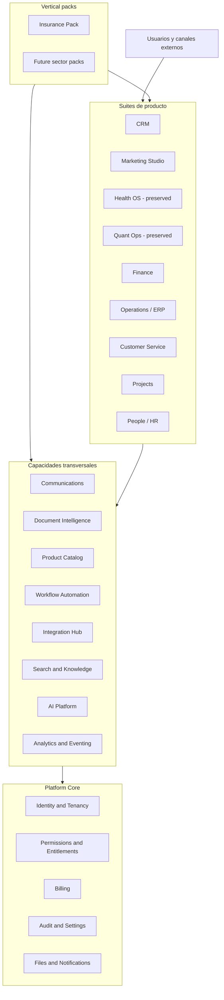
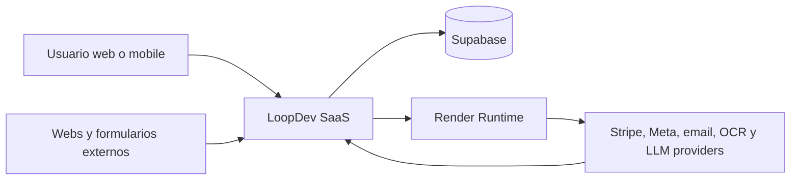
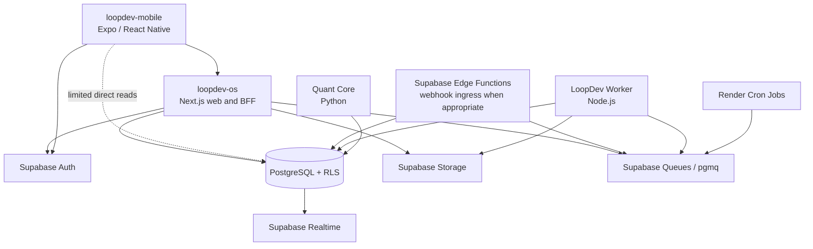
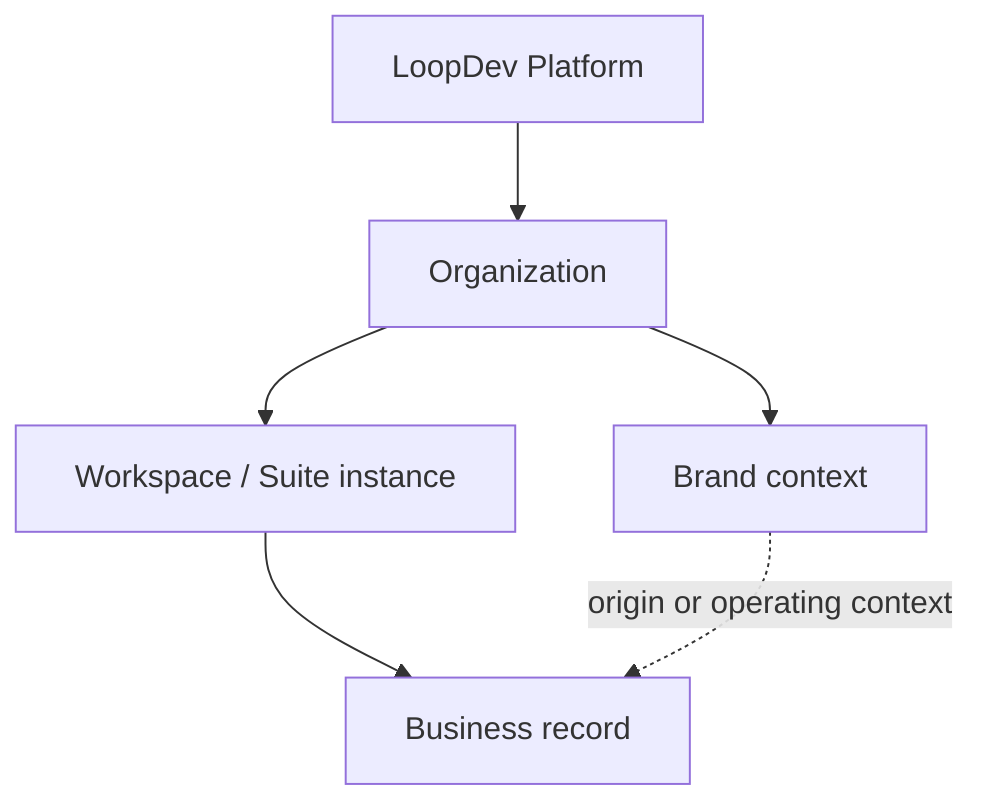
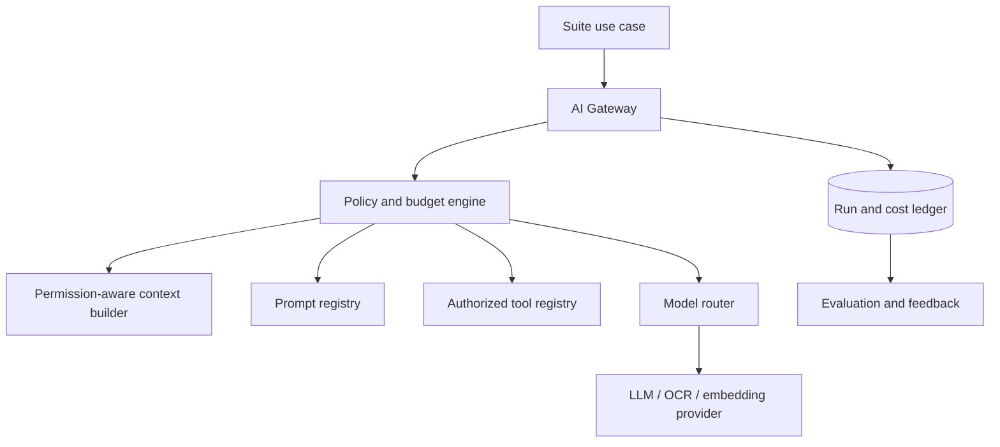
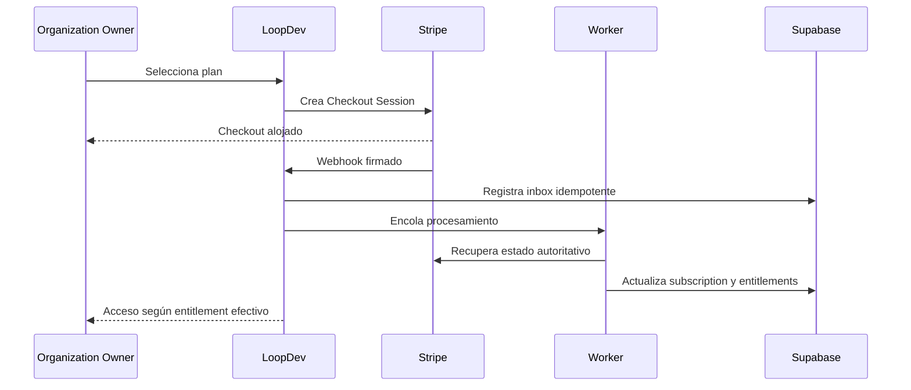

# LoopDev Product Architecture and Development Roadmap

## 1. Control del documento

### 1.1 Propósito

Este documento propone la arquitectura de producto, la arquitectura técnica y el sistema de
ejecución que deben guiar la evolución de LoopDev. Su objetivo es evitar que la plataforma siga
creciendo como una suma de piezas aisladas y convertir el trabajo existente en un programa
coherente, priorizado y verificable.

La propuesta parte del código y las migraciones actuales. No plantea reiniciar LoopDev, eliminar
las suites existentes ni reemplazar tecnologías que ya resuelven correctamente su función. Plantea
ordenar el producto alrededor de límites estables y entregar valor mediante vertical slices.

### 1.2 Estado y aprobación

El estado inicial es `proposed`. Mientras no sea aprobado explícitamente:

- describe la dirección recomendada, pero no cambia por sí solo el estado de ningún track;
- no autoriza eliminaciones, migraciones destructivas ni cierres de trabajo existente;
- no reemplaza decisiones aprobadas registradas en tracks o contratos implementados;
- puede ser revisado por secciones antes de convertirse en referencia normativa.

Después de su aprobación, los cambios importantes de dirección deberán registrarse como una
decisión aprobada en el track correspondiente y, cuando sean decisiones arquitectónicas duraderas,
en un ADR.

Registro de aprobación:

| Versión | Fecha      | Estado   | Aprobado por | Alcance                                 |
| ------- | ---------- | -------- | ------------ | --------------------------------------- |
| 0.2     | 2026-08-12 | proposed | Pendiente    | Primera arquitectura y roadmap integral |

Una enmienda posterior a la aprobación debe actualizar `version`, `updated` y `next_review`,
registrar la decisión en el program track afectado y crear o reemplazar un ADR cuando cambie un
contrato arquitectónico durable. Una revisión editorial sin impacto de alcance puede permanecer en
este documento con evidencia en Git.

### 1.3 Audiencia

- Product owner y responsables de priorización.
- Ingeniería web, mobile, backend, datos e infraestructura.
- Agentes de IA que creen, revisen o ejecuten tracks.
- Equipos que desarrollen nuevas suites o vertical packs.
- Personas responsables de seguridad, operaciones y soporte.

### 1.4 Jerarquía de fuentes

Cuando dos fuentes se contradigan, se aplicará esta jerarquía:

1. El código desplegado, las migraciones aplicadas y la configuración de infraestructura describen
   el estado real del sistema.
2. Los contratos públicos y ADR aprobados gobiernan interfaces y decisiones arquitectónicas
   vigentes.
3. Este documento, una vez aprobado, gobierna la dirección de producto y arquitectura objetivo.
4. Los tracks gobiernan alcance ejecutable, fases, decisiones, evidencia y cierre.
5. Las skills gobiernan el procedimiento repetible para ejecutar un tipo de trabajo.
6. Las guías y documentos históricos aportan contexto, pero no pueden contradecir las fuentes
   anteriores.

### 1.5 Documentos que requieren reconciliación

Las siguientes fuentes contienen conocimiento útil, pero mezclan estados antiguos y modernos:

- `AI_CONTEXT.md` está centrado en Quant y contiene una fecha y una visión parcial desactualizadas.
- `conductor/product.md` todavía prioriza Marketing Studio antes que CRM.
- `conductor/tech-stack.md` es válido en gran parte, pero no describe FSD ni la arquitectura AI.
- `conductor/inventory-loopdev.md` refleja un corte anterior a las migraciones actuales de CRM y
  Communications.
- `docs/01-foundations/SAAS_DATA_MODEL.md` usa `tenants` como modelo objetivo, ya sustituido por
  `organizations` y memberships reales.
- `docs/01-foundations/ARCHITECTURAL_DECISIONS.md` contiene ideas válidas sobre contratos y
  módulos, pero rutas, paquetes y algunas relaciones de dependencia no representan el repositorio
  actual.
- La documentación integrada describe `AppShell`, `SuiteShell`, `ModuleShell` y `ModuleWorkspace`.
  El track activo de shell evalúa `SuiteRuntime` y `SuiteCanvas` en una rama todavía no fusionada;
  esa composición es candidata, no baseline aprobado de `develop`.
- `docs/06-ai-skills` es una biblioteca histórica de conocimiento, no el catálogo actual de skills
  ejecutables de VS Code.

La reconciliación de estas fuentes será trabajo posterior. No se eliminarán hasta comprobar que la
información vigente está preservada.

## 2. Resumen ejecutivo

LoopDev debe evolucionar como una plataforma SaaS multi-tenant y AI-native compuesta por:

1. Un núcleo de plataforma estable para identidad, tenancy, permisos, billing, auditoría y
   operación.
2. Capacidades transversales reutilizables por todas las suites, como Communications, Document
   Intelligence, Product Catalog, Workflow Automation, Integration Hub y AI Platform.
3. Suites de producto que resuelven dominios horizontales: CRM, Marketing, Finance, Operations,
   Customer Service, Projects y People.
4. Vertical packs que especializan las suites sin contaminar sus modelos genéricos: Insurance y
   futuros sectores.

La estrategia no es construir de inmediato “todo Salesforce más un ERP”. La estrategia es crear una
plataforma que pueda crecer hasta ese alcance sin exigir que el primer producto cargue con toda esa
complejidad.

El primer producto será un piloto de Estar Protegidos construido sobre un CRM Core genérico y un
Insurance Pack desacoplado. El primer camino de valor será:

```text
Captación -> Contacto -> Lead -> Oportunidad -> Conversación -> Cotización -> Seguimiento
```

Después del piloto, CRM se convertirá en un MVP comercial con onboarding, entitlements y billing
self-service sobre Stripe. Marketing Studio será la segunda suite prioritaria y reutilizará Brand
Hub, Communications, CRM attribution y AI Platform.

Quant Ops, Health OS y la aplicación móvil se conservan. Quant queda en mantenimiento; Health queda
pendiente de un marco regulatorio y de datos específico; mobile conserva su fundación y contratos,
pero no persigue paridad durante la construcción inicial de CRM y Marketing.

La arquitectura técnica seguirá siendo un monolito modular sobre Next.js y Supabase. Los workers se
separarán del proceso web por perfil de ejecución, no porque cada dominio deba convertirse en un
microservicio. El frontend adoptará Feature-Sliced Design de forma incremental, empezando por los
nuevos vertical slices de CRM.

## 3. Decisiones de dirección

### 3.1 Decisiones confirmadas en esta iteración

| Decisión                   | Resultado                                                                           |
| -------------------------- | ----------------------------------------------------------------------------------- |
| Primer producto            | Piloto de Estar Protegidos sobre CRM Core genérico e Insurance Pack                 |
| Primera suite prioritaria  | CRM                                                                                 |
| Segunda suite prioritaria  | Marketing Studio                                                                    |
| Roadmap                    | Horizontes y gates, sin fechas artificiales                                         |
| Arquitectura de aplicación | Monolito modular antes que microservicios                                           |
| Arquitectura frontend      | FSD incremental adaptado a Next.js App Router                                       |
| Aplicación móvil           | Mantener fundación; no abrir paridad funcional en el camino crítico                 |
| Quant Ops                  | Conservar y mantener; no priorizar nuevas capacidades                               |
| Billing SaaS               | Incluido en el MVP comercial                                                        |
| Proveedor de billing       | Stripe-first internacional mediante adaptador provider-neutral                      |
| Experiencia de billing     | Self-service: trial, checkout, portal, cambio de plan, cancelación y dunning básico |
| IA                         | Plataforma transversal con evaluación, trazabilidad y human-in-the-loop             |

### 3.2 Decisiones que esta propuesta recomienda

- Usar Supabase Queues/`pgmq` como primera cola durable antes de introducir Redis, Kafka u otra
  plataforma de mensajería.
- Ejecutar inicialmente un worker Node compartido para Communications, Documents, Integrations y
  AI, separando workers solo cuando el perfil de carga lo justifique.
- Usar una base compartida con RLS como modelo multi-tenant estándar y reservar infraestructura
  dedicada para requisitos regulatorios o contractuales demostrados.
- No crear paquetes npm por cada dominio mientras solo exista un consumidor en `loopdev-os`.
- No introducir una capa FSD `pages` paralela a Next App Router.
- No activar agentes autónomos con capacidad de comunicación o mutación hasta disponer de políticas,
  simulación, aprobación, evaluación y kill switch.

Estas recomendaciones deberán aprobarse o ajustarse antes de crear los tracks que las implementen.

## 4. Visión de producto

### 4.1 Visión

LoopDev será un sistema operativo empresarial multi-tenant y AI-native que permita a una
organización gestionar relaciones, marketing, operaciones, finanzas y verticales sectoriales desde
una plataforma común, sin perder aislamiento, trazabilidad ni control humano.

### 4.2 Posicionamiento

LoopDev no competirá inicialmente por cantidad de módulos. Competirá por:

- continuidad real entre captación, venta, comunicación, documentación y operación;
- IA integrada en el flujo, no añadida como un chat desconectado;
- adaptación por industria mediante vertical packs;
- identidad de marca y marketing conectados al contexto comercial;
- arquitectura multiempresa desde el inicio;
- automatización con aprobación y evidencia;
- experiencia coherente en suites construidas sobre el mismo shell y Design System.

### 4.3 Usuario y mercado inicial

El primer ICP es una pyme o empresa mediana con varios equipos, marcas o canales que necesita
coordinar captación, CRM, conversaciones y procesos documentales. Estar Protegidos será el design
partner inicial, no la definición completa del producto.

El piloto debe validar simultáneamente:

- que un equipo comercial puede operar el CRM con datos representativos en UAT y, cuando exista un
  entorno productivo protegido, con datos reales;
- que el núcleo genérico no depende de conceptos de seguros;
- que el Insurance Pack resuelve el flujo sectorial sin forks de la plataforma;
- que tenancy, permisos y trazabilidad soportan una operación real;
- que la arquitectura puede incorporar un segundo tenant sin reescritura.

### 4.4 Regla de generalización

No se generalizará una capacidad solo porque pueda ser útil en el futuro. Una capacidad pasa al core
cuando cumple al menos una de estas condiciones:

- tiene dos consumidores reales de suites diferentes;
- representa una responsabilidad inseparable de la plataforma, como tenancy o billing;
- evita duplicar una integración sensible, como credenciales, webhooks o documentos;
- necesita una política uniforme de seguridad, auditoría o costes.

## 5. Diagnóstico del estado actual

### 5.1 Activos sólidos

- Monorepo pnpm/Turbo con TypeScript estricto.
- Next.js 16.1 y React 19 en `loopdev-os`.
- Supabase Auth, PostgreSQL, RLS, Storage, Realtime y Edge Functions.
- `@loopdev/contracts` con Platform, CRM, Communications, Documents, AI, Catalog, Insurance,
  Marketing y Brands.
- `@loopdev/ui`, tokens y contratos de Design System.
- Platform Core con organizations, memberships, permissions, brands y workspaces.
- Shell integrado basado en `AppShell`, `SuiteShell`, `ModuleShell` y `ModuleWorkspace`, con un track
  activo que propone composición declarativa mediante `SuiteRuntime` y `SuiteCanvas`.
- Migraciones y servicios de CRM Core, lead capture y Communications Core.
- Brand Hub, campañas, Content Engine inicial y DAM offline en Marketing Studio.
- WhatsApp inbound y texto saliente controlado validados en Dev.
- CI, CodeQL, validaciones de contratos, RLS, frontend, Playwright y tracks.
- App Expo/React Native con auth, organización y Launchpad.
- Quant Core Python desacoplado del frontend.

### 5.2 Problemas estructurales

- El roadmap vive repartido en tracks muy amplios con fases duplicadas y prioridades históricas.
- Algunas checklists contradicen evidencia posterior registrada en el mismo track.
- Decisiones transversales como Communications o Document Intelligence están enterradas en CRM.
- El frontend combina rutas, carpetas técnicas globales y algunos dominios bajo `src/suites`.
- Parte del CRM visible sigue usando contexto local y fixtures aunque existan servicios persistentes.
- AI Platform tiene contratos iniciales, pero no una implementación operacional.
- Billing, entitlements y medición SaaS no están modelados.
- No existe `render.yaml` ni despliegue reproducible de staging/production.
- Hay documentación normativa antigua que puede inducir nuevas implementaciones incorrectas.

### 5.3 Matriz de tratamiento

| Superficie           | Decisión                    | Motivo                                                   |
| -------------------- | --------------------------- | -------------------------------------------------------- |
| Monorepo pnpm/Turbo  | Conservar                   | Permite contratos, UI, web, mobile y módulos compartidos |
| Next.js/React        | Conservar                   | Adecuado para web, BFF y server-side operations          |
| Supabase             | Conservar y endurecer       | Ya soporta tenancy, datos, RLS, Storage y eventos        |
| `@loopdev/contracts` | Conservar y ampliar         | Es la frontera pública de datos y comandos               |
| Design System        | Conservar                   | Existe inversión y quality gates sólidos                 |
| Platform Core        | Completar                   | Faltan entitlements, billing, invitaciones y operación   |
| Shell integrado      | Conservar hasta supersesión | Es el contrato disponible en `develop`                   |
| Shell candidato      | Resolver y fusionar         | `SuiteRuntime`/`SuiteCanvas` siguen en una rama activa   |
| CRM backend          | Completar y conectar        | Tiene buena base persistente, pero falta producto usable |
| CRM frontend legacy  | Reorganizar por slices      | Es el primer candidato para adopción incremental de FSD  |
| Marketing Studio     | Preservar y repriorizar     | Es la segunda suite; no debe reconstruirse               |
| AI Platform          | Construir por fases         | Hoy existe intención y contrato, no plataforma operativa |
| Billing              | Crear como Platform Core    | Es requisito del MVP comercial                           |
| Mobile               | Mantener fundación          | Evita dispersar capacidad durante CRM/Marketing          |
| Health OS            | Aparcar expansión           | Requiere modelo regulatorio y de datos dedicado          |
| Quant Ops            | Aparcar expansión           | No está en el camino comercial prioritario               |
| Render               | Implementar staging primero | Falta topología versionada y operación reproducible      |

## 6. Principios arquitectónicos

1. **Monolito modular por defecto.** Se separa una ejecución cuando su carga, disponibilidad,
   lenguaje o riesgo lo exige; no por preferencia organizativa.
2. **Contrato antes que integración.** Toda frontera pública tiene esquema, comando, respuesta,
   errores y compatibilidad definidos.
3. **Aislamiento verificable en cada camino.** RLS es la barrera final para requests ejecutadas con
   JWT de usuario. Los caminos privilegiados que usan service role o credenciales de worker deben
   imponer scope, relaciones y permisos mediante RPCs o roles estrechos y pruebas negativas.
4. **Una autoridad por concepto.** Cada dato tiene un system of record explícito.
5. **Vertical slices sobre capas horizontales.** Una entrega debe completar comportamiento usable,
   persistencia, autorización, observabilidad y pruebas.
6. **Cross-suite sin suite dominante.** Communications, Documents, Catalog, Workflow y AI no
   pertenecen a CRM ni Marketing.
7. **Vertical packs sin contaminar el core.** Los campos sectoriales viven en extensiones con
   relaciones explícitas.
8. **IA asistiva antes que autónoma.** La autonomía aumenta únicamente con evidencia, evaluación y
   mecanismos de control.
9. **Asincronía explícita.** Webhooks y tareas largas son idempotentes, reintentables y observables.
10. **Frontend orientado a negocio.** La estructura debe permitir encontrar Contact, Move Lead o
    Customer 360 sin conocer carpetas técnicas globales.
11. **Evolución incremental.** No se detiene el producto para reorganizar todo el repositorio.
12. **Operabilidad como feature.** Backups, alertas, costes, soporte y rollback forman parte del
    producto SaaS.

## 7. Topología de producto



### 7.1 Platform Core

Platform Core es obligatorio para cualquier suite y no contiene comportamiento sectorial.

| Capacidad      | Responsabilidad core                                     |
| -------------- | -------------------------------------------------------- |
| Identity       | Usuarios, sesiones, MFA y recuperación                   |
| Organizations  | Cliente SaaS, estado, región, timezone y configuración   |
| Memberships    | Relación usuario-organización y ciclo de vida            |
| Workspaces     | Instancia habilitada de una suite y su alcance operativo |
| Brands         | Identidad comercial y contexto de atribución             |
| Permissions    | Acciones permitidas por scope y asignación de roles      |
| Entitlements   | Suites, features, límites y capacidades compradas        |
| Billing        | Suscripción SaaS, invoices, pagos y lifecycle comercial  |
| Suite registry | Catálogo de suites, módulos y versiones habilitadas      |
| Settings       | Preferencias de organización, workspace y usuario        |
| Feature flags  | Rollout técnico separado de entitlement comercial        |
| Audit          | Evidencia inmutable de acciones sensibles                |
| Files          | Registro base, ownership, Storage y políticas de acceso  |
| Notifications  | Entrega y persistencia de notificaciones internas        |
| Platform admin | Operación global separada de membresías de clientes      |

### 7.2 Capacidades transversales

#### Communications Core

Normaliza cuentas, canales, conversaciones, mensajes, plantillas, consentimientos, estados de
entrega, webhooks, reintentos e idempotencia.

Distingue:

- comunicación conversacional entre agente y cliente;
- comunicación de marketing con consentimiento y métricas;
- comunicación transaccional asociada a un proceso.

Las suites no almacenan tokens ni implementan directamente proveedores.

#### Document Intelligence Core

Separa cuatro objetos con ciclos de vida distintos:

1. Documento y versión original inmutable.
2. Resultado de clasificación y extracción provisional.
3. Validación automática con reglas, confianza y discrepancias.
4. Revisión humana con decisión, comentarios y responsable.

El pipeline común incluye upload seguro, validación de tipo/tamaño, malware scanning, OCR,
clasificación, extracción por esquema, revisión, retención y auditoría. Cada suite aporta esquemas y
reglas de dominio.

Incluso antes del OCR, el intake mínimo exige quarantine, allowlist de MIME y extensión, límites de
tamaño, malware scanning, hash, objeto privado, URL firmada, actor, propósito, retención y audit. H2
no puede aceptar documentos reales si esta base no está operativa.

#### Product Catalog Core

Modela lo que una organización usuaria de LoopDev vende: productos, servicios, planes, bundles,
proveedores, categorías, price books y versiones. No modela lo que LoopDev cobra a esa organización.

#### Workflow Automation Core

Ofrece triggers, conditions, actions, timers, approvals, versiones, ejecución, compensación y
auditoría. Los workflows referencian comandos públicos de suites; no escriben tablas ajenas.

#### Integration Hub

Centraliza connections, credenciales referenciadas, OAuth, webhooks, sync jobs, cursors,
reconciliación, rate limits y salud de proveedor.

#### Search and Knowledge

Proporciona búsqueda por permisos, indexación, retrieval y fuentes de conocimiento. Un índice nunca
se convierte en system of record y debe retirar resultados cuando desaparece el acceso original.

#### Analytics and Eventing

Mantiene separados:

- audit events para cumplimiento y trazabilidad;
- domain events para integración interna;
- operational metrics para salud del sistema;
- product analytics para adopción y experiencia;
- business metrics para decisiones de cada suite.

#### AI Platform

Gobierna proveedores, modelos, prompts, contexto, tools, runs, evaluaciones, feedback, seguridad y
costes. Su arquitectura se detalla en la sección 13.

### 7.3 Suites y vertical packs

Una suite es una experiencia de producto navegable, con bounded contexts, permisos y métricas
propios. Un vertical pack compone y extiende suites mediante contratos; no crea un segundo CRM o un
segundo sistema de documentos.

### 7.4 Portfolio y ownership transitorio

| Producto o capacidad      | Tipo             | Estado de portfolio | Owner canónico actual |
| ------------------------- | ---------------- | ------------------- | --------------------- |
| CRM                       | Suite            | Prioridad H1-H2     | `crm`                 |
| Marketing Studio          | Suite            | Prioridad H3        | `marketing-studio`    |
| Health OS                 | Suite preservada | Parked/maintenance  | `health`              |
| Quant Ops                 | Suite preservada | Parked/maintenance  | `quant`               |
| Platform Core             | Plataforma       | Enabling H0-H2      | `platform`            |
| Communications            | Cross-suite      | Enabling H1-H2      | `crm`                 |
| Document Intelligence     | Cross-suite      | Enabling H2-H4      | `ai-platform`         |
| AI Platform               | Cross-suite      | Enabling H2-H4      | `ai-platform`         |
| Catalog/Workflow/Search   | Cross-suite      | Planned             | `platform`            |
| Integration Hub/Analytics | Cross-suite      | Planned             | `platform`            |
| Insurance Pack            | Vertical pack    | Prioridad H2        | `crm`                 |

El owner de esta tabla permite crear tracks con el catálogo vigente; no significa que CRM sea dueño
arquitectónico de Communications ni Insurance. Antes de extraer un nuevo dominio canónico se debe
aprobar un track de governance que actualice `tracks/domains.md`, directorios y validator.

## 8. Catálogo de suites

### 8.1 CRM

**Objetivo:** gestionar relaciones e ingresos desde la captación hasta el handoff operativo.

**Bounded contexts:** Accounts and Contacts, Lead Management, Pipeline, Activities, Customer 360,
Attribution y Sales Configuration.

#### Core

- Contactos y empresas con deduplicación y relaciones.
- Leads, fuentes, campañas y atribución inmutable.
- Pipelines configurables y oportunidades.
- Asignación de agentes y equipos.
- Actividades, tareas, notas internas y timeline.
- Customer 360 mínimo.
- Consentimientos y preferencias de contacto.
- Búsqueda, filtros, importación y exportación controlada.
- Dashboard operativo básico.
- Permisos, RLS y auditoría.

#### Opcional

- Inbox omnicanal sobre Communications Core.
- Secuencias y automatizaciones comerciales.
- Product Catalog, productos por oportunidad y cotizaciones.
- Documentos relacionados con cliente y oportunidad.
- Forecasting, territorios, cuotas y reglas avanzadas de asignación.
- Service cases y handoff a Customer Service.
- Integraciones con calendarios, correo y formularios.
- Scoring, resumen y next-best-action asistidos por IA.

#### Nice to have

- CPQ avanzado.
- Revenue intelligence y forecasting predictivo.
- Conversation intelligence con coaching.
- Partner portal y channel sales.
- Enrichment externo y signals de intención.
- Operación offline móvil.

#### IA prioritaria

- Clasificación de leads.
- Resumen de conversación, cliente y oportunidad.
- Extracción de hechos y compromisos.
- Detección de duplicados sugeridos.
- Siguiente acción y tareas propuestas.
- Borradores de respuesta con aprobación humana.
- Detección de estancamiento y datos faltantes.

### 8.2 Marketing Studio

**Objetivo:** convertir el contexto de marca en contenido, campañas y aprendizaje medible.

**Bounded contexts:** Brand Hub, Assets, Content, Campaigns, Publishing, Insights, Growth y
Compliance.

#### Core

- Brand Hub con identidad, voz, reglas y versiones publicadas.
- Digital Asset Management con metadata, variantes, derechos y colecciones.
- Briefs, content items, copies y versiones.
- Campaign Orchestrator con canales, calendario, presupuesto y UTM.
- Revisión y aprobación.
- Integración de atribución con CRM.
- Métricas básicas con fuente y fecha verificables.
- Connections y settings protegidos.

#### Opcional

- Generación AI de copy y piezas con contexto de marca.
- Publicación social controlada.
- Email journeys y segmentación.
- Experimentos, variantes y Growth Ops.
- Compliance automático con revisión.
- SEO y content intelligence.
- Advisor con evidencia y feedback.

#### Nice to have

- Gestión de paid media y presupuestos publicitarios.
- Marketing mix modeling.
- Optimización predictiva de campañas.
- Influencer and partner workflows.
- Generación multimedia avanzada.
- Localización masiva y adaptación por mercado.

#### IA prioritaria

- Generación y reescritura basada en `BrandContextSnapshot`.
- Clasificación y tagging de assets.
- Checks de claims, tono y reglas.
- Resumen de performance y anomalías.
- Recomendaciones con evidencia, nunca cambios autónomos de gasto o publicación.

### 8.3 Finance

**Objetivo:** ofrecer control financiero y contable conectado a ventas y operaciones.

#### Core

- Chart of accounts y general ledger.
- Accounts receivable y accounts payable.
- Facturas, credit notes y pagos.
- Conciliación bancaria.
- Dimensiones, centros de coste y monedas.
- Period close y estados financieros.
- Configuración fiscal base y auditoría.

#### Opcional

- Gastos y aprobaciones.
- Presupuestos y cash-flow planning.
- Fixed assets.
- Collections y dunning de clientes del tenant.
- Integraciones de nómina e impuestos.
- Consolidación multiempresa.

#### Nice to have

- FP&A asistido por IA.
- Treasury y liquidez avanzada.
- Scenario planning.
- Detección de anomalías y fraude.
- Automated close con controles.

**Nota:** esta suite no sustituye Platform Billing. Finance gestiona las finanzas del cliente;
Platform Billing cobra la suscripción de LoopDev.

### 8.4 Operations / ERP

**Objetivo:** coordinar pedidos, compras, inventario, proveedores y cumplimiento operativo.

#### Core

- Sales orders y purchase orders.
- Proveedores y procurement.
- Inventario, warehouses y movimientos.
- Fulfillment y estados de entrega.
- Product Catalog compartido.
- Tareas, approvals y audit.

#### Opcional

- MRP y planificación.
- Quality management.
- Maintenance.
- Returns and reverse logistics.
- Field service.
- Contract and vendor performance.

#### Nice to have

- Demand forecasting.
- Optimización de rutas e inventario.
- Simulación operativa.
- Digital twin para casos industriales justificados.

### 8.5 Customer Service

**Objetivo:** resolver solicitudes y mantener continuidad con el historial comercial.

#### Core

- Cases/tickets, queues, priority y SLA.
- Communications omnicanal.
- Customer 360 autorizado.
- Knowledge base.
- Asignación, escalado, tareas y timeline.
- CSAT básico y audit.

#### Opcional

- Customer portal.
- Chatbot externo controlado.
- Field service handoff.
- Quality assurance y coaching.
- Entitlements de soporte y contratos.

#### Nice to have

- Agente supervisado de resolución.
- Predicción de churn.
- Workforce optimization.
- Routing semántico avanzado.

### 8.6 Projects / Professional Services

**Objetivo:** planificar y ejecutar trabajo facturable conectado a clientes y finanzas.

#### Core

- Clientes, proyectos, tareas y milestones.
- Tiempo, recursos y disponibilidad.
- Presupuesto, coste e ingreso previsto.
- Handoff hacia Finance.
- Estados, riesgos y audit.

#### Opcional

- Templates y approvals.
- Portfolio y capacity planning.
- Client portal.
- Retainers y billing rules.
- Dependencias y baselines.

#### Nice to have

- Estimación asistida por IA.
- Predicción de riesgo y retrasos.
- Resource matching.
- Generación de status reports.

### 8.7 People / HR

**Objetivo:** gestionar el ciclo de vida de las personas de la organización.

#### Core

- Employee directory y estructura organizativa.
- Onboarding y offboarding.
- Ausencias y vacaciones.
- Documentos laborales.
- Roles, managers y payroll export.
- Auditoría y permisos sensibles.

#### Opcional

- Applicant Tracking System.
- Performance y objetivos.
- Learning and development.
- Attendance y expenses.
- Compensación y beneficios.

#### Nice to have

- Workforce planning.
- Skills graph.
- Engagement intelligence.
- Career path recommendations con revisión humana.

### 8.8 Health OS

Health OS se conserva como vertical regulado. Su reactivación requiere una definición específica de:

- clasificación de datos clínicos y ocupacionales;
- consentimiento y base legal;
- segregación entre CRM comercial y datos sanitarios;
- retención, exportación y borrado;
- acceso de emergencia y auditoría reforzada;
- infraestructura dedicada cuando lo exija el riesgo o contrato;
- requisitos fiscales y sanitarios del mercado objetivo.

El core futuro puede incluir organizaciones, empresas cliente, pacientes, appointments, cases,
contratos, servicios, billing integration y audit. No se ampliará el dominio clínico desde modelos
genéricos sin aprobación regulatoria.

#### Core de mantenimiento

- Mantener auth, tenancy, shell, rutas existentes y controles de acceso.
- Corregir vulnerabilidades y pérdida de compatibilidad.
- Inventariar y clasificar datos ocupacionales y clínicos antes de persistir nuevos flujos.

#### Opcional diferido

- Appointments, cases, contratos, servicios y billing integration.
- Communications y Documents con políticas sanitarias específicas.

#### Nice to have diferido

- Asistencia clínica u ocupacional explicable y supervisada.
- Integraciones regulatorias y analítica poblacional con privacidad reforzada.

### 8.9 Quant Ops

Quant Ops conserva su UI, contratos, migraciones y motor Python de tres tiers. Durante los primeros
horizontes solo se permitirán:

- correcciones de seguridad y datos;
- compatibilidad con Platform Core;
- mantenimiento de secretos y conexiones;
- correcciones operativas críticas;
- documentación necesaria para recuperación.

Nuevas estrategias, exchanges, automatización o expansión de producto quedan fuera del camino
crítico.

#### Core de mantenimiento

- Seguridad, integridad de datos, secretos, conectividad y recuperación.
- Compatibilidad con Platform Core y contratos públicos existentes.

#### Opcional y nice to have diferidos

- Nuevas estrategias, exchanges, backtesting, optimización y automatización.
- Expansión comercial o móvil hasta una decisión explícita de portfolio.

### 8.10 Insurance Pack

Insurance Pack es la primera extensión vertical. Su primer incremento es `Insurance Quoting` y
consume CRM, Catalog, Documents y Communications. Policy administration, onboarding posterior,
emisión, renovaciones y fulfillment componen una extensión operativa futura que dependerá de
Operations; H2 no depende de la suite ERP de H5.

#### Core inicial

- Aseguradoras, productos, planes y coberturas.
- Exclusiones y reglas explícitas de elegibilidad.
- Cotizaciones y versiones.
- Tomador, asegurado y beneficiario como roles de dominio.
- Relación con contact, lead y opportunity.
- Documentos y revisión.
- Handoff operativo mínimo sin administrar todavía el ciclo completo de póliza.

#### Extensión operativa posterior

- Onboarding, emisión y seguimiento.
- Policies, renovaciones, incidencias y fulfillment.
- Integración con Operations y Finance cuando esas suites estén disponibles.

#### Reglas de aislamiento del dominio

- `crm_contacts` no recibe campos de póliza.
- Una persona asegurada no es automáticamente un contacto comunicable.
- La elegibilidad final no la decide un modelo generativo.
- Product Catalog conserva la oferta genérica; Insurance añade cobertura y reglas.
- Las comunicaciones verifican consentimiento, propósito y canal.

## 9. Arquitectura lógica objetivo

### 9.1 Contexto



### 9.2 Contenedores



### 9.3 Responsabilidades de ejecución

| Contenedor     | Responsabilidad                                              | No debe hacer                                           |
| -------------- | ------------------------------------------------------------ | ------------------------------------------------------- |
| `loopdev-os`   | UI, SSR, BFF, comandos sincrónicos y autorización de request | Procesos largos, polling infinito o secretos en cliente |
| Mobile         | Experiencia nativa y acceso mediante contratos               | Contener service role o lógica sensible definitiva      |
| Edge Functions | Webhooks de baja latencia y entrada cercana a Supabase       | Convertirse en un segundo backend sin límites           |
| Worker         | Jobs, proveedores, OCR, AI, reintentos y reconciliación      | Servir tráfico de usuario                               |
| Cron           | Encolar tareas periódicas y mantenimiento acotado            | Ejecutar procesos indefinidos                           |
| Quant Core     | Ingesta, señales y ejecución Quant                           | Acoplar el resto de suites a su modelo Python           |

### 9.4 Monolito modular

Los módulos server-side viven en el mismo repositorio y pueden compartir proceso, pero conservan
ownership explícito:

```text
src/server/
├── platform/
│   ├── tenancy/
│   ├── access/
│   ├── entitlements/
│   └── billing/
├── modules/
│   ├── crm/
│   │   ├── domain/
│   │   ├── application/
│   │   └── infrastructure/
│   ├── communications/
│   ├── documents/
│   ├── marketing/
│   └── ai/
├── integrations/
└── shared-kernel/
```

Reglas:

- `domain` no importa Next.js, Supabase ni proveedores.
- `application` implementa use cases y ports.
- `infrastructure` implementa repositorios, mappers y adapters.
- Route Handlers validan entrada, sesión y scope; delegan al application service.
- Un módulo no importa repositorios internos de otro módulo.
- Las lecturas cross-module usan una API de aplicación, una proyección o un contrato explícito.
- Las foreign keys cross-module se limitan a identidades estables y no transfieren ownership.
- Una mutación que publica hechos escribe estado de dominio y outbox en la misma transacción. El
  dispatcher entrega esos eventos a la queue únicamente después del commit.
- Los flujos largos cross-module usan process managers/sagas, idempotencia y compensación; no una
  transacción distribuida ni escritura directa en tablas ajenas.

## 10. Arquitectura frontend con Feature-Sliced Design

### 10.1 Objetivo

FSD se adopta para que el código de producto se organice por lenguaje de negocio y acciones de
usuario, no para trasladar archivos a una taxonomía nueva sin cambiar el acoplamiento.

### 10.2 Adaptación a Next.js App Router

La arquitectura usará estas capas:

```text
app -> widgets -> features -> entities -> shared
```

- `app` es el App Router real, providers, layouts, Route Handlers y composición global.
- `widgets` contiene bloques de producto grandes y autosuficientes.
- `features` contiene acciones de usuario reutilizables.
- `entities` contiene representación, queries y lógica de una entidad de negocio.
- `shared` contiene API client, configuración, utilidades enfocadas y UI sin negocio que no
  pertenezca a `@loopdev/ui`.

No se creará una segunda capa `pages` porque `src/app` ya representa routing, loading, errors y
layouts de Next. La capa FSD `processes` está deprecada y tampoco se usará. Los flujos multi-step
se compondrán en `app`, widgets o features según su alcance.

### 10.3 Regla de imports

Una capa solo puede importar capas inferiores. Dos slices de la misma capa no se importan entre sí.

```text
Allowed:
  app -> widgets/features/entities/shared
  widgets -> features/entities/shared
  features -> entities/shared
  entities -> shared

Forbidden:
  entities -> features
  features/a -> features/b
  entities/contact -> entities/company
  shared -> business slices
```

Una relación inevitable entre entidades se expone mediante una public API cross-reference explícita
`@x`, de forma que el acoplamiento no quede oculto.

### 10.4 Estructura objetivo

```text
apps/loopdev-os/src/
├── app/
│   ├── (platform)/
│   ├── sales-crm/
│   ├── marketing-studio/
│   └── api/
├── widgets/
│   ├── crm-customer-360/
│   ├── crm-pipeline-board/
│   └── communications-inbox/
├── features/
│   ├── contact/create-contact/
│   ├── contact/update-contact/
│   ├── lead/capture-lead/
│   ├── lead/move-lead-stage/
│   ├── task/complete-task/
│   └── conversation/send-reply/
├── entities/
│   ├── contact/
│   ├── company/
│   ├── lead/
│   ├── opportunity/
│   ├── task/
│   └── conversation/
├── shared/
│   ├── api/
│   ├── config/
│   ├── i18n/
│   ├── lib/
│   └── ui/
└── server/
    ├── platform/
    ├── modules/
    └── integrations/
```

Los segmentos dentro de un slice serán `ui`, `model`, `api`, `lib` y `config` cuando aporten valor.
No se crearán carpetas vacías. Cada slice expone una public API en `index.ts` y sus consumidores no
importan rutas internas.

### 10.5 Relación con packages compartidos

- `@loopdev/ui` sigue siendo la API visual pública y no contiene negocio.
- `@loopdev/contracts` contiene esquemas públicos, DTOs, comandos y eventos compartidos.
- Los contratos de base de datos generados no sustituyen contratos de dominio.
- `shared/ui` solo alberga composición específica de la app que no merece promoverse al Design
  System.
- Un dominio pasa a package solo cuando necesita distribución o tiene más de una app consumidora
  real.

### 10.6 Relación con el shell

La composición estándar aprobada para las suites nuevas se compone así:

```text
AppShell -> SuiteRuntime -> SuiteCanvas -> domain composition
```

`SuiteRuntime` y `SuiteCanvas` superseden conceptualmente la composición anterior para las suites
nuevas. La adopción puede ser incremental y debe conservar compatibilidad explícita con el baseline
existente mientras el track de shell completa su integración.

`SuiteCanvas` es una frontera de composición visual, no una frontera de negocio. Puede seleccionar
modos como `overview`, `data`, `workspace`, `split`, `board` o `full-bleed`, pero no conoce CRM,
contactos, leads, Supabase, permisos de dominio ni mutaciones. La suite entrega configuración,
navegación, acceso y contenido mediante contratos.

FSD organiza el contenido dentro de cada Canvas:

```text
app route -> SuiteRuntime/SuiteCanvas -> widgets -> features -> entities -> shared
```

El shell no importa slices de negocio. Los widgets pueden componer features y entities, y las
features ejecutan acciones de usuario mediante contratos y APIs de aplicación. No se crea una capa
FSD paralela al App Router ni se permite que Canvas se convierta en un contenedor de lógica CRM.

### 10.7 Migración incremental de CRM

El primer slice debe ser Contacts + Customer 360 mínimo:

1. Mantener `src/app/sales-crm` como entrada de ruta delgada.
2. Crear entities para contact, lead, activity y conversation cuando sean consumidas.
3. Crear features solo para acciones reales: create contact, add note, create task.
4. Componer Customer 360 como widget.
5. Mover acceso server-side de `src/services/crm` hacia el módulo CRM al modificar cada use case.
6. Conectar las APIs y contratos existentes sin reescribir migraciones válidas.
7. Retirar el contexto mock solo cuando el slice real cubra su comportamiento.

Todo código nuevo debe respetar FSD. El legacy se migra al tocar una entrega, no mediante un PR de
movimiento masivo.

### 10.8 Guardrails

- Alias estables para capas y packages.
- Check de imports descendentes, slices y public APIs mediante Steiger o herramienta equivalente.
- Detección de ciclos con una única herramienta de boundaries.
- Regla que impida imports de Supabase desde UI de dominio.
- Regla que impida contratos locales duplicados.
- Tests colocados junto al slice y E2E por flujo.
- Excepciones versionadas, con owner y fecha de expiración.

## 11. Datos, tenancy y autorización

### 11.1 Jerarquía de scope



- `organization_id` es la frontera de seguridad principal.
- `workspace_id` identifica una instancia habilitada de suite y su configuración.
- `brand_id` conserva contexto comercial, identidad y atribución; no siempre es barrera de
  seguridad en CRM.
- El record scope se usa para equipos, ownership o casos regulados cuando el dominio lo exige.

### 11.2 Membership, permission y entitlement

Son conceptos distintos:

| Concepto     | Pregunta                                                        |
| ------------ | --------------------------------------------------------------- |
| Membership   | ¿Pertenece este usuario a la organización y está activo?        |
| Permission   | ¿Puede este usuario ejecutar esta acción sobre este scope?      |
| Entitlement  | ¿Tiene la organización habilitada o comprada esta capacidad?    |
| Feature flag | ¿Está esta implementación disponible para este rollout técnico? |

Una acción se permite únicamente cuando las condiciones aplicables son verdaderas.

### 11.3 Invariantes RLS

- Toda tabla de negocio expuesta incluye `organization_id` y RLS.
- Las entidades de workspace y brand validan que sus referencias pertenezcan a la organización.
- Las policies especifican `TO authenticated` y comprueban sesión activa.
- Las columnas consultadas por policies tienen índices.
- Las queries añaden filtros explícitos de scope aunque RLS también los aplique.
- Los helpers `SECURITY DEFINER` viven en schema no expuesto, fijan `search_path` y revocan acceso
  innecesario.
- Las views expuestas usan `security_invoker` o se protegen de forma explícita.
- Service role nunca llega a navegador o mobile.
- Cada migración incluye tests positivos y negativos para múltiples organizaciones.

### 11.4 Caminos privilegiados

Los requests de usuario usan su JWT y RLS siempre que sea posible. Webhooks y workers que necesiten
service role deben cumplir además:

- resolver provider account o job hacia una organización/workspace de confianza, sin aceptar el
  scope directamente del payload externo;
- validar relaciones compuestas de organization, workspace, brand, account y record;
- preferir RPCs estrechos o roles DB dedicados sobre un cliente administrativo genérico;
- limitar tablas y operaciones permitidas por adapter;
- registrar actor de sistema, provider event/job, trace y motivo;
- probar intentos cross-tenant y referencias mezcladas también en caminos service-role;
- no reutilizar un cliente privilegiado en requests ordinarias del BFF.

RLS sigue siendo defensa crítica, pero no protege una operación que la omite explícitamente.

### 11.5 Estrategias de aislamiento

El modelo estándar será base compartida con RLS. Se considerará proyecto Supabase, schema o stack
dedicado cuando exista uno de estos triggers:

- requisito legal o contractual;
- volumen que comprometa SLOs de otros tenants;
- residencia de datos incompatible con el proyecto compartido;
- claves, backups o retención que deban aislarse;
- dominio sanitario o financiero con riesgo demostrado.

La aplicación debe conservar contratos comunes para que el aislamiento físico no obligue a crear un
fork funcional.

### 11.6 Datos sensibles

- Clasificación mínima: public, internal, confidential, restricted.
- PII y documentos usan acceso con propósito, audit y retención.
- URLs de Storage son firmadas y expiran.
- Export, delete, impersonation y cambios de acceso quedan auditados.
- MFA se exige para platform admin, billing owner y operaciones críticas.
- Los logs no almacenan tokens, documentos completos ni prompts sensibles sin política explícita.

## 12. Eventos, colas y trabajo asíncrono

### 12.1 Cuándo usar asincronía

- Webhooks de terceros.
- Envío de comunicaciones.
- Descarga y procesamiento de media.
- OCR y extracción documental.
- Generación o evaluación AI.
- Sincronizaciones e importaciones.
- Reportes, exports y tareas programadas.

### 12.2 Modelo inicial

Supabase Queues/`pgmq` será la primera opción propuesta porque ofrece durabilidad dentro de la
plataforma existente. No se introduce Kafka mientras no exista throughput, replay multi-consumer o
independencia de equipos que lo justifique.

Todo job contiene como mínimo:

```text
id
organization_id
workspace_id? / brand_id?
job_type
schema_version
input_reference or encrypted payload
idempotency_key
status
attempt_count / max_attempts
available_at / lease_until
created_by
trace_id
created_at / started_at / completed_at
last_error_code
```

### 12.3 Outbox e inbox

- Una mutación que produce evento escribe estado y outbox en la misma transacción.
- Después del commit, un dispatcher publica el outbox de forma reintentable; nunca se publica antes
  de que el estado sea durable.
- Cada consumidor registra inbox/idempotency antes de aplicar efectos.
- Un provider event conserva external ID, hash y processing status.
- Los retries usan backoff y dead-letter state observable.
- Los jobs manualmente reintentados conservan el historial anterior.
- Los workflows cross-module de varios pasos usan process managers/sagas con estado explícito,
  timeout y compensación.

### 12.4 Eventos de dominio

Convención propuesta:

```text
<bounded-context>.<aggregate>.<event>.v<version>

crm.lead.created.v1
crm.opportunity.stage-changed.v1
communications.message.received.v1
billing.subscription.activated.v1
documents.extraction.completed.v1
```

Los eventos son hechos inmutables, no comandos disfrazados. No incluyen secretos ni payloads
completos cuando basta una referencia autorizada.

## 13. Arquitectura AI-native

### 13.1 Definición

AI-native no significa añadir un botón de chat a cada pantalla. Significa que la plataforma tiene
una capa común para convertir contexto autorizado en asistencia medible y segura dentro de los
workflows.

### 13.2 Componentes



#### AI Gateway

Punto server-side único para autenticación, organización, task type, timeout, idempotencia,
streaming y errores normalizados.

#### Model catalog and router

Registra proveedor, modelo, región, capacidades, coste, latencia, límites y estado. El caso de uso
solicita una capability; no codifica un modelo directamente.

#### Prompt and policy registry

Versiona prompts, schemas de entrada/salida, guardrails, idiomas, owners, evaluaciones y rollout. Un
cambio de prompt con impacto se trata como cambio de código.

#### Context builder

Recupera únicamente datos que el actor puede consultar. Conserva entity references, permisos,
fuentes, versiones y redacción aplicada.

#### Knowledge/RAG

- Chunks vinculados a fuente, tenant, versión y ACL.
- Retrieval filtra permisos antes de ranking.
- La respuesta conserva evidencia y referencias internas.
- La eliminación de acceso invalida índices y caches.
- No se usa RAG para eludir contratos o queries estructuradas.

#### Tool registry

Cada tool declara input schema, permission, entitlement, riesgo, idempotencia, dry-run y necesidad de
aprobación. El modelo propone; el policy engine autoriza.

#### Run and cost ledger

Registra task type, modelo, prompt version, context version, input hash, tokens/unidades, coste,
latencia, resultado, confianza, actor, tenant y decisión humana. Los payloads sensibles pueden
guardarse por referencia o redacción.

#### Evaluation system

- Datasets por use case y dominio.
- Evaluaciones de schema, groundedness, relevancia, seguridad y coste.
- Regression suite antes de cambiar modelo o prompt.
- Feedback explícito del usuario y resultado downstream.
- Canary rollout y rollback de versión.

### 13.3 Superficies de chatbot

#### Copilot interno

Asistente autenticado dentro del shell. Puede buscar, resumir y proponer acciones según permisos del
usuario. No hereda permisos del platform owner ni de service role.

#### Chatbot externo

Atiende captación o soporte con identidad limitada, consentimiento, rate limiting y toolset
restringido. Una conversación anónima no recibe acceso al Customer 360 completo.

#### Platform Ops Assistant

Ayuda a operadores de LoopDev con métricas, runbooks y diagnósticos. Las operaciones destructivas
requieren aprobación y registro reforzado.

### 13.4 Escalera de autonomía

| Nivel | Capacidad                               | Requisito                                    |
| ----- | --------------------------------------- | -------------------------------------------- |
| 0     | Clasificar, extraer y resumir           | Schema, evidencia y evaluación               |
| 1     | Recomendar respuesta o siguiente acción | Feedback y aprobación humana                 |
| 2     | Preparar mutación en dry-run            | Tool autorizada y diff visible               |
| 3     | Ejecutar acción reversible aprobada     | Idempotencia, audit y compensación           |
| 4     | Automatizar bajo política limitada      | Evals, monitorización, budgets y kill switch |

No se autoriza Nivel 4 para comunicaciones sensibles, elegibilidad de seguros, decisiones clínicas,
decisiones financieras definitivas, publicación o gasto durante los primeros horizontes.

### 13.5 Guardrails

- Secretos y prompts operativos exclusivamente server-side.
- No entrenamiento con datos de clientes salvo acuerdo explícito.
- Redacción de PII antes del proveedor cuando sea viable.
- Retención configurable por organización y use case.
- Budgets y quotas por tenant, suite y task type.
- Rate limiting y circuit breaker por proveedor.
- Output validado con schema antes de uso.
- Evidencia obligatoria para extracción y recomendaciones.
- Aprobación humana para acciones de impacto.
- Kill switch global, por tenant, task y modelo.

### 13.6 Control plane mínimo antes del primer use case

H2 no puede activar una feature AI sin:

- gateway server-side y adapter de proveedor;
- modelo y prompt versionados;
- schema estricto de entrada/salida;
- dataset y eval de regresión del use case;
- autorización y retención definidas;
- run/cost ledger, cap por tenant y alerta de consumo;
- timeout, retries seguros, circuit breaker y kill switch;
- human-in-the-loop cuando el resultado pueda comunicar o mutar.

H4 amplía este control plane para múltiples suites, routing avanzado y gobierno central; no lo
introduce por primera vez.

### 13.7 Primeras capacidades AI

Orden recomendado:

1. Resumen de conversaciones y Customer 360.
2. Clasificación de lead e intención.
3. Extracción provisional de mensajes y documentos.
4. Siguiente acción y tareas sugeridas.
5. Respuestas en borrador.
6. Búsqueda con evidencia.
7. Contexto de marca para contenido.

No se empieza por un agente general que pueda ejecutar cualquier acción.

## 14. Platform Billing y entitlements

### 14.1 Separación de dominios

```text
Product Catalog
  -> lo que el tenant vende a sus clientes

Platform Billing
  -> lo que LoopDev cobra al tenant
```

Sus tablas, contratos, permisos y métricas no se comparten aunque ambos usen conceptos como plan o
precio.

### 14.2 Alcance del MVP comercial

- Catálogo de planes y prices de LoopDev.
- Trial configurable.
- Stripe Checkout.
- Stripe Customer Portal.
- Suscripción mensual/anual.
- Upgrade, downgrade y cancelación.
- Invoices y estado de pago.
- Dunning y grace period básicos.
- Webhooks idempotentes.
- Entitlements por suite y feature.
- Límites medibles de usuarios, storage, mensajes, documentos y AI.
- Overrides administrativos auditados.
- Vista de billing para organization owner.

### 14.3 Arquitectura provider-neutral

```text
Billing application service
  -> BillingProvider port
       -> Stripe adapter
```

Los contratos internos no exponen objetos Stripe como modelo de dominio. El adapter traduce
customer, subscription, invoice, checkout y portal.

### 14.4 Autoridad de datos

- Stripe es autoridad de customers, payment methods, payments, invoices y estado financiero.
- LoopDev es autoridad de organizaciones, entitlements efectivos, usage y overrides.
- La proyección local se actualiza por webhook y reconciliación periódica.
- Nunca se habilita acceso solo porque el navegador vuelva de Checkout.

### 14.5 Modelo local propuesto

```text
billing_customers
billing_subscriptions
billing_subscription_items
billing_provider_events
billing_reconciliation_runs
platform_plans
platform_features
platform_plan_features
organization_entitlements
organization_entitlement_overrides
usage_meters
usage_records
```

No se almacenan números de tarjeta ni datos de pago completos.

### 14.6 Flujo



### 14.7 Estados de acceso

Política inicial propuesta:

- `trialing` y `active`: acceso según plan.
- `past_due`: grace period limitado y avisos.
- `unpaid`: bloquear nuevas mutaciones premium y mantener acceso de recuperación/export según
  política.
- `canceled`: acceso hasta final de periodo si corresponde; después modo restringido.
- Overrides solo por platform admin, con motivo y expiración.

La política final debe revisarse con producto, soporte y requisitos legales antes de producción.

### 14.8 Planes

Se recomienda una estructura inicial sin fijar precios en arquitectura:

- `Starter`: CRM Core y límites bajos.
- `Growth`: CRM ampliado, Communications, Documents y AI assist.
- `Scale`: múltiples workspaces/marcas, controles avanzados, soporte y límites mayores.
- Add-ons de suites o consumo para Marketing, documentos, mensajes y AI.

Los nombres y packaging son hipótesis comerciales; necesitan validación de mercado.

### 14.9 Sobre internacional y fiscal del lanzamiento

`Stripe-first internacional` describe la capacidad del adapter, no autoriza un lanzamiento fiscal
global. El primer lanzamiento comercial se limita a una entidad legal merchant of record, un país
de venta inicial y una moneda de settlement aprobados antes de abrir H2.

El gate de entrada de H2 debe fijar:

- entidad legal y cuenta Stripe propietaria;
- país inicial, moneda, países bloqueados y método de pago;
- billing address y datos fiscales requeridos;
- VAT/impuestos, inclusive/exclusive pricing y decisión sobre Stripe Tax;
- SCA/3DS y autenticación aplicable;
- invoice/receipt legal, numeración y conservación;
- refunds, credits, cancelación y chargebacks;
- términos, privacidad, DPA y soporte de billing.

No se añade un segundo mercado hasta validar impuestos, invoices, moneda, soporte y tratamiento de
datos para ese mercado mediante el track de billing.

## 15. Integraciones y APIs

### 15.1 API interna y externa

- Route Handlers de Next actúan como BFF y API inicial.
- Endpoints públicos estables se versionan bajo `/api/v1` cuando existan consumidores externos.
- Comandos y queries tienen contratos diferentes.
- Errores usan códigos semánticos y `traceId`.
- Paginación es cursor-based para timelines y colecciones de alto volumen.
- Idempotency keys son obligatorias en captura, webhooks, pagos y operaciones reintentables.

### 15.2 Webhooks

- Verificación de firma sobre raw body.
- Respuesta rápida después de persistir inbox.
- Procesamiento asíncrono.
- Dedupe por provider/account/external event ID.
- Payload sensible restringido y con retención.
- Replay controlado y observable.
- Versionado y tolerancia a eventos desconocidos.

### 15.3 Proveedores iniciales

- Stripe para billing SaaS.
- Meta Cloud API para WhatsApp.
- Proveedor de email por decidir mediante adapter.
- OCR/document AI por decidir mediante evaluación.
- LLM y embeddings con routing provider-neutral.

No se incorporará un proveedor sin definir ownership de credenciales, costes, rate limits,
webhooks, observabilidad, fallback y proceso de desconexión.

## 16. Entornos e infraestructura

### 16.1 Entornos

| Entorno    | Propósito                      | Datos                             | Despliegue                   |
| ---------- | ------------------------------ | --------------------------------- | ---------------------------- |
| Local      | Desarrollo y tests             | Fixtures o Supabase local/efímero | Manual                       |
| Dev        | Integración compartida         | Datos sintéticos/controlados      | Continua o manual controlada |
| Staging    | UAT y validación preproducción | Sintético o pseudonimizado        | `develop`                    |
| Production | Clientes reales                | Datos productivos                 | `main` protegido             |

Staging y Production usan proyectos Supabase, credenciales y recursos Render separados.

H1 usa Staging solo para UAT con datos sintéticos o pseudonimizados. Si Estar Protegidos necesita
operar datos personales reales antes del lanzamiento comercial general, se crea un pilot production
ring sobre recursos de Production con controles productivos: acuerdo y propósito de tratamiento,
retención, backups, restore, incident response, observabilidad, acceso mínimo y soporte. Dev o
Staging nunca se renombran de facto como producción.

### 16.2 Topología Render inicial

Un único Blueprint versionado en `render.yaml` gestionará cada conjunto de recursos. La topología
inicial propuesta es:

```text
loopdev-os-web
loopdev-worker
loopdev-scheduler (solo cuando existan tareas periódicas)
```

El worker se implementará como workspace desplegable `apps/loopdev-worker`, no como proceso oculto
de Next.js. Antes de añadirlo al Blueprint debe definir scripts `build`, `start`, `typecheck` y
`test`, registry de queues y handlers, concurrencia por job type, lease/heartbeat, graceful shutdown,
credenciales, métricas y ownership. Un heartbeat y alertas sustituyen al health HTTP de un
background worker sin tráfico entrante.

El worker inicial procesa queues de Communications, Documents, Integrations, Billing y AI con
concurrencia y límites por tipo. Se separará un worker cuando exista aislamiento de carga,
dependencias o disponibilidad que lo justifique.

Quant Core puede desplegarse como servicio independiente cuando vuelva a activarse. No bloquea el
MVP CRM.

### 16.3 Blueprint y secretos

- `render.yaml` es la fuente de topología, build/start commands y nombres de variables.
- Los valores secretos usan `sync: false` o secret groups separados.
- Ningún recurso se gestiona desde dos Blueprints.
- Cambios manuales en Dashboard deben reconciliarse con el Blueprint.
- Staging puede usar auto-deploy; Production requiere aprobación protegida.

### 16.4 Secuencia de despliegue

1. Validar contratos, calidad, build y tests.
2. Validar migraciones en base efímera.
3. Aplicar migraciones compatibles al entorno.
4. Desplegar worker y web con estrategia compatible hacia atrás.
5. Ejecutar smoke tests y E2E críticos.
6. Comprobar queues, logs y métricas.
7. Promover o ejecutar rollback de aplicación; las migraciones destructivas requieren estrategia
   expand/migrate/contract.

### 16.5 Supabase

- Git es la fuente de migraciones.
- Production nace limpia desde migraciones revisadas.
- Tipos generados se actualizan después del schema aprobado.
- RLS tests se ejecutan en CI con varias organizaciones y roles.
- Backups y point-in-time recovery se configuran según plan y criticidad.
- Debe existir un restore drill periódico, no solo una confirmación de que hay backups.

## 17. Seguridad, observabilidad y operación

### 17.1 Seguridad mínima

- Threat model para auth, tenancy, uploads, webhooks, billing y AI tools.
- Secret scanning y CodeQL.
- Dependency review y actualización controlada.
- Rate limiting para auth, capture, webhooks, exports, AI y uploads.
- MFA para operaciones privilegiadas.
- Auditoría de impersonation y soporte.
- CORS, CSP y headers seguros.
- Política de incidentes, revocación y rotación de secretos.

### 17.2 Observabilidad

Cada request y job conserva `trace_id`, `organization_id` redacted/hashed cuando corresponda,
actor, bounded context y outcome.

Se necesitan:

- logs estructurados;
- error tracking;
- métricas de web, DB, queues, providers y AI;
- distributed tracing cuando web-worker-provider lo requiera;
- dashboards por entorno;
- alertas accionables con runbook;
- health y readiness checks;
- synthetic checks de login, CRM y billing.

### 17.3 SLOs iniciales propuestos

Los valores se aprobarán con capacidad real, pero deben medirse desde staging:

- disponibilidad web mensual;
- p95 de queries y comandos interactivos;
- tiempo máximo de procesamiento de webhook;
- queue latency y job success rate;
- tiempo de recuperación de provider failures;
- RPO y RTO de datos;
- coste AI por organización y workflow.

### 17.4 Runbooks obligatorios

- Supabase/DB no disponible.
- RLS o permiso incorrecto.
- Queue detenida o dead letters.
- Webhook de Meta o Stripe fallando.
- Provider LLM degradado.
- Billing/entitlement desincronizado.
- Despliegue Render fallido.
- Restore de backup.
- Fuga o exposición de secreto.

## 18. Quality gates

### 18.1 Por cambio

| Impacto          | Gate mínimo                                                          |
| ---------------- | -------------------------------------------------------------------- |
| Contracts        | Build, typecheck, tests de schema y consumidores                     |
| Frontend slice   | FSD boundaries, unit/component, shell checks y E2E del flujo         |
| Database         | Migration reset/dry-run, constraints, RLS matrix y generated types   |
| Webhook/provider | Signature, idempotency, retries, error mapping y sandbox             |
| Queue/worker     | Lease, retries, recovery, dead-letter y observabilidad               |
| AI               | Contract, eval set, safety, cost, timeout y human approval           |
| Billing          | Stripe test mode, webhook replay, lifecycle y entitlement projection |
| Render           | Blueprint validation, build, deploy smoke y rollback                 |

### 18.2 Definition of Ready de un vertical slice

- Outcome de usuario medible.
- Suite, workspace y scopes identificados.
- Contratos de comandos y lecturas definidos.
- Impacto de schema, RLS, Storage, secrets, AI y billing explícito.
- Estados loading, empty, error, forbidden, offline y success cuando apliquen.
- Rollout, rollback y observabilidad definidos.
- Dependencias y blockers reales declarados.

### 18.3 Definition of Done

- Flujo usable sobre datos autoritativos.
- Contratos y public APIs estables.
- Autorización server-side y RLS verificadas.
- Tests proporcionales al riesgo.
- Eventos/jobs idempotentes si aplica.
- Logs, métricas y errores accionables.
- Documentación y track actualizados con evidencia.
- Sin fixtures silenciosos en producción.
- Validación en staging cuando afecta integración o infraestructura.

## 19. Roadmap por horizontes

Las fechas se asignarán después de conocer capacidad, equipo y throughput. Un horizonte no se abre
porque haya pasado tiempo; se abre cuando cumple su gate de entrada.

| Horizonte | Owner                    | Entrada y dependencias                                 | Evidencia/KPI de salida                                                             |
| --------- | ------------------------ | ------------------------------------------------------ | ----------------------------------------------------------------------------------- |
| H0        | `platform`               | Arquitectura aprobada                                  | Baseline reconciliado, boundary checks verdes y staging reproducible desde Git      |
| H1        | `crm`                    | H0, shell aprobado, Platform Core/RLS y UAT disponible | 100% del flujo crítico completado por piloto y 0 fallos cross-tenant P0/P1          |
| H2        | `crm`                    | H1, mercado fiscal y control planes AI/Documents       | Un tenant adicional onboarded, pago live controlado y entitlement reconciliado      |
| H3        | `marketing-studio`       | H2 y atribución CRM estable                            | Una campaña end-to-end en dos organizaciones sin publicación no autorizada          |
| H4        | `platform`/`ai-platform` | Dos consumidores reales por capacidad                  | 100% de runs AI con coste atribuible y dos suites por capability promovida          |
| H5        | Owner de suite           | H4 y señal comercial aprobada                          | Design partner y compromiso comercial antes del primer delivery track de cada suite |

No se inicia el horizonte siguiente hasta adjuntar su evidencia de salida al program track. Los
targets operativos más finos se fijan en ese track antes de activar su primera fase.

### H0 — Reset y Foundation

**Outcome:** existe una dirección aprobada y el camino de CRM puede entregarse sin crear más deuda
estructural.

**Entregables:**

- Aprobar este documento y registrar ADRs necesarios.
- Reconciliar fuentes normativas y tracks amplios.
- Resolver el contrato de shell, validar la composición candidata y fusionar solo la opción
  aprobada para CRM.
- Definir y automatizar límites FSD.
- Certificar Platform Core y RLS para el primer slice.
- Diseñar contracts de billing/entitlements.
- Crear observabilidad base.
- Versionar `render.yaml` y desplegar staging.
- Crear la fundación desplegable de `apps/loopdev-worker` o diferir explícitamente sus recursos del
  Blueprint hasta que exista un consumidor.
- Definir ownership y runbooks mínimos.

**Gate de salida:**

- Una ruta CRM nueva puede usar shell, datos, permisos y observabilidad estándar.
- Staging se despliega reproduciblemente.
- Ninguna decisión crítica del MVP depende de un documento contradictorio.

### H1 — CRM Pilot

**Outcome:** Estar Protegidos puede validar su operación comercial principal en UAT; cualquier uso
de datos reales ocurre únicamente en un pilot production ring protegido.

**Vertical slices:**

1. Contacts and Companies.
2. Leads and capture.
3. Pipeline and opportunities.
4. Tasks, notes and timeline.
5. Customer 360 mínimo.
6. Dashboard operativo.

**Gate de salida:**

- No hay fixtures autoritativos en esos flujos.
- Un agente puede completar el ciclo principal.
- Dos organizaciones no mezclan datos en UI, API o DB.
- Errores y rendimiento se observan en staging.
- Usuarios piloto confirman que el flujo reduce trabajo manual.

### H2 — CRM Commercial MVP

**Outcome:** LoopDev puede incorporar y cobrar a un cliente CRM con operación y soporte básicos.

**Entregables:**

- Capture/attribution externa.
- WhatsApp inbox y respuesta controlada.
- Product Catalog básico.
- Insurance quotes como primer vertical pack.
- Document intake seguro y revisión manual; extracción AI inicial cuando cumpla el control plane.
- Resúmenes, clasificación y next actions de IA.
- Onboarding de organización, miembros y workspaces.
- Stripe Checkout, Portal, subscriptions y entitlements.
- Production en Render/Supabase.
- Backups, alerts, support y runbooks.
- Sobre fiscal internacional aprobado para el primer país y moneda.

**Gate de salida:**

- Trial-to-paid funciona en Stripe test y producción controlada.
- Entitlements no dependen del estado del navegador.
- Todo use case AI activo tiene eval, coste atribuible, cap y kill switch.
- Todo documento real ha pasado intake seguro y conserva evidencia de revisión.
- El flujo comercial y de comunicación tiene E2E y audit.
- Existe restore drill y proceso de incidentes.
- Al menos un tenant adicional puede onboardearse sin fork.

### H3 — Marketing Studio MVP

**Outcome:** una organización puede gestionar marca, assets, contenido y campañas conectadas a CRM.

**Entregables:**

- Brand Hub publicado y versionado.
- DAM persistente.
- Content Engine con revisión.
- Campaign Orchestrator.
- UTM y attribution hacia CRM.
- Integrations y publicación controlada.
- AI content assist con Brand Context.
- Métricas básicas verificables.

**Gate de salida:**

- Dos organizaciones no mezclan assets, campañas ni conexiones.
- Una campaña pasa de brief a aprobación y atribución.
- Ninguna publicación ni gasto se ejecuta sin autorización.

### H4 — Platform Leverage

**Outcome:** las capacidades compartidas aceleran varias suites sin duplicación.

**Entregables:**

- Expansión cross-suite de Document Intelligence.
- Workflow Automation versionado.
- Integration Hub y reconciliación.
- Search/RAG permission-aware.
- Routing, evals y cost governance AI avanzados y cross-suite.
- Analytics cross-suite.
- Notifications y files consolidados.

**Gate de salida:**

- Al menos dos suites consumen cada capacidad promovida a core.
- Los workflows y AI tools tienen aprobación, audit y rollback.
- Costes por tenant y feature son observables.

### H5 — ERP Expansion

**Outcome:** LoopDev amplía el portfolio según demanda comercial, no por catálogo aspiracional.

**Orden recomendado:**

1. Finance.
2. Operations/ERP.
3. Customer Service.
4. Projects/Professional Services.
5. People/HR.

Health se reactiva cuando exista marco regulatorio y cliente; Quant cuando vuelva a ser una prioridad
de producto. Antes de abrir una suite se exige señal comercial, owner, bounded contexts, dependencia
de plataforma y un primer vertical slice vendible.

## 20. Sistema de tracks

### 20.1 Responsabilidad de cada artefacto

| Artefacto         | Responsabilidad                                |
| ----------------- | ---------------------------------------------- |
| Documento maestro | Visión, arquitectura, portfolio y secuencia    |
| ADR               | Decisión arquitectónica durable y alternativas |
| Program track     | Outcome amplio de una suite o capacidad        |
| Delivery track    | Vertical slice cerrable y verificable          |
| Git/CI            | Evidencia de implementación y validación       |
| Skill             | Procedimiento repetible para ejecutar trabajo  |

### 20.2 Tamaño de track

Un delivery track debería completarse en uno a tres PRs coherentes. Si incluye varios outcomes
independientes, múltiples suites o fases que pueden vivir separadas, debe ser program track o
dividirse.

### 20.3 Metadata propuesta

La siguiente extensión se implementará únicamente mediante un track de governance y actualización
del validator:

```yaml
track_type: program | delivery | enabling | governance
program: <track-id-or-null>
horizon: H0 | H1 | H2 | H3 | H4 | H5
milestone: <slug-or-null>
priority: P0 | P1 | P2 | P3
```

No se editará manualmente el dashboard generado.

### 20.4 Impact assessment obligatorio

Cada track debe declarar:

```text
Contracts: none | changed
Schema: none | planned | required
RLS: none | planned | required
Storage: none | planned | required
Secrets/providers: none | planned | required
AI: none | planned | required
Billing/entitlements: none | planned | required
Observability: ...
Rollout/rollback: ...
```

### 20.5 WIP recomendado

Máximo simultáneo para el camino principal:

- un delivery track de producto;
- un enabling track de plataforma que desbloquee ese producto;
- un governance track acotado.

Mobile, Quant y suites futuras no abren slices paralelos salvo corrección crítica o capacidad de
equipo independiente demostrada.

### 20.6 Reconciliación propuesta de tracks actuales

No ejecutar sin revisión y aprobación:

| Track actual                    | Propuesta                                                                                                                                              |
| ------------------------------- | ------------------------------------------------------------------------------------------------------------------------------------------------------ |
| `loopdev-saas-platform-upgrade` | Absorber decisiones vigentes en arquitectura/ADRs y dividir pendientes en enabling tracks; retirar como mega-track cuando tenga evidencia y aprobación |
| `estar-protegidos-crm-platform` | Convertir conceptualmente en program track; crear delivery tracks pequeños para Contacts, Pipeline, Customer 360, Inbox y Insurance                    |
| `marketing-studio-platform`     | Mantener planned hasta H3; conservar inventario y evitar nueva implementación duplicada                                                                |
| `shell-standardization`         | Comparar baseline y composición candidata, aprobar el contrato y fusionar solo el mínimo que desbloquee CRM; separar Builder del camino crítico        |
| `mobile-app-foundation`         | Cerrar o aparcar al cumplir sus gates pendientes; dejar mobile en mantenimiento                                                                        |
| `frontend-quality-system`       | Reconciliar estado y checklists; cerrar con evidencia si cumple criterios y usuario aprueba                                                            |
| Tracks Quant cerrados           | Conservar como historia y evidencia, sin reabrir roadmap Quant                                                                                         |

Todo cambio de status, directorio o cierre sigue `track-governance` y requiere aprobación explícita.

## 21. Estrategia de skills

### 21.1 Skills actuales

| Skill              | Uso obligatorio                                                 |
| ------------------ | --------------------------------------------------------------- |
| `track-governance` | Crear, actualizar, revisar, mover o cerrar tracks               |
| `platform-shell`   | Shell integrado y candidato, navegación y composición de suites |
| `git-workflow`     | Ramas, commits, push y PRs                                      |

### 21.2 Skills propuestas

Se crearán después de aprobar esta arquitectura, usando la skill de `agent-customization` para
definir, revisar y probar su activación.

| Skill                     | Conocimiento estable                                                         |
| ------------------------- | ---------------------------------------------------------------------------- |
| `architecture-governance` | Bounded contexts, ADRs, dependency rules y promotion to core                 |
| `fsd-frontend`            | Capas, public APIs, Next App Router, migración incremental y boundary checks |
| `supabase-multitenancy`   | Schema impact, RLS patterns, tests, indexes y service-role rules             |
| `stripe-billing`          | Adapter, webhooks, lifecycle, entitlements, reconciliation y sandbox         |
| `ai-platform`             | Gateway, prompts, models, tools, evals, budgets y guardrails                 |
| `render-operations`       | Blueprint, environments, deploy, smoke, logs, rollback y runbooks            |
| `suite-delivery`          | Core/optional scope, vertical slices, DoR/DoD y cross-suite integration      |

### 21.3 Qué no debe vivir en una skill

- Estado actual de una fase.
- Branch o commit en curso.
- Checklists específicas de una entrega.
- Decisiones todavía no aprobadas.
- Inventarios que cambian semanalmente.

Eso pertenece al track, Git o documentación de producto. Las skills deben ser breves, normativas y
reutilizables.

### 21.4 Routing por impacto

```text
Nuevo vertical slice CRM
  -> track-governance
  -> suite-delivery
  -> fsd-frontend
  -> supabase-multitenancy (si toca datos)
  -> platform-shell (si toca composición)
  -> git-workflow

Feature AI
  -> track-governance
  -> ai-platform
  -> suite skill/context
  -> supabase-multitenancy (si persiste datos)
  -> git-workflow

Billing
  -> track-governance
  -> stripe-billing
  -> supabase-multitenancy
  -> render-operations
  -> git-workflow

Document Intelligence
  -> track-governance
  -> ai-platform
  -> supabase-multitenancy
  -> suite-delivery (por cada adapter consumidor)
  -> git-workflow

Chatbot externo o Copilot
  -> track-governance
  -> ai-platform
  -> communications/domain skill según superficie
  -> supabase-multitenancy
  -> git-workflow
```

## 22. Métricas

### 22.1 North-star inicial

**Organizaciones activas que completan semanalmente un workflow de valor end-to-end.**

Para CRM, un workflow de valor puede ser captar un lead, realizar seguimiento y avanzar o cerrar una
oportunidad con actividad trazable.

### 22.2 Producto CRM

- Time-to-first-lead.
- Weekly active organizations y users.
- Leads atendidos y tiempo de primera respuesta.
- Conversión por etapa y ciclo de venta.
- Tareas vencidas y leads estancados.
- Uso de Customer 360 e inbox.
- Retención por cohorte.

### 22.3 Billing

- Trial starts y activation.
- Trial-to-paid conversion.
- MRR/ARR y expansion.
- Churn y failed payment recovery.
- ARPA por suite/add-on.
- Usage frente a límites.

### 22.4 Ingeniería y operación

- Deployment frequency.
- Lead time for changes.
- Change failure rate y MTTR.
- Disponibilidad y p95.
- Queue latency, retries y dead letters.
- RLS/security incidents.
- Restore drill success.
- Coste por tenant y workflow.

### 22.5 IA

- Acceptance/rejection rate de recomendaciones.
- Groundedness y schema validity.
- Task success por use case.
- Override/correction rate.
- Latencia y coste por run.
- Incidentes de safety o acceso.
- Resultado downstream: respuesta más rápida, menor trabajo manual o mejor conversión.

## 23. Riesgos y controles

| Riesgo                                 | Señal                                            | Control                                        |
| -------------------------------------- | ------------------------------------------------ | ---------------------------------------------- |
| Intentar construir Salesforce completo | Muchas suites abiertas, ningún flujo completo    | Gates por horizonte y WIP limitado             |
| Sobrearquitectura                      | Nuevos packages/servicios sin segundo consumidor | Monolito modular y promotion criteria          |
| Migración FSD cosmética                | Muchos movimientos sin valor de usuario          | Migrar únicamente al entregar slices           |
| RLS compleja o lenta                   | Policies con joins, scans o bugs de scope        | Helpers, índices, filtros y tests negativos    |
| Vertical contamina core                | Campos sectoriales en CRM genérico               | Vertical packs y contratos explícitos          |
| IA no evaluada                         | Cambios de prompt/modelo rompen resultados       | Registry, datasets, evals y canary             |
| Coste AI sin control                   | Gasto no atribuible por tenant                   | Budgets, usage y cost ledger                   |
| Vendor lock-in                         | Objetos Stripe/Meta/LLM en dominio               | Ports, adapters y contratos internos           |
| Billing desincronizado                 | Pago y acceso divergen                           | Webhook inbox, reconciliación y proyección     |
| Documentación divergente               | Agentes siguen fuentes antiguas                  | Jerarquía, owner, review date y reconciliación |
| Render sin operación                   | Despliegue manual no recuperable                 | Blueprint, runbooks, smoke y rollback          |
| Mobile dispersa capacidad              | Paridad paralela bloquea CRM                     | Maintenance mode hasta gate comercial          |

## 24. Decisiones diferidas

| Decisión                             | Owner                      | Trigger/gate                                   | Destino                 |
| ------------------------------------ | -------------------------- | ---------------------------------------------- | ----------------------- |
| Precios y packaging                  | Product owner + `platform` | Antes del track de billing H2                  | Billing program track   |
| País, moneda, impuestos/Stripe Tax   | Product owner + `platform` | Gate de entrada H2                             | Billing ADR/track       |
| Proveedor de email                   | `platform`                 | Primer email transaccional real                | Integration track       |
| LLM/embeddings principal y fallback  | `ai-platform`              | Antes del primer use case AI H2                | AI provider ADR         |
| Proveedor OCR/document AI            | `ai-platform`              | Tras intake seguro, antes de extracción        | Documents track         |
| Residencia y aislamiento dedicado    | `platform`                 | Requisito legal/contractual o SLO insuficiente | Tenancy ADR             |
| Tracing y error tracking             | `platform`                 | Antes de staging H0                            | Observability track     |
| Retención por categoría              | `platform` + domain owner  | Antes de datos reales de cada dominio          | Data policy/track       |
| Separar workers o cambiar queue      | `platform`                 | SLO, throughput o aislamiento incumplido       | Runtime ADR             |
| Publicar `@loopdev/ui`               | `platform`                 | Segundo consumidor externo aprobado            | Package lifecycle track |
| Reactivar mobile CRM, Health o Quant | Owner canónico             | Gate comercial/regulatorio específico          | Program track de suite  |

Cada decisión necesita evidencia y aprobación en su destino; no se resuelve con una abstracción
vacía ni queda implícita en una implementación.

## 25. Primer backlog después de aprobar el documento

Orden recomendado, sujeto a creación formal de tracks:

1. `[Governance program]` Aprobar arquitectura y crear ADRs de monolito modular, tenancy y FSD.
2. `[Governance delivery]` Reconciliar documentos normativos y clasificar legacy.
3. `[Governance delivery]` Reorganizar program/delivery tracks y metadata sin cerrar trabajo.
4. `[Platform enabling]` Resolver y fusionar el contrato de shell aprobado para CRM.
5. `[Platform enabling]` Añadir FSD boundaries y plantilla de vertical slice.
6. `[Platform enabling]` Certificar Platform Core y caminos privilegiados para CRM pilot.
7. `[Platform enabling]` Crear Render staging, worker foundation y observabilidad base.
8. `[CRM delivery]` Entregar Contacts + Customer 360 mínimo.
9. `[CRM delivery]` Entregar Leads + Pipeline.
10. `[CRM delivery]` Entregar Tasks/Timeline + Dashboard.
11. `[CRM delivery]` Integrar Communications Inbox.
12. `[Platform program]` Implementar billing/entitlements y sobre fiscal del launch.
13. `[CRM delivery]` Entregar Product Catalog + Insurance Quoting.
14. `[AI enabling]` Activar primeros use cases AI con control plane mínimo y evals.

## 26. Criterios de aprobación de esta arquitectura

Antes de pasar de `proposed` a `approved`, se debe confirmar:

- [ ] CRM es el primer camino de producto y Marketing Studio el segundo.
- [ ] Estar Protegidos es design partner sobre un CRM genérico.
- [ ] Billing Stripe self-service pertenece al MVP comercial.
- [ ] Mobile y Quant permanecen fuera del camino crítico sin deprecación.
- [ ] FSD se adopta incrementalmente y no mediante big bang.
- [ ] El track de shell ha aprobado cuál es la composición estándar y ha documentado compatibilidad
      o supersesión entre el baseline y `SuiteRuntime`/`SuiteCanvas`.
- [x] La composición estándar de suites nuevas es `SuiteRuntime + SuiteCanvas`, con FSD dentro de
  cada Canvas y sin lógica de negocio en Canvas.
- [ ] Supabase con RLS es el modelo estándar de tenancy.
- [ ] AI Platform y capacidades cross-suite tienen ownership independiente.
- [ ] El roadmap por horizontes reemplaza la priorización histórica contradictoria.
- [ ] Los tracks se reorganizarán por programa y vertical slice mediante governance aprobada.
- [ ] Render staging y operabilidad son parte de Foundation.
- [ ] Las decisiones diferidas tienen trigger y owner antes de implementarse.
- [ ] El primer mercado fiscal de billing se decide antes de abrir H2.
- [ ] La aprobación completa `approver`, `approved_at`, `version` y `next_review`.

## 27. Referencias de estado actual

Fuentes principales utilizadas para esta propuesta:

- `conductor/product.md`
- `conductor/tech-stack.md`
- `conductor/inventory-loopdev.md`
- `tracks/domains.md`
- `tracks/README.md`
- `tracks/active/platform/2026-08-05-loopdev-saas-platform-upgrade.md`
- `tracks/active/platform/2026-08-10-shell-standardization.md`
- `tracks/active/crm/2026-08-08-estar-protegidos-crm-platform.md`
- `tracks/planned/marketing-studio/2026-08-09-marketing-studio-platform.md`
- `tracks/active/mobile/2026-08-09-mobile-app-foundation.md`
- `tracks/active/governance/2026-08-08-loopdev-frontend-quality-system.md`
- `.github/skills/track-governance/SKILL.md`
- `.github/skills/platform-shell/SKILL.md`
- `.github/skills/git-workflow/SKILL.md`
- `packages/contracts/src/`
- `apps/loopdev-os/src/`
- `apps/loopdev-mobile/`
- `supabase/migrations/`
- `modules/mod-quant-core/`

Referencias externas consultadas:

- Feature-Sliced Design: overview y layers.
- Supabase: Row Level Security y Queues.
- Render: Next.js, Blueprints, background workers y cron jobs.
- Stripe: subscriptions y entitlements.

Estas referencias externas orientan la implementación, pero las decisiones de LoopDev se versionan
en este repositorio.
