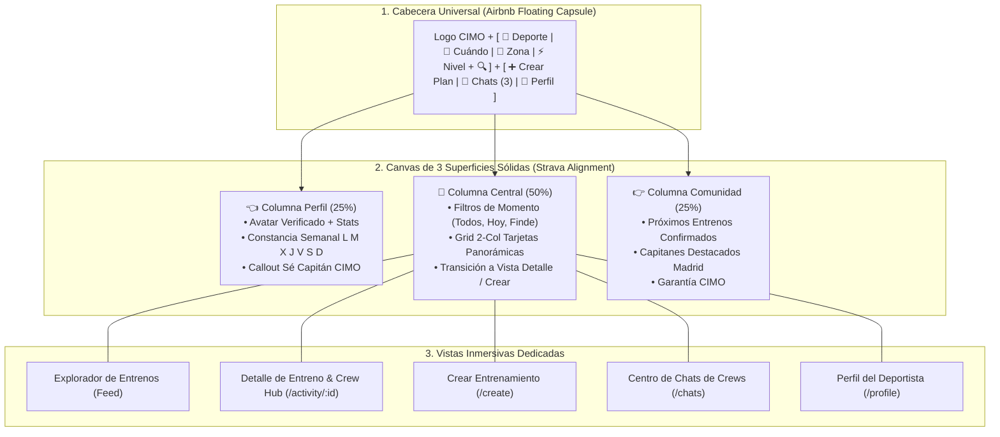

# CIMO Social Sports Platform, Strava/Airbnb 2.0 Architecture, Dedicated In-App Views, Crew Hub, Chat & Public Onboarding Landing

## Outcome

Construir y evolucionar la aplicación canónica **CIMO (`apps/cimo`)** como la plataforma social deportiva líder para conectar personas a través del entrenamiento grupal en microgrupos (*Crews*).

La aplicación combina:
1. **Descubrimiento y Búsqueda Visual de Alto Impacto (Estilo Airbnb Experiences):** Cabecera con cápsula flotante (*Deporte • Cuándo • Zona • Nivel*), secciones curadas y tarjetas panorámicas 16:9.
2. **Estructura Deportiva de 3 Columnas Proporcional (Estilo Strava):** Perfil del Atleta con constancia semanal (`L M X J V S D`), Feed central en superficie sólida y panel lateral de comunidad.
3. **Vistas Inmersivas Dedicadas (Eliminación de Modales / Anti-"Modal Hell"):**
   - Vista de Detalle de Entreno (`/activity/:id` o `CimoActivityDetailView`) con ruta, mapa, perfil del Capitán, miembros y chat integrado.
   - Vista de Creación de Entreno (`/create` o `CimoCreatePlanView`) paso a paso limpia y enfocada.
4. **Centro de Mensajería & Chats de Crews:** Bandeja de entrada de grupos y conversaciones en tiempo real.
5. **Perfil de Atleta:** Tarjeta verificada, estadísticas, historial de entrenos y deportes/niveles.
6. **Landing Page de Captación & Onboarding:** Página pública para visitantes con Hero de conversión (*"Match con entrenos, no con personas"*), showcase en vivo y registro deportivo rápido.

---

## Contexto y Arquitectura CIMO 2.0

---

## Decisiones Aprobadas

| Fecha | Decisión | Motivo | Impacto | Aprobado por |
| :--- | :--- | :--- | :--- | :--- |
| **2026-08-29** | Creación del Track Dedicado de CIMO bajo el dominio `apps`. | Desacoplar la evolución de la aplicación de producto CIMO del track de infraestructura transversal `public-shell-foundation`. | Foco exclusivo en UX, engagement deportivo y conversión de CIMO. | `@minoveaz` |
| **2026-08-29** | Arquitectura CIMO 2.0 (Strava + Airbnb Experiences). | Eliminar layouts rígidos de oficina y adoptar la búsqueda flotante de Airbnb con la estructura de 3 columnas de Strava. | Experiencia deportiva de primer nivel mundial. | `@minoveaz` |
| **2026-08-29** | Vistas Inmersivas Dedicadas en lugar de Modales (*No Modal Hell*). | Permitir URLs compartibles por WhatsApp/redes, mapas amplios, timelines y mejor control de navegación. | Máxima viralidad, deep linking y usabilidad. | `@minoveaz` |
| **2026-08-30** | Arquitectura de 2 Bloques para "Mi Crew" (Squads Habituales + Círculo Íntimo). | Adaptar lo mejor de *Playtomic* (convocatoria rápida), *Spond* (asistencia en 1 clic) y *Timeleft* (conexiones limpias). | Foco en micro-comunidades activas y retención deportiva. | `@minoveaz` |
| **2026-08-30** | Erradicación Total de Emojis del SO en Controles de UI. | Evitar el aspecto informal de "prototipo/chat" y garantizar consistencia cross-platform. | Interfaz seria, deportiva y profesional con SVG vectoriales (Lucide). | `@minoveaz` |
| **2026-08-30** | Elevación del Design System de Autor (4 Capas: Depth, Typography, Signature Components & Polish). | Romper la monotonía de "tarjeta blanca plana con borde gris" e infundir la calidad visual y de autor de *VitaBlue*, *LoopDev SaaS*, *Strava* y *Linear*. | Identidad de marca única, jerarquía visual de élite y acabado premium. | `@minoveaz` |

---

## Fases de Ejecución

### 📌 Fase 1: Arquitectura Base CIMO 2.0 & Superficies Sólidas
- [x] Crear e integrar `CimoFloatingSearchBar` en el slot central del Header con listeners de click-outside y `Escape`.
- [x] Unificar la columna izquierda (`CimoAthleteProfileCard`) en una superficie sólida con constancia semanal y callout de capitán.
- [x] Unificar la columna derecha (`CimoCommunityWidgets`) con entrenos confirmados y ranking de capitanes.
- [x] Envolver el feed central (`CimoCuratedFeed`) en un contenedor con filtros de momento (*Todos, Hoy, Finde*).
- [x] Expandir el canvas a `max-w-[1720px]` con espaciado amplio y alineación superior simétrica (`items-start`).

### 📌 Fase 2: Vistas Inmersivas Dedicadas & Pasaporte de Atleta (Eliminación de Modales)
- [x] Implementar `CimoActivityDetailView` como vista completa inmersiva dentro del canvas (portada panorámica, biografía del capitán, mapa de la ruta, miembros confirmados y chat del Crew).
- [x] Implementar `CimoCreatePlanView` como vista dedicada en 7 islas modulares para publicar entrenos sin popups.
- [x] Implementar `CimoProfileView` y `CimoEditProfileView` con Pasaporte Deportivo completo, matriz semanal día a día y canales de contacto con candado de privacidad.
- [x] Conectar la navegación interna fluida entre Explorar, Detalle de Actividad, Crear Plan, Chats y Perfil con deep linking bidireccional (`/`, `/activity/:id`, `/create`, `/chats`, `/profile`, `/profile/edit`).

### 📌 Fase 3: Red Social Deportiva, Tercer Tiempo & Algoritmo de Matching Deportivo Inteligente

#### 🤝 1. "Mi Red de Crew" & Arquitectura de 2 Bloques (Squads Habituales & Círculo Íntimo)
* **Objetivo:** Fomentar la recurrencia, la retención y la transformación de compañeros de entreno esporádicos en micro-comunidades sólidas y grupos de confianza habituales.
* **Inspiración de Producto & UX:** Combinación de lo mejor de *Playtomic* (convocatoria rápida a habituales), *Spond/Heja* (gestión de squads y asistencia), *Midnight Runners/NRC* (squads por ritmos) y *Timeleft* (conexiones limpias post-experiencia).
* **Arquitectura de la Pantalla en 2 Bloques Canónicos:**
  - [ ] **📦 BLOQUE 1: "Mis Squads Deportivos" (Micro-Equipos Habituales - Estilo Playtomic + Spond):**
    - Tarjetas de grupos habituales activos del atleta:
  - [x] **📦 BLOQUE 1: "Mis Squads Deportivos" (Micro-Equipos Habituales - Estilo Playtomic + Spond):**
    - Mostrar los 2-3 Squads recurrentes del atleta (*Retiro Morning Runners 🏃*, *Cuarteto Pádel Chamartín 🎾*, *Sierra Guadarrama Hikers 🥾*).
    - Tarjeta integrada y espaciosa sin dobles cajas grises con:
      - Nombre del grupo, deporte, ritmo y horario recurrente.
      - **Próxima Convocatoria Activa** con split-card de *Punto de Encuentro* vs *Tercer Tiempo Cálido* (`#FFFBEB`).
      - **Segmented Control Táctil** de asistencia: `[ ✓ Voy | ? Duda | ✕ No ]`.
      - Acciones: `[ + Convocatoria ]` y `[ 💬 Chat del Squad ]`.
  - [x] **👥 BLOQUE 2: "Mi Círculo Íntimo de Compañeros" (Conexiones Directas 1 a 1 - Estilo Timeleft + Strava):**
    - Filas limpias, minimalistas y espaciosas de los deportistas habituales.
    - Memoria compartida (*"🟢 4 entrenos en común • Último: Ayer"*).
    - Chip consolidado de ritmo y tercer tiempo (*"Activity 5:15 min/km • Coffee"*).
    - Acciones 1 a 1: `[ ⚡ Proponer entreno ]` (modal rápido) y `[ 💬 Chat ]`.
  - [x] **Smart Captain Invites (Invitación Inteligente en 1 Clic - `CimoInviteCrewModal.tsx`):**
    - Al publicar un entreno como Capitán, el sistema sugiere automáticamente a los deportistas de su red con mayor compatibilidad ($>90\%$) para ese deporte y horario.
    - Botón `[ 📨 Invitar a mi Crew habitual ]` para pre-llenar los cupos en minutos antes de abrirlo a la comunidad general.

#### 🎨 2. Elevación del Design System & UI Craft Sprint (Identidad de Autor tipo VitaBlue / Linear)
* **Objetivo:** Erradicar el look genérico de plantilla plana de IA y dotar a CIMO de un lenguaje visual deportivo de alta fidelidad, profundidad y coherencia.
* **Pilares de Ejecución:**
  - [x] **Erradicación de Emojis del SO:** Reemplazo integral de emojis en botones, tabs y badges por iconografía vectorial SVG (`Lucide`) con tokens de color consistentes.
  - [x] **Carga Tipográfica Oficial `Plus Jakarta Sans`:** Importación de todos los pesos (400-900) con tracking ajustado (-0.03em en títulos, +0.08em en overlines) y números tabulares.
  - [x] **Segmented Control Táctil:** Selector de asistencia físico con micro-feedbacks y estados claros.
  - [ ] **Tokens de Elevación & Sombras Difusas:** Implementar escala de superficies (Canvas, Slabs satinados, Highlights cálidos de Tercer Tiempo con bordes suaves).
  - [ ] **Signature Components en Feed y Tarjetas de Actividad:** Llevar la estética *Sports Boarding Pass* y chips unificados a todo el catálogo de planes.

#### ☕ 3. Sección Explícita de "Tercer Tiempo" en Cada Plan (Post-Workout Social Protocol)
* **Objetivo:** Convertir el entrenamiento en un catalizador de relaciones humanas, asegurando que cada plan tenga un momento opcional de tertulia e hidratación post-ejercicio.
* **Tipologías Canónicas:**
  - `☕ Café & Desayuno / Brunch:` Para rodajes matutinos de running o ciclismo (07:00 - 10:00 h).
  - `🍻 Caña & Tapeo / Aperitivo:` Para partidas de pádel, partidos de tenis o entrenos de tarde/fin de semana.
  - `🥤 Smoothie / Recovery Bar:` Para sesiones de alta intensidad en box de CrossFit, Hyrox o entrenos funcionales.
  - `🌿 Picnic & Hidratación al Aire Libre:` Para rutas de Hiking, montaña o parques urbanos.
* **Integración en Componentes & Contratos:**
  - [x] **`CimoCreatePlanView` (Isla 7 de Tercer Tiempo Opcional):** Selector conmutador (`hasThirdHalf`), Tipo (`cafe`, `beer`, `smoothie`, `picnic`), Nombre del local/lugar y nota de sobremesa (*"Nos sentaremos 30 min en Café Murillo..."*).
  - [x] **`CimoCuratedFeed` (Badges de Tercer Tiempo):** Pastilla contextual visible en la tarjeta: `☕ Tercer Tiempo: Café Murillo` o `🍻 Tercer Tiempo: Terraza Club Chamartín`, manteniendo limpias las tarjetas sin tercer tiempo.
  - [x] **`CimoActivityDetailView` (Bloque Social):** Sección dedicada con tarjeta visual del Tercer Tiempo, hora estimada post-entreno e indicación de plan 100% deportivo cuando no está habilitado.

#### 🎯 3. Motor de Matching Deportivo Inteligente (5 Vectores de Compatibilidad & Radar)
* **Objetivo:** Calcular una puntuación de afinidad real ($Score \in [0\%, 100\%]$) entre el Pasaporte Deportivo del Atleta y los parámetros de cada entreno / compañeros, eliminando la frustración de ritmos incompatibles y maximizando la sintonía social.
* **Formulación de los 5 Vectores de Compatibilidad:**
  $$\text{MatchScore} = 0.40 \cdot V_{\text{fit}} + 0.20 \cdot V_{\text{geo}} + 0.20 \cdot V_{\text{schedule}} + 0.10 \cdot V_{\text{social}} + 0.10 \cdot V_{\text{trust}}$$
  1. **$V_{\text{fit}}$ - Homogeneidad de Ritmo y Nivel Técnico ($40\%$ de peso):**
     - *Running:* $\Delta \text{pace} \le 15\text{ s/km} \rightarrow 100\%$, $\Delta \text{pace} \le 30\text{ s/km} \rightarrow 75\%$, $\Delta \text{pace} > 45\text{ s/km} \rightarrow 20\%$.
     - *Pádel:* $\Delta \text{nivel Playtomic} \le 0.25 \rightarrow 100\%$, $\Delta \le 0.50 \rightarrow 75\%$, $\Delta > 0.75 \rightarrow 25\%$.
     - *Ciclismo / Hiking / CrossFit:* Compatibilidad estricta de categoría (`Intermedio`, `Avanzado`, `Open`, `Scaled`).
  2. **$V_{\text{geo}}$ - Geo-Conveniencia y Barrios Habituales ($20\%$ de peso):**
     - Coincidencia en barrio base o distrito colindante (ej. Retiro con Salamanca / Chamberí con Chamartín).
  3. **$V_{\text{schedule}}$ - Solapamiento en Matriz de Horarios ($20\%$ de peso):**
     - Coincidencia directa entre el día/hora del plan y las franjas marcadas por el atleta en su matriz semanal (`morning`, `noon`, `afternoon`).
  4. **$V_{\text{social}}$ - Afinidad de Tercer Tiempo & Tamaño de Grupo ($10\%$ de peso):**
     - Preferencia coincidente de tamaño de grupo (`micro` 4-6 vs `medium` 8-15) y metas compartidas (*"☕ Café post-entreno"*, *"🤝 Conocer gente activa"*).
  5. **$V_{\text{trust}}$ - Red Previa, Conexiones & Confianza ($10\%$ de peso):**
     - Bonificación si el usuario ya ha entrenado con el Capitán o miembros del Crew, o si el Capitán posee valoración $\ge 4.9$ con 0 cancelaciones.
* **Visualización en UI:**
  - Pastilla de Afinidad destacada en cada tarjeta: `⚡ 96% Match con tu Pasaporte` con tooltip explicativo desglosando los factores clave.
  - Carrusel / Radar en el Feed: *"Deportistas en Retiro a tu mismo ritmo (5:15 min/km)"*.

#### 💬 4. Chats de Crew Orientados a Comunidad & Coordinación Post-Entreno
* **Objetivo:** Transformar el chat de un simple canal de texto a un centro de coordinación social del grupo antes, durante y después del entreno.
* **Capacidades Específicas:**
  - **Punto de Encuentro & Mapa en Tiempo Real:** Botón fijado con la chincheta exacta para que nadie se pierda.
  - **Álbum de Fotos del Entreno:** Espacio para compartir fotos grupales post-workout que quedan guardadas en el historial del Crew.
  - **Confirmación del Tercer Tiempo:** Votación rápida o confirmación del café/caña elegido tras la sesión.
  - **Canal Permanente del Crew:** Opción de mantener el grupo de chat activo para planificar futuras quedadas recurrentes.

### 📌 Fase 4: Landing Page Pública de Captación & Onboarding Deportivo
- [ ] Construir la Landing Page Pública para visitantes no autenticados:
  - Hero de conversión con propuesta de valor (*"Match con entrenos, no con personas"*).
  - Showcase de planes y entrenos en vivo en Madrid.
  - Explicación de los 3 pasos (*Elige deporte ➔ Únete al Crew ➔ Entrena y comparte*).
  - Testimonios y social proof de capitanes.
- [ ] Flujo de Onboarding deportivo:
  - Captación rápida de email magic-link.
  - Selección de deportes favoritos (Running, Pádel, Hiking, Crossfit, Ciclismo).
  - Configuración de ritmo / nivel deportivo y zona habitual de entrenamiento.
- [ ] Transición fluida: `Landing Pública` (visitantes) ➔ `Onboarding` ➔ `App CIMO 2.0` (deportistas).

### 📌 Fase 5: Calidad, Rendimiento, PWA & Quality Gate
- [ ] Configurar auditoría Lighthouse / Unlighthouse para certificar Score ≥ 90 en Desktop y Mobile.
- [ ] Suite de pruebas de integración con Vitest y Testing Library.
- [ ] Verificación de responsive en Mobile PWA, Tablet y Desktop panorámico.
- [ ] Quality Gate final en verde: `pnpm --filter cimo typecheck && pnpm --filter cimo test && pnpm --filter cimo build`.

---

## Criterios de cierre

- [x] Jerarquía Visual 2.0: Header con búsqueda flotante, 3 superficies sólidas alineadas y canvas ancho `max-w-[1720px]`.
- [x] Cero Modales para Flujos Principales: Detalle de entreno, Creación de plan y Edición de perfil operan como vistas inmersivas dedicadas sin scroll horizontal.
- [ ] Red Social Deportiva & Matching: Algoritmo de 5 vectores con Badge de Afinidad (%) y Tercer Tiempo integrado en cada plan.
- [ ] Flujos Completos Operativos: Feed curado con fotos exactas, creación de entrenos, unirse a un Crew, chat en tiempo real y perfil deportivo.
- [ ] Embudo de Conversión: Landing pública ➔ Onboarding deportivo ➔ App inmersiva.
- [ ] Auditoría de Rendimiento: Lighthouse Score ≥ 90 en Performance, Accesibilidad, Mejores Prácticas y SEO.

## Evidencia de validación

| Fecha | Validación | Resultado | Referencia |
| :--- | :--- | :--- | :--- |
| 2026-08-29 | `pnpm --filter cimo typecheck` | Correcta | TypeScript 0 errores |
| 2026-08-29 | `pnpm --filter cimo test` | Correcta | Vitest 4/4 passing |
| 2026-08-29 | `pnpm --filter cimo build` | Correcta | Vite build exitoso |

## Cierre

Pendiente de completar Fase 3 (Red Social & Matching), Fase 4 (Landing & Onboarding) y Fase 5 (Quality Gate Lighthouse).
