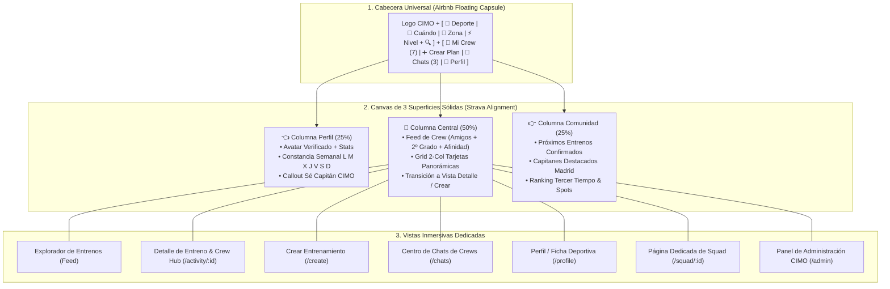

# CIMO Social Sports Platform, Strava/Airbnb 2.0 Architecture, Dedicated In-App Views, Crew Hub, Chat & Public Onboarding Landing

## Outcome

Construir y evolucionar la aplicación canónica **CIMO (`apps/cimo`)** como la plataforma social deportiva líder para conectar personas a través del entrenamiento grupal en microgrupos (*Crews*).

La aplicación combina:
1. **Descubrimiento y Búsqueda Visual de Alto Impacto (Estilo Airbnb Experiences):** Cabecera con cápsula flotante (*Deporte • Cuándo • Zona • Nivel*), secciones curadas y tarjetas panorámicas 16:9.
2. **Estructura Deportiva de 3 Columnas Proporcional (Estilo Strava):** Perfil del Atleta con constancia semanal (`L M X J V S D`), Feed central en superficie sólida y panel lateral de comunidad.
3. **Vistas Inmersivas Dedicadas (Eliminación de Modales / Anti-"Modal Hell"):**
   - Vista de Detalle de Entreno (`/activity/:id` o `CimoActivityDetailView`) con ruta, mapa, perfil del Capitán, miembros y chat integrado.
   - Vista de Creación de Entreno (`/create` o `CimoCreatePlanView`) paso a paso limpia y enfocada.
4. **Centro de Mensajería & Chats de Crews:** Bandeja de entrada de grupos y conversaciones en tiempo real.
5. **Perfil de Atleta:** Tarjeta verificada, estadísticas, historial de entrenos y deportes/niveles.
6. **Landing Page de Captación & Onboarding:** Página pública para visitantes con Hero de conversión (*"Match con entrenos, no con personas"*), showcase en vivo y registro deportivo rápido.

---

## Contexto y Arquitectura CIMO 2.0

---

## Decisiones Aprobadas

| Fecha | Decisión | Motivo | Impacto | Aprobado por |
| :--- | :--- | :--- | :--- | :--- |
| **2026-08-29** | Creación del Track Dedicado de CIMO bajo el dominio `apps`. | Desacoplar la evolución de la aplicación de producto CIMO del track de infraestructura transversal `public-shell-foundation`. | Foco exclusivo en UX, engagement deportivo y conversión de CIMO. | `@minoveaz` |
| **2026-08-29** | Arquitectura CIMO 2.0 (Strava + Airbnb Experiences). | Eliminar layouts rígidos de oficina y adoptar la búsqueda flotante de Airbnb con la estructura de 3 columnas de Strava. | Experiencia deportiva de primer nivel mundial. | `@minoveaz` |
| **2026-08-29** | Vistas Inmersivas Dedicadas en lugar de Modales (*No Modal Hell*). | Permitir URLs compartibles por WhatsApp/redes, mapas amplios, timelines y mejor control de navegación. | Máxima viralidad, deep linking y usabilidad. | `@minoveaz` |
| **2026-08-30** | Arquitectura de 2 Bloques para "Mi Crew" (Squads Habituales + Círculo Íntimo). | Adaptar lo mejor de *Playtomic* (convocatoria rápida), *Spond* (asistencia en 1 clic) y *Timeleft* (conexiones limpias). | Foco en micro-comunidades activas y retención deportiva. | `@minoveaz` |
| **2026-08-30** | Erradicación Total de Emojis del SO en Controles de UI. | Evitar el aspecto informal de "prototipo/chat" y garantizar consistencia cross-platform. | Interfaz seria, deportiva y profesional con SVG vectoriales (Lucide). | `@minoveaz` |
| **2026-08-30** | Elevación del Design System de Autor (4 Capas: Depth, Typography, Signature Components & Polish). | Romper la monotonía de "tarjeta blanca plana con borde gris" e infundir la calidad visual y de autor de *VitaBlue*, *LoopDev SaaS*, *Strava* y *Linear*. | Identidad de marca única, jerarquía visual de élite y acabado premium. | `@minoveaz` |
| **2026-08-31** | **Roadmap de Expansión de Producto & Integraciones CIMO 2.5:** 1. Feed de Crew multicapa (Amigos + 2º grado + Afinidad). 2. Perfil con 1-4 fotos reales en acción (anti-stock). 3. Ficha Técnica estructurada por desplegables (sin texto libre). 4. Integración Playtomic (Pádel) & Strava/Wikiloc/Garmin (Running/Hiking). 5. Squad Hub dedicado (`/squad/:id`) con flujo de creación y sugerencias. 6. Directorio & Ranking de Tercer Tiempo y Hotspots Deportivos. 7. Panel de Administración / Backoffice CIMO. | Llevar la plataforma de un directorio de eventos a una red social deportiva y ecosistema integral con datos certificados y micro-comunidades activas. | Fuerte diferenciación competitiva, engagement diario y monetización/alianzas B2B. | `@minoveaz` |
| **2026-08-31** | **Aprobación de 5 Innovaciones Clave de Engagement:** 1. Check-in GPS/QR post-entreno (Zero No-Shows & Proof of Workout). 2. Indicador de Liebre / Pacer oficial en quedadas de Running. 3. División de gastos de pista / consumiciones con enlace directo Bizum/Revolut. 4. Etiquetas de Energía Social / Vibe (Focused vs Conversational). 5. Desafíos y retos mensuales inter-squads. | Blindar la puntualidad, eliminar la fricción de pagos en grupo y maximizar la seguridad y sintonía de los miembros. | Confianza total de la comunidad, alta retención y crecimiento orgánico de Squads. | `@minoveaz` |
| **2026-08-31** | **Incorporación de 4 Mecanismos de Eventbrite / Luma de Alta Conversión & Asistencia:** 1. **Lista de Espera Inteligente & Auto-Relleno (Waitlist Engine):** Cola de espera automática con ventana de 15 minutos para reclamar plaza libre si alguien cancela. 2. **Sincronización con Google / Apple Calendar en 1 Clic:** Botón directo (.ics / Google URL) con recordatorio 2h, GPS exacto y link al chat. 3. **Preguntas Clave de Admisión (RSVP Questionnaire):** 1-2 preguntas obligatorias configurables por el capitán (ritmo 10K, pala propia, calzado de montaña). 4. **Broadcast Pre-Entreno del Capitán:** Envío de avisos prioritarios fijados al grupo (cambios de clima, hidratación). | Maximizar la tasa de asistencia real, evitar huecos de última hora en grupos pequeños y dar control operativo total a los capitanes. | Cero absentismo, organización impecable y máxima retención deportiva. | `@minoveaz` |
| **2026-08-31** | **Sistema de Gamificación, Insignias de Autor (CIMO Badges) & Top Leaderboard Local:** 1. **Insignias de Constancia y Reputación:** *Club del Amanecer* (5 entrenos pre-8h), *Palabra de Honor* (100% asistencia / 0 no-shows), *Embajador Tercer Tiempo*, *Capitán 5 Estrellas*, *Pacer de Oro*. 2. **Hall of Fame / Top Ranking por Ciudad y Deporte:** Leaderboard mensual de deportistas más constantes (no por velocidad, sino por días activos y asistencia). | Desbloquear el estatus social, la motivación diaria y la confianza entre deportistas. | Máxima retención diaria (DAU/MAU) y orgullo de pertenencia. | `@minoveaz` |
| **2026-08-31** | **Sistema de Valoraciones 360º Tripartita (Evento + Capitán + Compañeros de Entreno):** 1. **Valoración del Evento (1-5⭐ + Micro-tags):** Cumplimiento de ruta, ritmo real y calidad del Tercer Tiempo. 2. **Valoración del Capitán:** Liderazgo, acogida a los nuevos y puntualidad (alimenta el sello de Capitán Verificado). 3. **Feedback entre Compañeros (Kudos & "¿Volverías a entrenar con él/ella?"):** Reconocimientos positivos de energía/compañerismo y reporte discreto de seguridad/conducta. | Generar confianza ciega entre deportistas que no se conocen y blindar la seguridad de la comunidad. | Conversión máxima de nuevos usuarios y cero toxicidad. | `@minoveaz` |

---

## Fases de Ejecución

### 📌 Fase 1: Arquitectura Base CIMO 2.0 & Superficies Sólidas
- [x] Crear e integrar `CimoFloatingSearchBar` en el slot central del Header con listeners de click-outside y `Escape`.
- [x] Unificar la columna izquierda (`CimoAthleteProfileCard`) en una superficie sólida con constancia semanal y callout de capitán.
- [x] Unificar la columna derecha (`CimoCommunityWidgets`) con entrenos confirmados y ranking de capitanes.
- [x] Envolver el feed central (`CimoCuratedFeed`) en un contenedor con filtros de momento (*Todos, Hoy, Finde*).
- [x] Expandir el canvas a `max-w-[1720px]` con espaciado amplio y alineación superior simétrica (`items-start`).

### 📌 Fase 2: Vistas Inmersivas Dedicadas & Pasaporte de Atleta (Eliminación de Modales)
- [x] Implementar `CimoActivityDetailView` como vista completa inmersiva dentro del canvas (portada panorámica, biografía del capitán, mapa de la ruta, miembros confirmados y chat del Crew).
- [x] Implementar `CimoCreatePlanView` como vista dedicada en 7 islas modulares para publicar entrenos sin popups.
- [x] Implementar `CimoProfileView` y `CimoEditProfileView` con Pasaporte Deportivo completo, matriz semanal día a día y canales de contacto con candado de privacidad.
- [x] Conectar la navegación interna fluida entre Explorar, Detalle de Actividad, Crear Plan, Chats y Perfil con deep linking bidireccional (`/`, `/activity/:id`, `/create`, `/chats`, `/profile`, `/profile/edit`).

---

### 📌 Fase 3: Red Social Deportiva, Integraciones, Squad Hubs & Motor de Matching

#### 🌐 1. Feed Social de Red de Confianza (Crew Multicapa: 1er Grado, 2º Grado & Afinidad Algorítmica)
* **Concepto:** En el Home, el feed no es un listado plano anónimo, sino el pulso vivo de tu red deportiva expandida:
  - **Nivel 1 (Directos):** Convocatorias de tus amigos y miembros de tus Squads habituales.
  - **Nivel 2 (Amigos de Amigos):** Entrenos creados por contactos de tu círculo íntimo (*"Creado por Sofía Díaz, amiga de Alex"*).
  - **Nivel 3 (Matching por Afinidad):** Entrenos públicos recomendados según tu Ficha Técnica y horarios ($Score > 85\%$).
* **Filtros de Feed:** Pestañas superiores `[ 🌐 Todo mi Crew ] [ 👥 Amigos ] [ ⚡ Sugeridos para ti ]`.

#### 📸 2. Perfil Deportivo con Portada de Fotos Reales en Acción (Anti-Fotos de Stock)
* **Concepto:** Cero fotos de stock genéricas en la portada del perfil.
* **Galería Deportiva Real (1 a 4 fotos):**
  - El usuario sube de 1 a 4 fotografías reales entrenando, compitiendo o compartiendo un Tercer Tiempo.
  - Formato carrusel / mosaico dinámico de presentación atlética.
  - Permite a otros miembros del Crew conocer la energía, estilo y presencia real del deportista antes de entrenar juntos.

#### 📋 3. Ficha Técnica Deportiva Estructurada (Desplegables Estándar por Deporte)
* **Naming:** Alternativas a debatir: *Ficha Técnica CIMO, Credencial Atlética, Carnet Deportivo, Perfil Técnico*.
* **Estructura Estricta por Deporte (Sin texto libre):**
  - **Running:**
    - *Ritmo Base:* `< 4:15 min/km (Élite)`, `4:15 - 4:45 (Avanzado)`, `4:45 - 5:15 (Medio-Alto)`, `5:15 - 5:45 (Medio)`, `> 5:45 (Iniciación/Suave)`.
    - *Distancia Habitual:* `5-8K`, `10K`, `Media Maratón (21K)`, `Maratón (42K)`, `Trail Running`.
    - *Objetivo Actual:* Mantenimiento, Preparación de Carrera, Rodaje Social.
  - **Pádel:**
    - *Nivel Playtomic:* `1.0 - 2.0 (Iniciación)`, `2.0 - 3.0 (Principiante)`, `3.0 - 4.0 (Intermedio)`, `4.0 - 5.0 (Avanzado)`, `5.0+ (Competición)`.
    - *Posición en pista:* `Drive`, `Revés`, `Ambos`.
    - *Mano hábil:* `Diestro`, `Zurdo`.
  - **Hiking / Trekking:**
    - *Exigencia Física:* `Fácil (< 8 km / plano)`, `Moderada (10-15 km / +400m)`, `Exigente (+16 km / +800m)`, `Alta Montaña / Técnico`.
    - *Terreno preferido:* Senderos de bosque, Sierra de Guadarrama, Cumbres/Crestas, Vías Ferratas.

#### 🔌 4. Ecosistema de Integraciones Deportivas & Redes con Privacidad Granular
* **Integración Playtomic (Pádel):**
  - Sincronización de Nivel Oficial Playtomic verificado con badge en el perfil.
  - Importación/vinculación de reservas de pistas de clubes de Playtomic a convocatorias CIMO.
* **Integración Running & Outdoor (Strava, Garmin, Wikiloc, Komoot, AllTrails):**
  - **Strava:** Conexión OAuth para validar kilometraje semanal real, ritmos promedio y últimas actividades.
  - **Wikiloc & Komoot:** Importación de tracks GPX/KML para rutas de Hiking y Ciclismo con altimetría y mapa interactivo.
  - **Garmin Connect:** Sincronización de constancia de entrenos.
* **Integración WhatsApp & Redes Sociales con Políticas de Privacidad:**
  - Enlace rápido a WhatsApp (`wa.me/`) e Instagram/Strava/LinkedIn.
  - **Matriz de Privacidad:** El usuario elige quién puede ver sus enlaces de contacto:
    - `Público:` Visible para toda la comunidad CIMO.
    - `Solo Miembros de mis Squads / Conexiones:` Visible solo tras haber entrenado juntos.
    - `Solo tras Confirmar Asistencia:` El teléfono/WhatsApp solo se revela a los inscritos confirmados en el mismo entreno.

#### 🛡️ 5. Rediseño del Módulo de Squads & Squad Hub Dedicado (`/squad/:id`)
* **Tarjeta de Entidad de Squad:** La tarjeta muestra la esencia del Squad (nombre, insignia, disciplina, nivel medio, capitanes, miembros y frecuencia habitual), sin saturarla con eventos anidados.
* **Flujos Clave:**
  - Botón `[ + Crear Nuevo Squad ]` con asistente guiado.
  - Carrusel de **"Squads Sugeridos para ti"** según afinidad de ritmo y zona.
* **Página Dedicada de Squad (`/squad/:id`):**
  - Portada del equipo y manifiesto del grupo.
  - Próximas convocatorias oficiales del Squad.
  - Historial de entrenos y álbum de fotos compartidas.
  - **Chat Exclusivo del Squad** con notificaciones y encuestas de horario.

#### 🍻 6. Directorio & Ranking CIMO de Tercer Tiempo & Hotspots Deportivos
* **Ranking de Tercer Tiempo:**
  - Los locales (cafeterías de especialidad, terrazas de pádel, cervecerías artesanales) mejor valorados por los Crews en Madrid y principales ciudades.
  - Métricas: Calidad de café/brunch, espacio para grupos grandes, facilidad para dejar mochilas/bicis, ambiente post-deporte.
  - Alianzas/Beneficios CIMO (descuento del 10% o consumición especial para Crews que hagan check-in post-entreno).
* **Directorio de Hotspots Deportivos:**
  - Circuitos de running icónicos (Retiro, Madrid Río, Casa de Campo).
  - Pistas de pádel con mejor luz/césped.
  - Rutas de senderismo certificadas (La Pedriza, Cotos, Peñalara).

#### 🛠️ 7. Panel de Administración CIMO (Backoffice / SuperAdmin `/admin`)
* **Dashboard de Métricas Clave:** Usuarios activos diarios (DAU/MAU), entrenos creados vs completados, ratio de asistencia real, tasa de conversión a Tercer Tiempo.
* **Moderación de Comunidad:** Gestión de reportes de conducta, validación de insignias de Capitanes Verificados, control de no-shows (usuarios que reservan y no van).
* **Gestión de Spots y Tercer Tiempo:** Alta de locales aliados, promociones para Crews y gestión de tracks de rutas recomendadas.
* **Configuración de Algoritmos:** Calibración de pesos del matching score ($V_{\text{fit}}, V_{\text{geo}}, V_{\text{schedule}}$).

---

### 💡 Ideas de Innovación Propuestas por el Equipo de Diseño (Aportes UI/UX):

1. **Check-in GPS / QR Post-Entreno ("Proof of Workout" & Asistencia Garantizada):**
   - Cuando el grupo se reúne en el punto de encuentro, el Capitán o el sistema valida la presencia vía geolocalización o escaneo de QR en 1 segundo.
   - Otorga puntos de reputación y desbloquea el Tercer Tiempo, eliminando el problema de los *no-shows* (gente que reserva plaza y no aparece).
2. **"Liebre / Pacer" en Entrenos de Running:**
   - En las quedadas de running, marcar quién del grupo lleva el reloj con el ritmo fijo establecido para dar total seguridad a los corredores que temen quedarse atrás.
3. **División de Gasto Integrada para Pádel y Tercer Tiempo (Split Cost / Bizum link):**
   - En partidos de pádel donde se alquila pista (ej. 24€ / 4 = 6€ por persona), incluir el cálculo automático y el botón para pagar al capitán o compartir enlace de Bizum/Revolut en 1 toque.
4. **Desafíos Inter-Squads (Gamificación Saludable de Club):**
   - Retos mensuales entre Squads de Madrid (ej. *"¿Qué Squad acumula más kilómetros en septiembre?"* o *"Liga de Pádel entre Squads de Chamartín"*).
5. **Nivel de "Energía Social" del Plan (Etiquetas de Vibe):**
   - Definir si el entreno es *100% Focused Workout* (series duras sin casi charla) o *Social & Conversational* (ritmo tranquilo donde el 50% de la experiencia es hablar y conocer al grupo).

---

### 🎟️ Mecanismos de Eventbrite / Luma de Alta Conversión y Asistencia:

1. **Lista de Espera Inteligente & Auto-Relleno (Waitlist Engine):**
   - Para actividades con plazas completas (ej: 4/4 en pádel o 6/6 en running), los usuarios pueden sumarse a la lista de espera con 1 clic.
   - Si un asistente confirma su baja o no puede asistir, el primer atleta en la lista recibe una notificación prioritaria con un temporizador de 15 minutos para reclamar su plaza antes de pasar al siguiente.
2. **Añadir a Google / Apple Calendar en 1 Clic (Sync Automático):**
   - Generación instantánea de archivo `.ics` y enlace directo a Google Calendar al unirse al entreno.
   - Incluye alarma recordatorio 2 horas antes, coordenadas y chincheta GPS del punto de encuentro y enlace directo al chat del Crew.
3. **Preguntas Clave de Admisión (Custom RSVP Questionnaire):**
   - El Capitán puede definir 1-2 preguntas breves antes de confirmar la plaza (ej: *"¿Traes pala propia o necesitas préstamo?"*, *"¿Ritmo medio en 10K?"*, *"¿Calzado de trail para la ruta?"*).
4. **Broadcast & Aviso Urgente del Capitán (Pre-Workout Blast):**
   - Canal de aviso destacado en la cabecera del entreno para avisos de última hora (cambios por lluvia, aviso de hidratación o punto de encuentro exacto).

---

### 🏅 Gamificación, Insignias de Autor (CIMO Badges) y Top Ranking Local:

1. **Vitrina de Insignias de Autor en el Perfil:**
   - 🌅 *Club del Amanecer:* 5 entrenos completados antes de las 08:00 AM.
   - 🛡️ *Palabra de Honor (100% Asistencia):* 10 entrenos consecutivos con check-in y cero no-shows.
   - ☕ *Embajador del Tercer Tiempo:* 10 asistencias al café/caña post-entreno.
   - 👑 *Capitán Verificado 5 Estrellas:* Liderar 5 convocatorias con valoración comunitaria 5.0.
   - ⚡ *Pacer / Liebre de Oro:* Marcar el ritmo oficial en 3 rodajes grupales.
   - 🏔️ *Cumbres de Madrid:* Completar 3 rutas de senderismo/hiking en la sierra.
2. **Top Leaderboard / Hall of Fame por Ciudad y Deporte:**
   - Ranking mensual de constancia comunitaria (días activos de entreno + fiabilidad de asistencia).
   - Filtros dinámicos por Ciudad (*Madrid, Barcelona, Valencia*) y Deporte (*Running, Pádel, Hiking*).
   - Acceso directo a los perfiles de los deportistas más activos de la zona para proponer entrenos.

---

### ⭐️ Sistema de Valoraciones 360º Tripartita (Evento, Capitán y Compañeros):

1. **Valoración de la Actividad / Entreno (1-5 ⭐ + Micro-Tags):**
   - Pregunta clave: *"¿El ritmo y la ruta se ajustaron a lo prometido en la ficha?"*
   - Tags rápidos: `[ 🎯 Ritmo Clavado ]` `[ 🗺️ Ruta Espectacular ]` `[ ☕ Tercer Tiempo Top ]` `[ ⚡ Intenso & Retador ]` `[ 💬 Muy Social & Divertido ]`.
2. **Valoración del Capitán Organizador (Trust & Leadership):**
   - Puntualidad, dinamización y bienvenida a nuevos miembros.
   - Tags: `[ ⏱️ Muy Puntual ]` `[ 🛡️ Súper Atento ]` `[ 🧭 Conoce la Ruta ]` `[ 🤝 Acoge a Nuevos ]`.
   - Alimenta el ranking de Capitanes Destacados de la ciudad y el sello de Capitán Verificado.
3. **Feedback entre Compañeros de Entreno (Peer Review & Kudos):**
   - Micro-feedback positivo y privado: *"¿Volverías a entrenar con este compañero? [ 👍 Sí, sin duda ] [ 😐 Neutral ]"*.
   - Reconocimientos de 1 toque (Kudos): `[ 🔥 Gran Energía ]` `[ 🤝 Excelente Compañero ]` `[ 💨 Pacer Constante ]`.
   - Canal de reporte de seguridad y conducta deportiva para moderación inmediata.
4. **Flujo Post-Entreno en 15 Segundos:**
   - Notificación/tarjeta emergente automática 2 horas después de finalizar la actividad para calificar en solo 2 toques sin fricción.

---

## Criterios de Cierre Actualizados

- [x] Jerarquía Visual 2.0 con búsqueda flotante, 3 columnas proporcionales y fondo mineral `#EEF2F2`.
- [x] Calendario dinámico multi-mes/año y buscador de ciudades predictivo sin duplicados.
- [x] Deep Linking completo y estándar de URLs canónicas con handles de deportistas y slugs semánticos de squads y entrenos.
- [ ] Feed Social de Red de Confianza (1er y 2º grado + Afinidad algorítmica).
- [ ] Perfil con 1-4 fotos reales en acción y Ficha Técnica desplegable por deporte.
- [ ] Integraciones con Playtomic, Strava, Garmin, Wikiloc y candados de privacidad de WhatsApp/Redes.
- [ ] Squad Hub dedicado (`/squad/:id`) con flujo de creación y sugerencias.
- [ ] Ranking de Tercer Tiempo & Hotspots Deportivos con convenios de locales.
- [ ] 5 Innovaciones de Engagement (Check-in GPS/QR anti-no-shows, Liebre oficial, Split Cost Bizum, Etiquetas de Vibe y Desafíos Inter-Squads).
- [ ] 4 Mecanismos Eventbrite/Luma (Waitlist inteligente, 1-Click Calendar Sync, Preguntas de admisión y Broadcast del capitán).
- [ ] Sistema de Gamificación (Insignias de Autor en el Perfil y Top Leaderboard / Hall of Fame por Ciudad y Deporte).
- [ ] Sistema de Valoraciones 360º Tripartita (Evento, Capitán y Compañeros con Kudos y Reporte de Seguridad).
- [ ] Panel de Administración de CIMO (`/admin`).
- [ ] Suite de Tests Focalizados estilo Vitablue (Componentes, a11y, WCAG).
- [ ] Quality Gate en verde: `pnpm --filter cimo typecheck && pnpm --filter cimo test && pnpm --filter cimo build`.

---

## Evidencia de Validación

| Fecha | Validación | Resultado | Referencia |
| :--- | :--- | :--- | :--- |
| **2026-08-30** | `pnpm --filter cimo typecheck` | Correcta | TypeScript 0 errores |
| **2026-08-30** | `pnpm --filter cimo test` | Correcta | Vitest 4/4 passing |
| **2026-08-30** | `pnpm --filter cimo build` | Correcta | Vite build exitoso |
