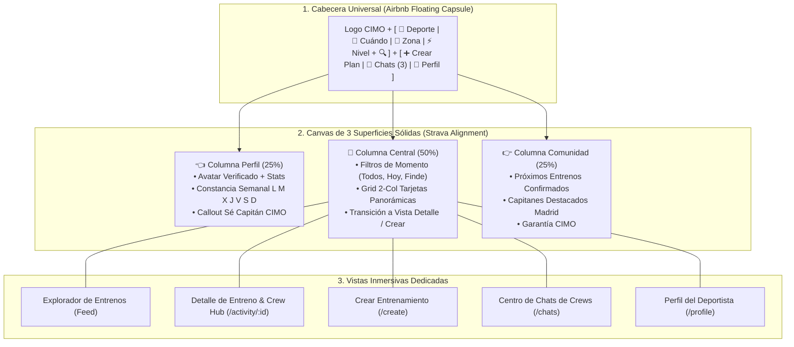

# CIMO Social Sports Platform, Strava/Airbnb 2.0 Architecture, Dedicated In-App Views, Crew Hub, Chat & Public Onboarding Landing

## Outcome

Construir y evolucionar la aplicación canónica **CIMO (`apps/cimo`)** como la plataforma social deportiva líder para conectar personas a través del entrenamiento grupal en microgrupos (*Crews*).

La aplicación combina:
1. **Descubrimiento y Búsqueda Visual de Alto Impacto (Estilo Airbnb Experiences):** Cabecera con cápsula flotante (*Deporte • Cuándo • Zona • Nivel*), secciones curadas y tarjetas panorámicas 16:9.
2. **Estructura Deportiva de 3 Columnas Proporcional (Estilo Strava):** Perfil del Atleta con constancia semanal (`L M X J V S D`), Feed central en superficie sólida y panel lateral de comunidad.
3. **Vistas Inmersivas Dedicadas (Eliminación de Modales / Anti-"Modal Hell"):**
   - Vista de Detalle de Entreno (`/activity/:id` o `CimoActivityDetailView`) con ruta, mapa, perfil del Capitán, miembros y chat integrado.
   - Vista de Creación de Entreno (`/create` o `CimoCreatePlanView`) paso a paso limpia y enfocada.
4. **Centro de Mensajería & Chats de Crews:** Bandeja de entrada de grupos y conversaciones en tiempo real.
5. **Perfil de Atleta:** Tarjeta verificada, estadísticas, historial de entrenos y deportes/niveles.
6. **Landing Page de Captación & Onboarding:** Página pública para visitantes con Hero de conversión (*"Match con entrenos, no con personas"*), showcase en vivo y registro deportivo rápido.

---

## Contexto y Arquitectura CIMO 2.0

---

## Decisiones Aprobadas

| Fecha | Decisión | Motivo | Impacto | Aprobado por |
| :--- | :--- | :--- | :--- | :--- |
| **2026-08-29** | Creación del Track Dedicado de CIMO. | Desacoplar la evolución de la aplicación de producto CIMO del track de infraestructura transversal `public-shell-foundation`. | Foco exclusivo en UX, engagement deportivo y conversión de CIMO. | `@minoveaz` |
| **2026-08-29** | Arquitectura CIMO 2.0 (Strava + Airbnb Experiences). | Eliminar layouts rígidos de oficina y adoptar la búsqueda flotante de Airbnb con la estructura de 3 columnas de Strava. | Experiencia deportiva de primer nivel mundial. | `@minoveaz` |
| **2026-08-29** | Cápsula de Búsqueda Flotante integrada en el Header. | Ganar espacio vertical y mantener el buscador siempre visible (*sticky*) con cierre click-outside. | Interfaz limpia, rápida y sin redundancias. | `@minoveaz` |
| **2026-08-29** | 3 Superficies Sólidas Alineadas en el Canvas (`max-w-[1720px]`). | Dotar de peso visual homogéneo a las 3 columnas y eliminar los espacios laterales vacíos en pantallas panorámicas. | Composición simétrica y profesional. | `@minoveaz` |
| **2026-08-29** | Vistas Inmersivas Dedicadas en lugar de Modales (*No Modal Hell*). | Permitir URLs compartibles por WhatsApp/redes, mapas amplios, timelines y mejor control de navegación. | Máxima viralidad, deep linking y usabilidad. | `@minoveaz` |

---

## Fases de Ejecución

### 📌 Fase 1: Arquitectura Base CIMO 2.0 & Superficies Sólidas
- [x] Crear e integrar `CimoFloatingSearchBar` en el slot central del Header con listeners de click-outside y `Escape`.
- [x] Unificar la columna izquierda (`CimoAthleteProfileCard`) en una superficie sólida con constancia semanal y callout de capitán.
- [x] Unificar la columna derecha (`CimoCommunityWidgets`) con entrenos confirmados y ranking de capitanes.
- [x] Envolver el feed central (`CimoCuratedFeed`) en un contenedor con filtros de momento (*Todos, Hoy, Finde*).
- [x] Expandir el canvas a `max-w-[1720px]` con espaciado amplio y alineación superior simétrica (`items-start`).

### 📌 Fase 2: Vistas Inmersivas Dedicadas (Eliminación de Modales)
- [ ] Implementar `CimoActivityDetailView` como vista completa inmersiva dentro del canvas (portada panorámica, biografía del capitán, mapa de la ruta, miembros confirmados y chat del Crew).
- [ ] Implementar `CimoCreatePlanView` como vista dedicada paso a paso para publicar entrenos sin popups.
- [ ] Conectar la navegación interna fluida entre Explorar, Detalle de Actividad, Crear Plan, Chats y Perfil.
- [ ] Soportar URLs canónicas y deep linking (`/`, `/activity/:id`, `/create`, `/chats`, `/profile`).

### 📌 Fase 3: Landing Page Pública de Captación & Onboarding
- [ ] Construir la Landing Page Pública para visitantes no autenticados:
  - Hero de conversión con propuesta de valor (*"Match con entrenos, no con personas"*).
  - Showcase de planes y entrenos en vivo en Madrid.
  - Explicación de los 3 pasos (*Elige deporte ➔ Únete al Crew ➔ Entrena y comparte*).
  - Testimonios y social proof de capitanes.
- [ ] Flujo de Onboarding deportivo:
  - Captación rápida de email magic-link.
  - Selección de deportes favoritos (Running, Pádel, Hiking, Crossfit, Ciclismo).
  - Configuración de ritmo / nivel deportivo y zona habitual de entrenamiento.
- [ ] Transición fluida: `Landing Pública` (visitantes) ➔ `Onboarding` ➔ `App CIMO 2.0` (deportistas).

### 📌 Fase 4: Calidad, Rendimiento, PWA & Quality Gate
- [ ] Configurar auditoría Lighthouse / Unlighthouse para certificar Score ≥ 90 en Desktop y Mobile.
- [ ] Suite de pruebas de integración con Vitest y Testing Library.
- [ ] Verificación de responsive en Mobile PWA, Tablet y Desktop panorámico.
- [ ] Quality Gate final en verde: `pnpm --filter cimo typecheck && pnpm --filter cimo test && pnpm --filter cimo build`.

---

## Criterios de Aceptación y Certificación

1. **Jerarquía Visual 2.0:** Header con búsqueda flotante, 3 superficies sólidas alineadas y canvas ancho `max-w-[1720px]`.
2. **Cero Modales para Flujos Principales:** Detalle de entreno y Creación de plan operan como vistas inmersivas dedicadas.
3. **Flujos Completos Operativos:** Feed curado, creación de entrenos, unirse a un Crew, chat en tiempo real y perfil deportivo.
4. **Embudo de Conversión:** Landing pública ➔ Onboarding deportivo ➔ App inmersiva.
5. **Auditoría de Rendimiento:** Lighthouse Score ≥ 90 en Performance, Accesibilidad, Mejores Prácticas y SEO.
