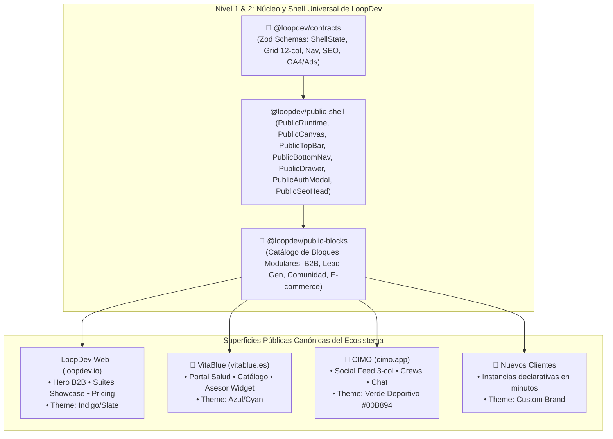

# Public Shell Foundation, Contract-Driven Architecture, Public Blocks, SEO, Analytics & Universal Multi-Client Surface System

## Outcome

Proveer una arquitectura canónica y universal de frontend público para todo el ecosistema LoopDev, diseñada para gobernar con el máximo estándar de calidad las webs y aplicaciones públicas de:

1. **LoopDev Web Pública (`loopdev.io`):** Plataforma institucional, showcase de suites, producto B2B, pricing, blog y captación.
2. **VitaBlue Web (`vitablue.es`):** Portal de seguros de salud, catálogo, comparador, cotizador y funnel de visados/expatriados.
3. **CIMO App (`cimo.app`):** Red social deportiva, feed de planes en 3 columnas, microgrupos (_Crews_), chat y comunidad PWA.
4. **Cualquier Cliente Futuro:** Capacidad de lanzar nuevas webs públicas o portales en minutos componiendo bloques reutilizables e inyectando tokens de marca (_White-Label Theming_).

---

## Contexto y Las 3 Superficies Canónicas

---

## Decisiones Aprobadas

| Fecha          | Decisión                                                                                                   | Motivo                                                                                                                   | Impacto                                                                  | Aprobado por |
| :------------- | :--------------------------------------------------------------------------------------------------------- | :----------------------------------------------------------------------------------------------------------------------- | :----------------------------------------------------------------------- | :----------- |
| **2026-08-28** | Arquitectura Universal para LoopDev Web, VitaBlue, CIMO y futuros clientes.                                | Estandarizar el 100% de las superficies públicas bajo un único framework y design system.                                | Cero duplicación de código y lanzamiento instantáneo de nuevos clientes. | `@minoveaz`  |
| **2026-08-28** | Arquitectura de 4 Niveles (`@loopdev/ui` ➔ `@loopdev/public-shell` ➔ `@loopdev/public-blocks` ➔ Clientes). | Desacoplar primitivos, infraestructura de navegación y bloques de negocio reutilizables.                                 | Reutilización masiva de código entre todas las webs públicas.            | `@minoveaz`  |
| **2026-08-28** | Unificar Desktop, Tablet y Mobile en un solo `PublicShell` adaptativo continuo.                            | Evitar bifurcaciones y entregar una experiencia desktop rica (3 columnas / full-width) sin degradar la app móvil táctil. | Experiencia de primera clase en cualquier dispositivo.                   | `@minoveaz`  |
| **2026-08-28** | Implementar `PublicRuntime` y `PublicCanvas` (Grid 12 cols).                                               | Replicar la disciplina de `SuiteRuntime` y `SuiteCanvas` del SaaS Shell.                                                 | Layouts declarativos matemáticos sin código inline.                      | `@minoveaz`  |
| **2026-08-28** | Sistema de SEO de Primera Clase gobernado por contratos Zod.                                               | Garantizar indexabilidad, canonicals sin redirecciones, Open Graph y datos estructurados Schema.org.                     | Máxima visibilidad orgánica en Google y motores de IA.                   | `@minoveaz`  |
| **2026-08-28** | Telemetría Unificada (GA4, Google Ads, GTM, Consent Mode v2).                                              | Estandarizar tracking de conversiones y eventos respetando el RGPD / CookieBanner.                                       | Medición unificada de campañas y atribución.                             | `@minoveaz`  |
| **2026-08-28** | Puerta de Calidad de Auditoría Lighthouse / Unlighthouse en CI.                                            | Exigir estándares de Performance, a11y, Best Practices y SEO (Score ≥ 90).                                               | Experiencias ultra rápidas y certificadas.                               | `@minoveaz`  |

---

## Arquitectura de Contratos (`@loopdev/contracts`)

### 1. Estados Estructurales (`PublicShellState`)

- `ready`, `loading`, `error`, `offline`, `unauthenticated`, `maintenance`.

### 2. Recetas Canónicas de Composición (`PublicCompositionRecipe`)

- `PublicB2BLanding`: Hero B2B (12) + Features/Suites Showcase (6-6) + Pricing/Testimonials (4-4-4) + CTA Banner (12) (para **LoopDev Web**).
- `PublicSocialFeed`: Grid 3-col: Filtros (3 cols) | Feed (6 cols) | Inspector de Crew/Plan (3 cols) (para **CIMO**).
- `PublicDiscoverySplit`: 2-col Split: Listado/Cards (5 cols) | Mapa / Calendario interactivo (7 cols).
- `PublicDetailWorkspace`: Hero (12 cols) + Detalle/Itinerario (8 cols) | Sidebar de Unión / Capitán (4 cols).
- `PublicPortalOverview`: Hero (12 cols) + Grid de Productos (4-4-4 cols) + Asesor & FAQ (12 cols) (para **VitaBlue**).
- `PublicWorkflowCanvas`: Stepper centrado (12 cols, max-w-xl) para Auth / Onboarding / Feedback.

### 3. Regiones de Canvas (`PublicCompositionRegion`)

- `id`, `slot`, `colSpan` (1-12), `rowSpan`, `sizing`, `overflow`, y reglas responsivas (`tablet` y `mobile`).

### 4. Contratos de SEO y Datos Estructurados (`PublicSeoMetadata`)

- `<title>`, `<meta description>` (50-200 chars), `<link rel="canonical">`, `<link rel="alternate" hreflang>`, Open Graph, Twitter Cards y `jsonLd` (`SportsEvent`, `Product`, `SoftwareApplication`, `Article`, `FAQPage`, `Organization`).

### 5. Contratos de Telemetría y Analytics (`PublicAnalyticsConfig`)

- GA4 (`G-XXXXX`), Google Ads (`AW-XXXXX`), GTM (`GTM-XXXXX`), Meta Pixel y Google Consent Mode v2 integrado con el `CookieBanner`.

---

## Fases de Ejecución y Checkpoints

### 📌 Fase 1: Contratos Zod en `@loopdev/contracts`

- [x] Crear `packages/contracts/src/platform/public-shell.ts` con todos los schemas (`PublicShellState`, `PublicCompositionRecipe`, `PublicCompositionRegion`, `PublicViewComposition`, `PublicNavRoute`, `PublicBrandTheme`).
- [x] Crear `packages/contracts/src/platform/seo.ts` y `telemetry.ts` con los contratos de SEO y Analytics.
- [x] Exportar contratos en `packages/contracts/src/index.ts`.
- [x] Suite de tests unitarios de validación de contratos (`public-shell.test.ts`, `seo.test.ts`).
- [x] Ejecutar build de contracts: `pnpm --filter @loopdev/contracts build`.

### 📌 Fase 2: Construcción de `@loopdev/public-shell` y Servicios Base

- [x] Configurar `ds/packages/public-shell/package.json` y `tsconfig.json`.
- [x] Implementar el motor de theming: `BrandThemeProvider` y `useBrandTheme`.
- [x] Construir el orquestador `<PublicRuntime>` y el motor `<PublicCanvas>`.
- [x] Implementar `<PublicSeoHead>` (Helmet/Head con Canonicals, Open Graph, Twitter Cards y JSON-LD).
- [x] Implementar `<PublicAnalyticsProvider>` con soporte para GA4, Google Ads, `dataLayer` y Google Consent Mode v2.
- [x] Implementar componentes primitivos de navegación (`PublicTopBar`, `PublicBottomNav`, `PublicSidebar`, `PublicContextPanel`, `PublicAuthModal`, `PublicDrawer`).
- [x] Suite de tests unitarios en `ds/packages/public-shell`.

### 📌 Fase 3: Construcción de `@loopdev/public-blocks`

- [x] Configurar `ds/packages/public-blocks/package.json` y `tsconfig.json`.
- [x] Extraer y estandarizar bloques transversales:
  - **Bloques B2B / Plataforma (para LoopDev Web):** `ProductShowcaseGrid.tsx`, `PricingComparisonTable.tsx`, `FeatureSpotlight.tsx`.
  - **Bloques Lead-Gen / Portal (para VitaBlue):** `AdvisorCard.tsx`, `FaqSection.tsx`, `TestimonialsGrid.tsx`, `TrustBadgeBar.tsx`, `FloatingWhatsApp.tsx`.
  - **Bloques Comunidad / App (para CIMO):** `ActivityCard.tsx`, `CrewAvatarGroup.tsx`, `ChatStreamWidget.tsx`, `FeedbackRatingBlock.tsx`.
- [x] Suite de tests unitarios en `ds/packages/public-blocks`.

### 📌 Fase 4: Integración Piloto de Superficies Públicas, Theming & Quality Gate

- [x] Implementar instancias de prueba para las 3 superficies canónicas (`LoopDev Web`, `VitaBlue Portal` y `CIMO App`).
- [x] Validar que el 100% de los layouts públicos se gobiernen por `PublicRuntime` y `PublicCanvas` sin código inline.
- [x] Validar la experiencia adaptativa: Desktop (12 columnas / full-width), Tablet (drawer lateral) y Mobile (BottomNav táctil).
- [x] Desacoplar el desarrollo de producto de CIMO hacia su propio track dedicado ([`2026-08-29-cimo-social-sports-platform.md`](../apps/2026-08-29-cimo-social-sports-platform.md)).
- [ ] Configurar scripts de auditoría automatizada con **Unlighthouse / Lighthouse** (`unlighthouse.config.ts`).
- [ ] Suite de tests E2E y Quality Gate final: `pnpm turbo run build lint test` en todo el monorepo.

---

## Criterios de cierre

- [x] Validación de Contratos: El 100% de los schemas Zod compilan y superan los tests.
- [x] Orquestador PublicRuntime y PublicCanvas: Resuelven la distribución de 12 columnas, slots, responsive y eventos de ciclo de vida sin código inline.
- [x] Librería de Bloques Operativa: `@loopdev/public-blocks` exporta componentes modulares listos para LoopDev Web, VitaBlue, CIMO y futuros clientes.
- [x] Triple Experiencia Verificada en CIMO: Desktop (3 columnas), Tablet (2 columnas) y Mobile (PWA táctil).
- [x] SEO & Telemetría Certificados: 100% de páginas con canonical, Open Graph, JSON-LD Schema.org, GA4 y Google Ads.
- [ ] Lighthouse Score ≥ 90: Rendimiento, Accesibilidad, Mejores Prácticas y SEO certificados.
- [ ] Quality Gate Verde: `pnpm turbo run build typecheck test` finaliza con 0 errores en el monorepo.

## Evidencia de validación

| Fecha      | Validación                                   | Resultado | Referencia                |
| :--------- | :------------------------------------------- | :-------- | :------------------------ |
| 2026-08-29 | `pnpm --filter @loopdev/contracts build`     | Correcta  | Schemas compilados        |
| 2026-08-29 | `pnpm --filter @loopdev/public-shell build`  | Correcta  | Shell y Canvas exportados |
| 2026-08-29 | `pnpm --filter @loopdev/public-blocks build` | Correcta  | Bloques modulares listos  |

## Cierre

Pendiente de ejecutar suite E2E final y certificación Lighthouse.
