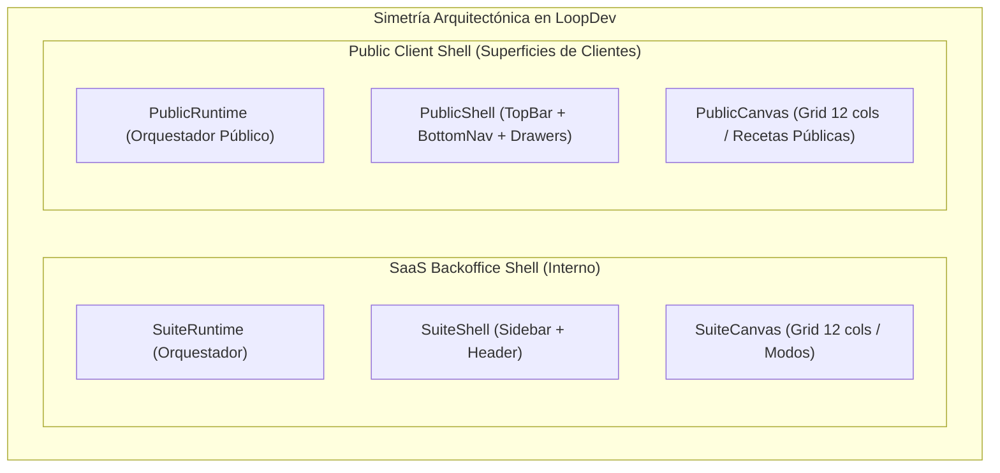

# Public Shell Foundation, Contract-Driven Architecture and Modular Client Surfaces

## Outcome

Proveer una arquitectura canónica de shell público basada en contratos formales (`@loopdev/contracts`), un orquestador de tiempo de ejecución (`PublicRuntime`) y un canvas declarativo de 12 columnas (`PublicCanvas`), garantizando que cualquier cliente del ecosistema LoopDev (como **CIMO**, **VitaBlue** o futuros proyectos) disponga de una experiencia integral en **Desktop (3 columnas / multi-panel)**, **Tablet (2 columnas adaptativas)** y **Mobile (App táctil con BottomNav)**, eliminando el código inline en las pantallas y desacoplando la estructura del diseño de marca (*White-label Theming*).

---

## Contexto y Principios de Diseño

LoopDev cuenta con un sólido modelo de orquestación para su SaaS Backoffice (`SuiteRuntime`, `SuiteShell` y `SuiteCanvas`) basado en especificaciones formales y contratos Zod. Las superficies públicas de cara al usuario final (PWA, redes sociales deportivas, portales de captación y portales de clientes) adoptan ahora esta misma disciplina de ingeniería.

### Principios Fundamentales:
1. **Un Solo Shell Responsivo Continuo:** Un único componente `<PublicShell>` y `<PublicRuntime>` gestionan dinámicamente la transición fluida entre Mobile (`< 640px`), Tablet (`640px - 1024px`) y Desktop (`≥ 1024px`).
2. **Orquestación en Tiempo de Ejecución (`PublicRuntime`):** Equivalente a `SuiteRuntime`, orquesta de forma declarativa la resolución de modos, presets, slots, navegación y eventos de ciclo de vida.
3. **Canvas Declarativo de 12 Columnas (`PublicCanvas`):** Las páginas no maquetan layouts con `divs` ni estilos manuales; declaran una especificación de regiones (`PublicViewComposition`) con `colSpan`, `rowSpan`, `overflow`, `sizing` y reglas responsivas.
4. **Cero Código Inline / Composición por Bloques:** Las pantallas componen exclusivamente bloques modulares reutilizables en los slots tipados (`topBar`, `sidebarFilters`, `mainFeed`, `contextInspector`, `bottomNav`, `drawer`, `authModal`).
5. **Contratos Estrictos con Zod (`@loopdev/contracts`):** Estados estructurales, capacidades, navegación, recetas y marcas se validan en tiempo de compilación y runtime.
6. **Theming White-Label Universal:** La identidad visual (colores `#00B894`, `#1F4E5F`, logos SVG, tipografías y contraste WCAG) se inyecta mediante tokens dinámicos en `BrandThemeProvider`.
7. **CIMO como Piloto de Certificación:** Se refactoriza la aplicación de CIMO para validar la experiencia completa de 3 columnas en Desktop, navegación Tablet y PWA móvil táctil.

---

## Decisiones Aprobadas

| Fecha | Decisión | Motivo | Impacto | Aprobado por |
| :--- | :--- | :--- | :--- | :--- |
| **2026-08-28** | Unificar Desktop, Tablet y Mobile en un solo `PublicShell` adaptativo continuo. | Evitar bifurcaciones de código y proveer una experiencia desktop rica (3 columnas) sin degradar la app móvil. | Arquitectura universal para todos los clientes públicos. | `@minoveaz` |
| **2026-08-28** | Implementar `PublicRuntime` como motor simétrico a `SuiteRuntime`. | Centralizar la orquestación de slots, breakpoints, eventos de navegación y ciclo de vida. | Separación total entre lógica de orquestación y bloques de UI. | `@minoveaz` |
| **2026-08-28** | Implementar `PublicCanvas` con Grid matemático de 12 columnas. | Replicar la robustez de `SuiteCanvas` para resolver layouts sin código inline. | Layouts declarativos, predecibles y sin layout shifts. | `@minoveaz` |
| **2026-08-28** | Arquitectura orientada a contratos en `@loopdev/contracts/src/platform/public-shell.ts`. | Mantener la misma disciplina y robustez que gobierna el SaaS Shell de LoopDev. | Tipado Zod estricto en runtime y compile-time. | `@minoveaz` |
| **2026-08-28** | Composición por Slots y Bloques Reutilizables (Cero código inline en páginas). | Estandarizar la interfaz y garantizar consistencia de accesibilidad y responsive. | Páginas declarativas y altamente mantenibles. | `@minoveaz` |
| **2026-08-28** | Inyección de Tokens de Marca dinámicos (`PublicBrandTheme`). | Permitir que CIMO, VitaBlue y futuros clientes compartan el 100% de la infraestructura visual. | Soporte nativo para clientes multi-marca (*White-Label*). | `@minoveaz` |

---

## Arquitectura de Contratos (`@loopdev/contracts`)

El archivo canónico `packages/contracts/src/platform/public-shell.ts` define los siguientes contratos:

### 1. Estados Estructurales del Shell (`PublicShellState`)
- `ready`: Shell completamente renderizado con datos.
- `loading`: Esqueleto de carga estructurado (*Skeleton Loaders* sin layout shifts).
- `error`: Estado de error con acción de reintento.
- `offline`: Indicador de pérdida de conectividad PWA.
- `unauthenticated`: Modo explorador / invitado con disparador de autenticación.
- `maintenance`: Pantalla de mantenimiento controlada.

### 2. Recetas Canónicas de Composición (`PublicCompositionRecipe`)
- `PublicSocialFeed`: Grid 3-col: Filtros (3 cols) | Feed (6 cols) | Inspector de Crew/Plan (3 cols).
- `PublicDiscoverySplit`: 2-col Split: Listado/Cards (5 cols) | Mapa / Calendario interactivo (7 cols).
- `PublicDetailWorkspace`: Hero (12 cols) + Detalle/Itinerario (8 cols) | Sidebar de Unión / Capitán (4 cols).
- `PublicPortalOverview`: Hero (12 cols) + Grid de Productos (4-4-4 cols) + Asesor & FAQ (12 cols).
- `PublicWorkflowCanvas`: Stepper centrado (12 cols, max-w-xl) para Auth / Onboarding / Feedback.

### 3. Regiones de Canvas (`PublicCompositionRegion`)
- `id`: Identificador único de la región.
- `slot`: `top-bar` | `sidebar-filters` | `main-feed` | `context-inspector` | `bottom-nav` | `floating-actions` | `modal-overlay`.
- `colSpan`: Ancho en columnas (1 a 12).
- `rowSpan`: Alto en filas opcional.
- `sizing`: `content` | `fill` | `fixed`.
- `overflow`: `hidden` | `auto-y` | `auto-x` | `visible`.
- `responsive`:
  - `tablet`: `preserve` | `stack` | `drawer` | `full`.
  - `mobile`: `stack` | `sheet` | `modal` | `bottom-nav` | `hidden`.

### 4. Navegación Pública Tipada (`PublicNavRoute`)
- Rutas con `id`, `path`, `label`, `icon`, `badgeCount` en vivo, visibilidad por viewport (`mobile`, `tablet`, `desktop`) y `requiresAuth`.

### 5. Motor de Temas de Marca (`PublicBrandTheme`)
- Paleta semántica (`primary`, `primaryHover`, `secondary`, `accent`, `background`, `surface`, `textMain`, `textSecondary`).
- Logos vectoriales SVG (`markSvg`, `fullSvg`, `favicon`).
- Tipografía del sistema y contraste accesible (mínimo 4.5:1 WCAG AA).

---

## Alcance

### Incluido

1. **Definición de Contratos en `@loopdev/contracts`:**
   - `packages/contracts/src/platform/public-shell.ts` y exportación canónica en `index.ts`.
   - Pruebas unitarias de contratos en `packages/contracts/src/platform/__tests__/public-shell.test.ts`.
2. **Implementación de `@loopdev/public-shell` (`ds/packages/public-shell`):**
   - `<PublicRuntime>`: Orquestador central de tiempo de ejecución (slots, lifecycle, breakpoints, nav dispatch).
   - `<PublicCanvas>` y `<PublicCanvasRegion>`: Motor de resolución de Grid de 12 columnas.
   - `<PublicTopBar>`: Header responsive con buscador, logo SVG dinámico y acciones.
   - `<PublicBottomNav>`: Barra de navegación inferior móvil táctil (touch-target ≥ 44px) con badges.
   - `<PublicSidebar>`: Columna lateral de filtros / categorías.
   - `<PublicContextPanel>`: Columna de inspección / detalle de actividad / acciones secundarias.
   - `<PublicDrawer>`: Menú lateral animado para móviles y tablets.
   - `<PublicAuthModal>`: Modal de autenticación/registro desacoplado con estados OTP y Magic Link.
   - `<BrandThemeProvider>` / `useBrandTheme`: Inyección de variables CSS y contexto de diseño.
3. **Refactorización Piloto de CIMO:**
   - Declarar `cimoFeedPageSpec`, `CIMO_FEED_COMPOSITION` y `cimoBrandTheme`.
   - Modularizar la aplicación en bloques reutilizables (`CimoSportFiltersBlock`, `CimoActivitiesFeedBlock`, `CimoCrewInspectorBlock`, `CimoAuthModalBlock`).
   - Eliminar código inline en favor de `PublicRuntime` y `PublicCanvas`.
   - Validar la experiencia de 3 columnas en Desktop, 2 columnas en Tablet y App móvil táctil en Mobile.
4. **Calidad y Verificación:**
   - Pruebas unitarias con Vitest.
   - Verificación de TypeScript estricto (`tsc --noEmit`) y Linting.
   - Auditoría de responsive sin overflow horizontal ni layout shifts.

### Excluido

- Modificaciones a las suites de backoffice de `loopdev-os`.
- Módulos verticales específicos de seguros de VitaBlue (se integrarán en una fase subsiguiente).

---

## Fases de Ejecución y Checkpoints

### 📌 Fase 1: Contratos y Especificaciones en `@loopdev/contracts`
- [ ] Crear `packages/contracts/src/platform/public-shell.ts` con todos los schemas Zod y tipos inferidos (`PublicShellState`, `PublicCompositionRecipe`, `PublicCompositionRegion`, `PublicViewComposition`, `PublicNavRoute`, `PublicBrandTheme`).
- [ ] Exportar los contratos en `packages/contracts/src/index.ts`.
- [ ] Añadir suite de tests unitarios de validación de contratos (`public-shell.test.ts`).
- [ ] Ejecutar build de contracts: `pnpm --filter @loopdev/contracts build`.

### 📌 Fase 2: Construcción del Paquete `@loopdev/public-shell`
- [ ] Configurar `ds/packages/public-shell/package.json` y `tsconfig.json`.
- [ ] Implementar el motor de theming: `BrandThemeProvider` y `useBrandTheme`.
- [ ] Construir el orquestador `<PublicRuntime>` y el motor `<PublicCanvas>`.
- [ ] Construir los componentes primitivos de soporte:
  - `PublicTopBar.tsx`, `PublicBottomNav.tsx`, `PublicSidebar.tsx`, `PublicContextPanel.tsx`, `PublicAuthModal.tsx`, `PublicDrawer.tsx`.
- [ ] Implementar hooks de responsive (`useShellBreakpoint`).
- [ ] Añadir suite de tests unitarios en `ds/packages/public-shell`.

### 📌 Fase 3: Integración Piloto en CIMO
- [ ] Crear la especificación formal de página `cimoFeedPageSpec`, la composición `CIMO_FEED_COMPOSITION` y los tokens `cimoBrandTheme`.
- [ ] Modularizar los componentes de CIMO en bloques desacoplados:
  - `CimoSportFiltersBlock` (slot `sidebarFilters`).
  - `CimoActivitiesFeedBlock` (slot `mainFeed`).
  - `CimoCrewInspectorBlock` (slot `contextInspector`).
  - `CimoAuthModalBlock` (slot `authModal`).
- [ ] Validar el renderizado con `PublicRuntime` en Desktop (3 columnas), Tablet (2 columnas) y Mobile (PWA con BottomNav).

### 📌 Fase 4: Certificación de Calidad y Pipeline de CI
- [ ] Ejecutar `pnpm turbo run build lint test` en todo el monorepo.
- [ ] Verificar accesibilidad táctil (touch target ≥ 44px) y navegación por teclado.
- [ ] Registrar evidencia en el track y preparar Pull Request hacia `develop`.

---

## Criterios de Aceptación

1. **Validación de Contratos:** El 100% de los schemas Zod de `public-shell.ts` compilan y superan las pruebas unitarias.
2. **Orquestador PublicRuntime Funcional:** `PublicRuntime` gestiona slots, ciclo de vida, navegación y responsive de manera determinista.
3. **Canvas Declarativo de 12 Columnas:** `PublicCanvas` resuelve la distribución de columnas sin clases arbitrarias ni código inline.
4. **Triple Experiencia Verificada en CIMO:**
   - **Desktop (`≥ 1024px`):** Layout expansivo de 3 columnas (`Filtros` | `Feed` | `Inspector de Crew`).
   - **Tablet (`640px - 1024px`):** Reorganización limpia en 2 columnas con drawer colapsable.
   - **Mobile (`< 640px`):** Experiencia táctil fluida con TopBar compacta, BottomNav fija y safe-areas respetadas.
5. **Theming White-Label Operativo:** El cambio de tokens de marca adapta instantáneamente colores, logos y tipografías sin tocar componentes.
6. **Quality Gate Verde:** `pnpm turbo run build typecheck test` finaliza con 0 errores en el monorepo.
