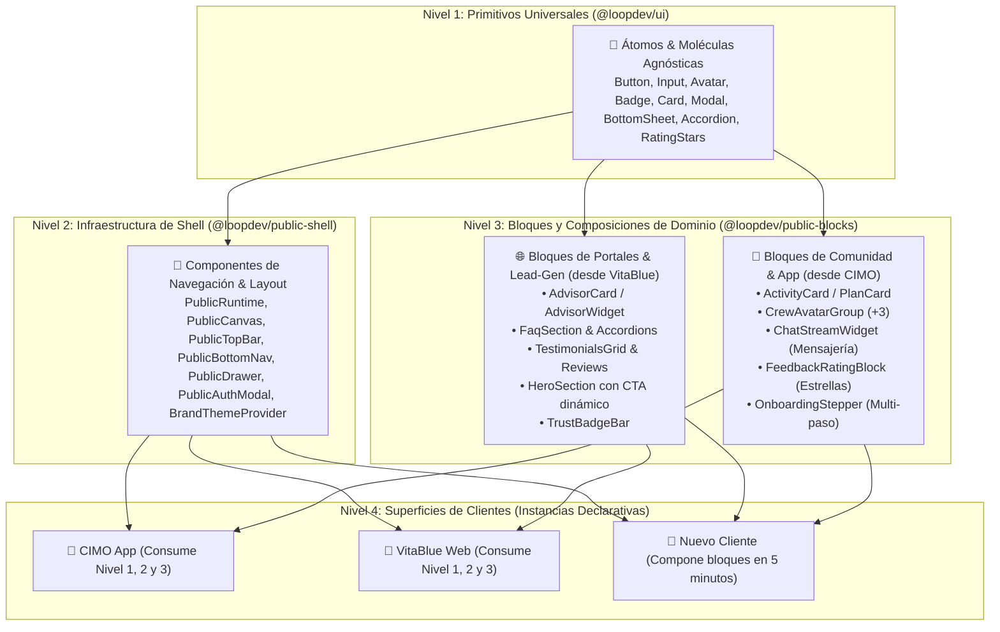

# Public Shell Foundation, Contract-Driven Architecture, Public Blocks and Modular Client Surfaces

## Outcome

Proveer una arquitectura canónica de frontend público para el ecosistema LoopDev compuesta por:
1. Contratos formales y esquemas Zod en `@loopdev/contracts`.
2. Un orquestador de tiempo de ejecución (`PublicRuntime`) y un canvas declarativo de 12 columnas (`PublicCanvas`) en `@loopdev/public-shell`.
3. Una librería modular de bloques públicos reutilizables (`@loopdev/public-blocks`) promovidos desde **VitaBlue** (Lead-Gen / Asesores / FAQs) y **CIMO** (Comunidad / Tarjetas de Actividad / Chat Streams / Feedback).
4. Un modelo de composición en **4 niveles de granularidad** que elimina el código inline en las pantallas, soporta tematización multi-marca (*White-label*) y entrega una experiencia integral en **Desktop (3 columnas / multi-panel)**, **Tablet (2 columnas adaptativas)** y **Mobile (PWA táctil con BottomNav)**.

---

## Contexto y Arquitectura de 4 Niveles

---

## Decisiones Aprobadas

| Fecha | Decisión | Motivo | Impacto | Aprobado por |
| :--- | :--- | :--- | :--- | :--- |
| **2026-08-28** | Modelo de 4 Niveles de Componentes (`@loopdev/ui` ➔ `@loopdev/public-shell` ➔ `@loopdev/public-blocks` ➔ Clientes). | Desacoplar primitivos de diseño, infraestructura de shell y bloques de negocio público reutilizables. | Reutilización masiva de código entre VitaBlue, CIMO y futuros clientes. | `@minoveaz` |
| **2026-08-28** | Unificar Desktop, Tablet y Mobile en un solo `PublicShell` adaptativo continuo. | Evitar bifurcaciones de código y proveer una experiencia desktop rica (3 columnas) sin degradar la app móvil. | Arquitectura universal para todos los clientes públicos. | `@minoveaz` |
| **2026-08-28** | Implementar `PublicRuntime` como motor simétrico a `SuiteRuntime`. | Centralizar la orquestación de slots, breakpoints, eventos de navegación y ciclo de vida. | Separación total entre lógica de orquestación y bloques de UI. | `@minoveaz` |
| **2026-08-28** | Implementar `PublicCanvas` con Grid matemático de 12 columnas. | Replicar la robustez de `SuiteCanvas` para resolver layouts sin código inline. | Layouts declarativos, predecibles y sin layout shifts. | `@minoveaz` |
| **2026-08-28** | Arquitectura orientada a contratos en `@loopdev/contracts/src/platform/public-shell.ts`. | Mantener la misma disciplina y robustez que gobierna el SaaS Shell de LoopDev. | Tipado Zod estricto en runtime y compile-time. | `@minoveaz` |
| **2026-08-28** | Inyección de Tokens de Marca dinámicos (`PublicBrandTheme`). | Permitir que CIMO, VitaBlue y futuros clientes compartan el 100% de la infraestructura visual. | Soporte nativo para clientes multi-marca (*White-Label*). | `@minoveaz` |

---

## Reglas de Promoción de Componentes (*Component Promotion Workflow*)

1. **Primitivo Puro UI (Agnóstico de negocio):** Vive en `@loopdev/ui` (ej. `Button`, `BottomSheet`, `RatingStars`).
2. **Infraestructura de Shell/Navegación:** Vive en `@loopdev/public-shell` (ej. `PublicRuntime`, `PublicTopBar`, `PublicBottomNav`, `PublicCanvas`).
3. **Bloque de Dominio Público Reutilizable:** Vive en `@loopdev/public-blocks` (ej. `AdvisorCard`, `ActivityCard`, `ChatStreamWidget`, `FaqSection`).
4. **Lógica Exclusiva Vertical:** Vive en la aplicación del cliente (ej. cotizador Sanitas en `vitablue`, ritmo km en `cimo`).

---

## Arquitectura de Contratos (`@loopdev/contracts`)

El archivo canónico `packages/contracts/src/platform/public-shell.ts` define:

### 1. Estados Estructurales del Shell (`PublicShellState`)
- `ready`, `loading`, `error`, `offline`, `unauthenticated`, `maintenance`.

### 2. Recetas Canónicas de Composición (`PublicCompositionRecipe`)
- `PublicSocialFeed`: Grid 3-col: Filtros (3 cols) | Feed (6 cols) | Inspector de Crew/Plan (3 cols).
- `PublicDiscoverySplit`: 2-col Split: Listado/Cards (5 cols) | Mapa / Calendario interactivo (7 cols).
- `PublicDetailWorkspace`: Hero (12 cols) + Detalle/Itinerario (8 cols) | Sidebar de Unión / Capitán (4 cols).
- `PublicPortalOverview`: Hero (12 cols) + Grid de Productos (4-4-4 cols) + Asesor & FAQ (12 cols).
- `PublicWorkflowCanvas`: Stepper centrado (12 cols, max-w-xl) para Auth / Onboarding / Feedback.

### 3. Regiones de Canvas (`PublicCompositionRegion`)
- `id`, `slot` (`top-bar`, `sidebar-filters`, `main-feed`, `context-inspector`, `bottom-nav`, `floating-actions`, `modal-overlay`), `colSpan` (1-12), `rowSpan`, `sizing`, `overflow`, y reglas responsivas (`tablet` y `mobile`).

### 4. Navegación Pública Tipada (`PublicNavRoute`)
- Rutas con `id`, `path`, `label`, `icon`, `badgeCount` en vivo, visibilidad por viewport (`mobile`, `tablet`, `desktop`) y `requiresAuth`.

### 5. Motor de Temas de Marca (`PublicBrandTheme`)
- Paleta semántica (`primary`, `primaryHover`, `secondary`, `accent`, `background`, `surface`, `textMain`, `textSecondary`).
- Logos vectoriales SVG (`markSvg`, `fullSvg`, `favicon`).
- Tipografía y contraste accesible (mínimo 4.5:1 WCAG AA).

---

## Fases de Ejecución y Checkpoints

### 📌 Fase 1: Contratos y Especificaciones en `@loopdev/contracts`
- [ ] Crear `packages/contracts/src/platform/public-shell.ts` con todos los schemas Zod y tipos inferidos.
- [ ] Exportar los contratos en `packages/contracts/src/index.ts`.
- [ ] Añadir suite de tests unitarios de validación de contratos (`public-shell.test.ts`).
- [ ] Ejecutar build de contracts: `pnpm --filter @loopdev/contracts build`.

### 📌 Fase 2: Construcción de `@loopdev/public-shell` y Primitivos UI
- [ ] Configurar `ds/packages/public-shell/package.json` y `tsconfig.json`.
- [ ] Implementar el motor de theming: `BrandThemeProvider` y `useBrandTheme`.
- [ ] Construir el orquestador `<PublicRuntime>` y el motor `<PublicCanvas>`.
- [ ] Implementar componentes primitivos de navegación (`PublicTopBar`, `PublicBottomNav`, `PublicSidebar`, `PublicContextPanel`, `PublicAuthModal`, `PublicDrawer`).
- [ ] Añadir primitivos faltantes en `@loopdev/ui` (ej. `BottomSheet`, `RatingStars`).
- [ ] Suite de tests unitarios en `ds/packages/public-shell`.

### 📌 Fase 3: Construcción de `@loopdev/public-blocks`
- [ ] Configurar `ds/packages/public-blocks/package.json` y `tsconfig.json`.
- [ ] Extraer y estandarizar bloques de **VitaBlue**:
  - `AdvisorCard.tsx`, `FaqSection.tsx`, `TestimonialsGrid.tsx`, `TrustBadgeBar.tsx`, `HeroSection.tsx`, `FloatingWhatsApp.tsx`.
- [ ] Extraer y estandarizar bloques de **CIMO**:
  - `ActivityCard.tsx`, `CrewAvatarGroup.tsx`, `ChatStreamWidget.tsx`, `FeedbackRatingBlock.tsx`, `OnboardingStepper.tsx`.
- [ ] Suite de tests unitarios en `ds/packages/public-blocks`.

### 📌 Fase 4: Refactorización Piloto de CIMO y Certificación
- [ ] Declarar `cimoFeedPageSpec`, `CIMO_FEED_COMPOSITION` y `cimoBrandTheme`.
- [ ] Componer la aplicación CIMO importando exclusivamente bloques de `@loopdev/public-blocks` y `@loopdev/public-shell` (cero código inline).
- [ ] Validar la experiencia de 3 columnas en Desktop, 2 columnas en Tablet y App móvil táctil en Mobile.
- [ ] Ejecutar `pnpm turbo run build lint test` en todo el monorepo.
- [ ] Registrar evidencia en el track y preparar Pull Request hacia `develop`.

---

## Criterios de Aceptación

1. **Validación de Contratos:** El 100% de los schemas Zod de `public-shell.ts` compilan y superan las pruebas unitarias.
2. **Orquestador PublicRuntime y PublicCanvas:** Resuelven la distribución de 12 columnas, slots y eventos responsivos sin código inline.
3. **Librería de Bloques Operativa:** `@loopdev/public-blocks` exporta componentes modulares listos para ser consumidos por cualquier portal o app.
4. **Triple Experiencia Verificada en CIMO:**
   - **Desktop (`≥ 1024px`):** Layout expansivo de 3 columnas (`Filtros` | `Feed` | `Inspector de Crew`).
   - **Tablet (`640px - 1024px`):** Reorganización limpia en 2 columnas con drawer colapsable.
   - **Mobile (`< 640px`):** Experiencia táctil fluida con TopBar compacta, BottomNav fija y safe-areas respetadas.
5. **Theming White-Label Universal:** El cambio de tokens de marca adapta instantáneamente colores, logos y tipografías.
6. **Quality Gate Verde:** `pnpm turbo run build typecheck test` finaliza con 0 errores en el monorepo.
