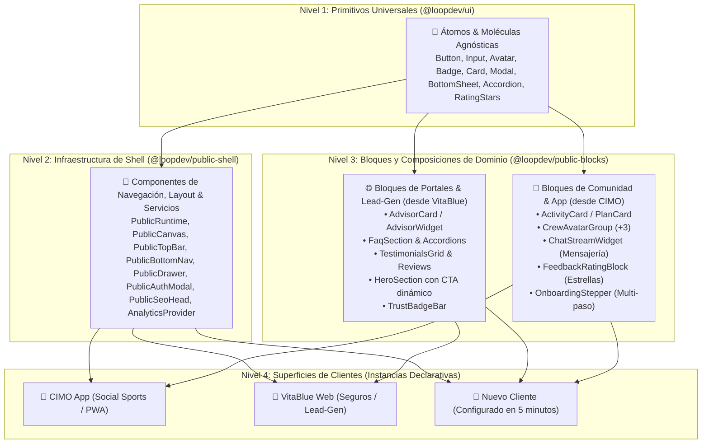

# Public Shell Foundation, Contract-Driven Architecture, Public Blocks, SEO, Analytics & Performance Certification

## Outcome

Proveer una arquitectura canónica de frontend público para todo el ecosistema LoopDev (clientes actuales como **CIMO**, **VitaBlue** y futuros desarrollos) que integre:
1. **Contratos Formales Zod:** Gobernanza en `@loopdev/contracts` para estados, composición, navegación, SEO y telemetría.
2. **Orquestador `PublicRuntime` y Canvas de 12 Columnas (`PublicCanvas`):** Resolución matemática de layouts sin código inline, garantizando la triple experiencia en **Desktop (3 columnas / multi-panel)**, **Tablet (2 columnas adaptativas)** y **Mobile (PWA táctil con BottomNav)**.
3. **Librería de Bloques Reutilizables (`@loopdev/public-blocks`):** Componentes modulares promovidos de VitaBlue (Lead-Gen / Asesores / FAQs) y CIMO (Comunidad / Tarjetas de Actividad / Chat Streams / Feedback).
4. **Motor de SEO de Primera Clase:** Contratos JSON-LD (`Schema.org`), canonicals automáticos, hreflang multi-idioma, Open Graph, Twitter Cards y generación de `sitemap.xml` / `robots.txt`.
5. **Telemetría, Consentimiento y Conversiones:** Soporte nativo para GA4, Google Ads (`AW-XXXXXX`), GTM, Meta Pixel y Google Consent Mode v2 respetando el `CookieBanner`.
6. **Certificación y Puertas de Calidad:** Playwright E2E SEO Audits, pruebas unitarias con Vitest y auditoría automatizada con **Lighthouse / Unlighthouse** (Score ≥ 90/100).

---

## Contexto y Arquitectura de 4 Niveles



---

## Decisiones Aprobadas

| Fecha | Decisión | Motivo | Impacto | Aprobado por |
| :--- | :--- | :--- | :--- | :--- |
| **2026-08-28** | Arquitectura de 4 Niveles (`@loopdev/ui` ➔ `@loopdev/public-shell` ➔ `@loopdev/public-blocks` ➔ Clientes). | Desacoplar primitivos, infraestructura de navegación y bloques de negocio reutilizables. | Reutilización masiva de código entre VitaBlue, CIMO y futuros clientes. | `@minoveaz` |
| **2026-08-28** | Unificar Desktop, Tablet y Mobile en un solo `PublicShell` adaptativo continuo. | Evitar bifurcaciones y entregar una experiencia desktop rica (3 columnas) sin degradar la app móvil. | Arquitectura universal para todos los clientes públicos. | `@minoveaz` |
| **2026-08-28** | Implementar `PublicRuntime` y `PublicCanvas` (Grid 12 cols). | Replicar la disciplina de `SuiteRuntime` y `SuiteCanvas` del SaaS Shell. | Layouts declarativos matemáticos sin código inline. | `@minoveaz` |
| **2026-08-28** | Sistema de SEO de Primera Clase gobernado por contratos Zod. | Garantizar indexabilidad, canonicals sin redirecciones, Open Graph y datos estructurados Schema.org. | Máxima visibilidad orgánica en Google y motores de IA. | `@minoveaz` |
| **2026-08-28** | Telemetría Unificada (GA4, Google Ads, GTM, Consent Mode v2). | Estandarizar tracking de conversiones y eventos respetando el RGPD / CookieBanner. | Medición unificada de campañas y atribución. | `@minoveaz` |
| **2026-08-28** | Puerta de Calidad de Auditoría Lighthouse / Unlighthouse en CI. | Exigir estándares de Performance, a11y, Best Practices y SEO (Score ≥ 90). | Experiencias ultra rápidas y certificadas. | `@minoveaz` |

---

## Arquitectura de Contratos (`@loopdev/contracts`)

### 1. Estados Estructurales (`PublicShellState`)
- `ready`, `loading`, `error`, `offline`, `unauthenticated`, `maintenance`.

### 2. Recetas Canónicas de Composición (`PublicCompositionRecipe`)
- `PublicSocialFeed`: Grid 3-col: Filtros (3 cols) | Feed (6 cols) | Inspector de Crew/Plan (3 cols).
- `PublicDiscoverySplit`: 2-col Split: Listado/Cards (5 cols) | Mapa / Calendario interactivo (7 cols).
- `PublicDetailWorkspace`: Hero (12 cols) + Detalle/Itinerario (8 cols) | Sidebar de Unión / Capitán (4 cols).
- `PublicPortalOverview`: Hero (12 cols) + Grid de Productos (4-4-4 cols) + Asesor & FAQ (12 cols).
- `PublicWorkflowCanvas`: Stepper centrado (12 cols, max-w-xl) para Auth / Onboarding / Feedback.

### 3. Regiones de Canvas (`PublicCompositionRegion`)
- `id`, `slot`, `colSpan` (1-12), `rowSpan`, `sizing`, `overflow`, y reglas responsivas (`tablet` y `mobile`).

### 4. Contratos de SEO y Datos Estructurados (`PublicSeoMetadata`)
```typescript
export const PublicSeoMetadataSchema = z.object({
  title: z.string().min(10).max(80),
  description: z.string().min(50).max(200),
  canonicalUrl: z.string().url().optional(),
  hreflang: z.record(z.string()).optional(),
  openGraph: z.object({
    title: z.string().optional(),
    description: z.string().optional(),
    image: z.string().url(),
    type: z.enum(['website', 'article', 'profile']).default('website'),
  }),
  twitter: z.object({
    card: z.enum(['summary', 'summary_large_image']).default('summary_large_image'),
    site: z.string().optional(),
  }).optional(),
  jsonLd: z.array(z.record(z.any())).optional(), // Schema.org Objects (SportsEvent, Product, FAQPage)
  indexable: z.boolean().default(true),
});
```

### 5. Contratos de Telemetría y Analytics (`PublicAnalyticsConfig`)
```typescript
export const PublicAnalyticsConfigSchema = z.object({
  googleAnalyticsId: z.string().regex(/^G-[A-Z0-9]+$/).optional(),
  googleAdsId: z.string().regex(/^AW-[0-9]+$/).optional(),
  gtmId: z.string().regex(/^GTM-[A-Z0-9]+$/).optional(),
  metaPixelId: z.string().optional(),
  consentModeEnabled: z.boolean().default(true),
});
```

---

## Fases de Ejecución y Checkpoints

### 📌 Fase 1: Contratos Zod en `@loopdev/contracts`
- [ ] Crear `packages/contracts/src/platform/public-shell.ts` con todos los schemas (`PublicShellState`, `PublicCompositionRecipe`, `PublicCompositionRegion`, `PublicViewComposition`, `PublicNavRoute`, `PublicBrandTheme`).
- [ ] Crear `packages/contracts/src/platform/seo.ts` y `telemetry.ts` con los contratos de SEO y Analytics.
- [ ] Exportar contratos en `packages/contracts/src/index.ts`.
- [ ] Suite de tests unitarios de validación de contratos (`public-shell.test.ts`, `seo.test.ts`).
- [ ] Ejecutar build de contracts: `pnpm --filter @loopdev/contracts build`.

### 📌 Fase 2: Construcción de `@loopdev/public-shell` y Servicios Base
- [ ] Configurar `ds/packages/public-shell/package.json` y `tsconfig.json`.
- [ ] Implementar el motor de theming: `BrandThemeProvider` y `useBrandTheme`.
- [ ] Construir el orquestador `<PublicRuntime>` y el motor `<PublicCanvas>`.
- [ ] Implementar `<PublicSeoHead>` (Helmet/Head con Canonicals, Open Graph, Twitter Cards y JSON-LD).
- [ ] Implementar `<PublicAnalyticsProvider>` con soporte para GA4, Google Ads, `dataLayer` y Google Consent Mode v2.
- [ ] Implementar componentes primitivos de navegación (`PublicTopBar`, `PublicBottomNav`, `PublicSidebar`, `PublicContextPanel`, `PublicAuthModal`, `PublicDrawer`).
- [ ] Suite de tests unitarios en `ds/packages/public-shell`.

### 📌 Fase 3: Construcción de `@loopdev/public-blocks`
- [ ] Configurar `ds/packages/public-blocks/package.json` y `tsconfig.json`.
- [ ] Extraer y estandarizar bloques de **VitaBlue**:
  - `AdvisorCard.tsx`, `FaqSection.tsx`, `TestimonialsGrid.tsx`, `TrustBadgeBar.tsx`, `HeroSection.tsx`, `FloatingWhatsApp.tsx`.
- [ ] Extraer y estandarizar bloques de **CIMO**:
  - `ActivityCard.tsx`, `CrewAvatarGroup.tsx`, `ChatStreamWidget.tsx`, `FeedbackRatingBlock.tsx`, `OnboardingStepper.tsx`.
- [ ] Suite de tests unitarios en `ds/packages/public-blocks`.

### 📌 Fase 4: Refactorización Piloto de CIMO, Auditorías y Certificación
- [ ] Configurar especificación `cimoFeedPageSpec`, `CIMO_FEED_COMPOSITION`, `cimoBrandTheme` y `cimoSeoConfig`.
- [ ] Componer la aplicación CIMO importando exclusivamente bloques de `@loopdev/public-blocks` y `@loopdev/public-shell` (cero código inline).
- [ ] Validar la experiencia de 3 columnas en Desktop, 2 columnas en Tablet y App móvil táctil en Mobile.
- [ ] Configurar scripts de auditoría automatizada con **Unlighthouse / Lighthouse** (`unlighthouse.config.ts`).
- [ ] Suite de tests E2E de SEO y responsive con Playwright.
- [ ] Ejecutar `pnpm turbo run build lint test` en todo el monorepo y registrar evidencia en el track.

---

## Criterios de Aceptación y Certificación

1. **Validación de Contratos:** El 100% de los schemas Zod de `public-shell.ts`, `seo.ts` y `telemetry.ts` compilan y superan los tests.
2. **Orquestador PublicRuntime y PublicCanvas:** Resuelven la distribución de 12 columnas, slots, responsive y eventos de ciclo de vida sin código inline.
3. **Librería de Bloques Operativa:** `@loopdev/public-blocks` exporta componentes modulares listos para ser consumidos por cualquier portal o app.
4. **Triple Experiencia Verificada en CIMO:**
   - **Desktop (`≥ 1024px`):** Layout expansivo de 3 columnas (`Filtros` | `Feed` | `Inspector de Crew`).
   - **Tablet (`640px - 1024px`):** Reorganización limpia en 2 columnas con drawer colapsable.
   - **Mobile (`< 640px`):** Experiencia táctil fluida con TopBar compacta, BottomNav fija y safe-areas respetadas.
5. **SEO & Telemetría Certificados:**
   - 100% de páginas con canonical, meta description, Open Graph y datos estructurados Schema.org válidos.
   - Tracking de GA4 y conversiones de Google Ads disparándose a `dataLayer` conforme al consentimiento.
6. **Lighthouse Score ≥ 90:** Rendimiento, Accesibilidad, Mejores Prácticas y SEO certificados.
7. **Quality Gate Verde:** `pnpm turbo run build typecheck test` finaliza con 0 errores en el monorepo.
